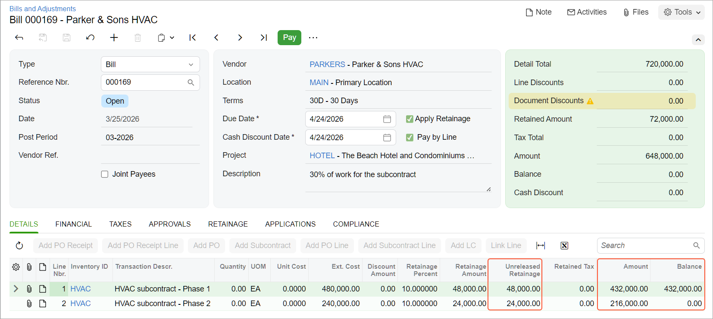

# AP Bills with Retainage: Process Activity {#_18439937-89f9-4222-8b9f-54cd26a7bc7e .task}

This activity will walk you through the processing of an AP bill with retainage. This activity demonstrates the workflow with AP bills with open AP and retainage balances at the line level.

**Attention:** This activity is based on the *U100* dataset. If you are using another dataset or if any system settings have been changed in *U100*, these changes can affect the workflow of the activity and the results of the processing. To avoid issues, restore the *U100* dataset to its initial state.

## Story { .section}

Suppose that on March 15, 2026, the ToadGreen Building Group company hired a subcontractor to install air conditioning systems for the hotel being built. By the subcontract, $2,400,000 will be paid to the subcontractor for work and 10% of each payment will be withheld by the company until the related work is finished. Also, ToadGreen and the subcontractor have agreed that after 30% of the work is done, ToadGreen has to release 10% of the retained amount.

On March 25, 2026, ToadGreen receives the first bill for the completed work, which is 30% of the total work, in the amount of $720,000. A ToadGreen project accountant needs to enter a bill that includes the $72,000 retainage amount and then process a payment for the full bill amount. After the subcontractor reports about finishing a part of the work, the ToadGreen project accountant needs to release $7,200, which is a part of the retainage amount. Acting as this project accountant, you will enter and process the related financial documents.

## Configuration Overview { .section}

In the *U100* dataset, the following tasks have been performed to support this activity:

-   The following features have been enabled on the [Enable/Disable Features](CS_10_00_00.md) \(CS100000\) form:
    -   *Retainage Support*
    -   *Payment Application by Line*
    -   *Construction*
-   On the [Vendors](AP_30_30_00.md#) \(AP303000\) form, the *PARKERS* vendor has been created; the **Pay by Line** \(**Payment** tab\) and **Apply Retainage** \(**Financial** tab\) check boxes are selected for this vendor. In the **Retainage Percent** box \(**Financial** tab\), *10* is specified. On the **GL Accounts** tab, *28000 - AP Retainage* is specified in the **Retainage Payable Account** box. In the **Cash Account** box on the **Payments** tab, the *10200TG* cash account is specified for the vendor.
-   On the [Non-Stock Items](IN_20_20_00.md) \(IN202000\) form, the *HVAC* non-stock item has been created.
-   On the [Projects](PM_30_10_00.md#) \(PM301000\) form, the *HOTEL* project has been created with multiple project tasks.
-   On the [Subcontracts](SC_30_10_00.md) \(SC301000\) form, the subcontract for the *PARKERS* vendor in the amount of $2,400,000 has been entered.

## Process Overview { .section}

You will create a partial bill for the subcontract on the [Bills and Adjustments](AP_30_10_00.md#) \(AP301000\) form. On the [Prepare Payments](AP_50_30_00.md#) \(AP503000\) form, you then will prepare a partial payment for the bill and process it by using the [Process Payments / Print Checks](AP_50_50_00.md#) \(AP505000\) and [Release Payments](AP_50_52_00.md#) \(AP505200\) forms. You will then review the retainage details of the processed AP bill in the [AP Aging](AP_63_10_00.md#) \(AP631000\) report. After that, you will release the retainage on the [Release AP Retainage](AP_51_00_00.md#) \(AP510000\) form and prepare the retainage document. Finally, you will process the retainage document and pay its balance.

## System Preparation { .section}

To prepare to perform the instructions of this activity, do the following:

1.  Launch the Acumatica ERP website, and sign in to a company with the *U100* dataset preloaded. You should sign in as a project accountant by using the *bsanchez* username and the *123* password.
2.  In the info area, in the upper-right corner of the top pane of the Acumatica ERP screen, make sure that the business date in your system is set to *3/25/2026*. If a different date is displayed, click the Business Date menu button, and select *3/25/2026* on the calendar. For simplicity, in this activity, you will create and process all documents in the system on this business date.

## Step 1: Create an AP Bill with Retainage for a Subcontract { .section}

To create and pay an AP bill for the vendor, do the following:

1.  On the [Bills and Adjustments](AP_30_10_00.md#) \(AP301000\) form, add a new record.
2.  In the Summary area, specify the following settings:
    -   **Vendor**: *PARKERS*
    -   **Date**: *3/25/2026*
    -   **Description**: `30% of work for the subcontract`
    -   **Apply Retainage**: Selected
    -   **Pay by Line**: Selected
3.  On the table toolbar of the **Details** tab, click **Add Subcontract**.
4.  In the **Add Subcontract** dialog box, which opens, select the unlabeled check box in the row with the subcontract to *PARKERS* and the $2,400,000 subcontract total, and click **Add &amp; Close**. The system adds four subcontract lines to the bill.
5.  Modify the lines as follows to indicate that the bill is being prepared for 30% of the subcontract work:

    1.  Leave the first line, with the *HVAC subcontract - Phase 1* description, as it is, and make sure the **Ext. Cost** amount is 480,000.
    2.  In the second line, with the *HVAC subcontract - Phase 2* description, change the **Ext. Cost** amount to `240000`.
    3.  Remove the third and fourth lines from the bill by clicking each line and then clicking **Delete Row** on the table toolbar.
    Make sure that the bill balance is now *648,000*, which is the total amount \(*720,000*\) minus the retained amount \(*72,000*\).

6.  Save your changes.
7.  On the form toolbar, click **Remove Hold** to assign the bill the *Balanced* status, and then click **Release** to release the bill. For each line on the **Details** tab, notice that the **Balance** column now shows the amount to be paid for each line \(which is the line amount minus the retainage amount\).

## Step 2: Paying the Bill { .section}

To pay the bill, do the following:

1.  Open the [Prepare Payments](AP_50_30_00.md#) \(AP503000\) form and specify the following settings in the Selection area:

    -   **Payment Method**: *CHECK*
    -   **Cash Account**: *10200TG*
    -   **Vendor**: *PARKERS*
    -   **Pay Date Within**: Cleared
    The lines of the bill that you have created earlier in this activity appear in the table.

2.  Select the unlabeled check box for both lines, and make sure that in the Selection area, the **Selection Total** amount is *$648,000.00*, and the **Available Balance** amount is greater than the total amount to be paid.
3.  Click **Process** on the form toolbar.
4.  On the [Process Payments / Print Checks](AP_50_50_00.md#) \(AP505000\) form, which opens, click **Process** to process the only selected line, which corresponds to the prepared payment. The system opens a printable version of the check.

    **Attention:** For the purposes of this activity, you do not need to actually print the document. In a production setting, you would click **Print** on the form toolbar to print the check before closing the browser tab.

5.  Close the printable check and return to the [Release Payments](AP_50_52_00.md#) \(AP505200\) form, which the system has opened.
6.  On the form toolbar, click **Process** to release the AP payment. Wait until the processing has finished, and in the **Processing** dialog box, which opens, click **Close**.
7.  On the [Bills and Adjustments](AP_30_10_00.md#) \(AP301000\) form, open the AP bill for which you have processed the payment, and review the line-level balances. Both lines have an unreleased retainage balance in the **Unreleased Retainage** box, as shown below. Therefore, the bill retains the *Open* status even though both bill lines have been paid.

    

    On the **Applications** tab, review the lines of the payment that you have processed. The amounts in the **Amount Paid** column of each line show how much has been paid for each line of the AP bill.

## Step 3: Reviewing Retainage Details { .section}

To review the retainage details of the processed AP bill, do the following:

1.  Open the [AP Aging](AP_63_10_00.md#) \(AP631000\) report form.
2.  On the **Report Parameters** tab, specify the following settings:
    -   **Report Format**: *Detailed with Retainage*
    -   **Company/Branch**: *TBGROUP* \(inserted automatically\)
    -   **Vendor**: *PARKERS*
    -   **Age as of Date**: 3/25/2026
3.  On the form toolbar, click **Run Report**. In the displayed report, the retainage amount held for the AP bill \(*72,000.00*\) is not aged, and is shown in the **Unreleased Retainage** column.

## Step 4: Releasing a Part of the Retainage { .section}

To partially release the retainage, do the following:

1.  Open the [Release AP Retainage](AP_51_00_00.md#) \(AP510000\) form.
2.  In the Selection area, select *PARKERS* in the **Vendor** box.
3.  In the **Retainage to Release** column of the table, for the lines that are displayed, specify the following amounts:
    -   Line 1: `4800`
    -   Line 2: `2400`
4.  In the table, select the unlabeled check box for both lines.
5.  Click **Process** on the form toolbar to prepare the retainage document. In the **Processing** dialog box, which opens, click **Close**.
6.  On the [Bills and Adjustments](AP_30_10_00.md#) \(AP301000\) form, open the prepared retainage document for the *PARKERS* vendor.

    Each line of the retainage bill has the project \(*HOTEL*\), project task \(*15*\), and cost code \(*15-700*\), copied from the original AP bill. Because the original AP bill was created with the **Pay by Line** check box selected, the retainage AP bill is also processed at the line level \(that is, the **Pay by Line** check box is selected in the Summary area\).

7.  Make sure the **Balance** in the Summary area is $7,200, and on the form toolbar, click **Remove Hold** to assign the document the *Balanced* status. Then click **Release** to release the document. The retainage document is assigned the *Open* status.

## Step 5: Paying the Retainage Document { .section}

To pay the retainage document, do the following:

1.  While you are still on the [Bills and Adjustments](AP_30_10_00.md#) \(AP301000\) form with the retainage document open, on the form toolbar, click **Pay**.

    The system opens the [Checks and Payments](AP_30_20_00.md#) \(AP302000\) form with the prepared AP payment.

2.  In the Summary area, make sure that the **Payment Amount** is *7,200.00*, and on the form toolbar, click **Remove Hold** to assign the payment the *Pending Print* status.
3.  On the form toolbar, click **Print/Process**.
4.  On the [Process Payments / Print Checks](AP_50_50_00.md#) \(AP505000\) form, which opens, click **Process** to process the only selected line, which corresponds to the prepared payment. The system opens the printable version of the check.
5.  Close the printed check and return to the [Release Payments](AP_50_52_00.md#) \(AP505200\) form, which the system has opened.
6.  On the [Release Payments](AP_50_52_00.md#) form, click **Process** on the form toolbar to process the selected line. Wait until the processing has finished, and in the **Processing** dialog box, which opens, click **Close**.
7.  On the [Bills and Adjustments](AP_30_10_00.md#) form, open the bill created in Step 1 \(which still has the *Open* status\). Review the line amounts in the lines of the bill, focusing on the following columns:
    -   **Ext. Cost** is the original amount that includes retainage \($480,000 and $240,000\).
    -   **Retainage Amount** is the original retainage amount of the lines \($48,000 and $24,000\).
    -   **Amount** is the original amount of the line less retainage \($432,000 and $216,000\). This amount becomes the open AP balance of the line on release of the bill.
    -   **Balance** is the current open AP balance of the line, which is the **Amount** minus the total amount of payments applied to the line \($0 in both lines\).
    -   **Unreleased Retainage** is the retainage currently held for the line \($43,200 and $21,600\).

You have prepared a partial payment for the subcontract and released a part of the retainage amount.

**Parent topic:**[Processing AP Bills with Retainage](../UserGuide/Construction_APBill_with_Retainage_Mapref.md)

