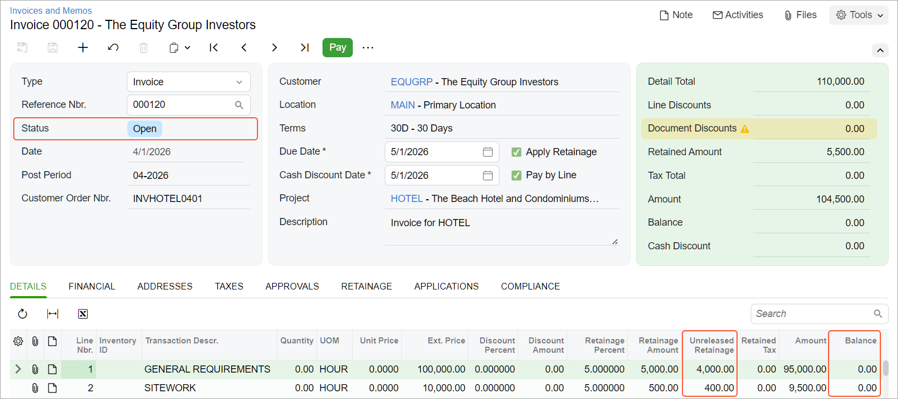

# AR Invoices with Retainage: To Perform Progress Billing with Retainage {#_dc848122-bf62-4964-8095-6521743bcb53 .task}

This activity will walk you through the process of performing progress billing with retainage.

**Attention:** This activity is based on the *U100* dataset. If you are using another dataset or if any system settings have been changed in *U100*, these changes can affect the workflow of the activity and the results of the processing. To avoid issues, restore the *U100* dataset to its initial state.

## Story { .section}

Suppose that the ToadGreen Building Group company is building a hotel for the Equity Group Investors. A ToadGreen project manager bills the customer for the progress of the work being performed. According to the contract signed with the customer, the customer retains 5% of the amount of each progress billing line in an invoice. After a defined part of the work is done, the ToadGreen project accountant prepares an AR invoice for the customer to request the release of 20% of the retained amount.

Acting as the project manager, you need to prepare a pro forma invoice for the project. Then acting as the project accountant, you need to enter and process all the needed financial documents in the system.

## Configuration Overview { .section}

In the *U100* dataset, the following tasks have been performed to support this activity:

-   On the [Enable/Disable Features](CS_10_00_00.md) \(CS100000\) form, the following features have been enabled:
    -   *Retainage Support*
    -   *Payment Application by Line*
    -   *Construction*
-   On the [Customers](AR_30_30_00.md#) \(AR303000\) form, the *EQUGRP* customer has been created; the **Pay by Line** and **Apply Retainage** check boxes are selected on the **Financial** tab for this customer. On the **GL Accounts** tab, *18000* is specified in the **Retainage Receivable Account** box.
-   On the [Projects](PM_30_10_00.md#) \(PM301000\) form, the *HOTEL* project has been created with multiple project tasks and their budgets. The *PROGRRET* billing rule is assigned to all project tasks. On the **Summary** tab of the form, the *Standard* option is selected in the **Retainage Mode** box and *5.00* is specified in the **Retainage \(%\)** box of the **Retainage** section.

## Process Overview { .section}

You will specify the pending invoice amounts on the [Projects](PM_30_10_00.md) \(PM301000\) form and run the project billing. On the [Pro Forma Invoices](PM_30_70_00.md) \(PM307000\) form, you will release the generated pro forma invoice. Also, you will release the related AR invoice on the [Invoices and Memos](AR_30_10_00.md) \(AR301000\) form.

You will then prepare the retainage invoice by using the [Release AR Retainage](AR_51_00_00.md) \(AR510000\) form, and release it on the [Invoices and Memos](AR_30_10_00.md) form. On the [Payments and Applications](AR_30_20_00.md) \(AR302000\) form, you will create a payment that includes lines of both the original invoice and the retainage invoice and release the payment and the payment application.

## System Preparation { .section}

To prepare to perform the instructions of this activity, do the following:

1.  Launch the Acumatica ERP website, and sign in to a company with the *U100* dataset preloaded. You should sign in as a construction project manager by using the *ewatson* username and the *123* password.
2.  In the info area, in the upper-right corner of the top pane of the Acumatica ERP screen, make sure that the business date in your system is set to *4/1/2026*. If a different date is displayed, click the Business Date menu button, and select *4/1/2026* on the calendar. For simplicity, in this activity, you will create and process all documents in the system on this business date.

## Step 1: Creating and Releasing the AR Invoice with Retainage { .section}

To perform progress billing with retainage, do the following:

1.  On the [Projects](PM_30_10_00.md#) \(PM301000\) form, open the *HOTEL* project.
2.  On the **Revenue Budget** tab, in the first line \(for the *01* project task\) of the table, in the **Pending Invoice Amount** column, enter `100000`.
3.  In the second line \(for the *02* project task\), in the **Pending Invoice Amount** column, specify `10000`.
4.  In the Summary area, make sure that the **Pending Invoice Amount** is *110,000.00*, and click **Run Billing** on the form toolbar to bill the project by progress.

    The system opens the [Pro Forma Invoices](PM_30_70_00.md#) \(PM307000\) form with a prepared pro forma invoice. On the **Progress Billing** tab, in the first and second lines, the **Amount** column shows the **Pending Invoice Amount** from the respective revenue budget line \(*100,000* and *10,000*\), and the calculated retainage amount \(*5,000* and *500*\) is shown in the **Retainage Amount** column. Other lines of the pro forma invoice have the amounts and quantities of *0*.

5.  In the Summary area, in the **Customer Order Nbr.** box, type `INVHOTEL0401`. This is the original reference number of the pro forma invoice assigned by the customer.
6.  On the form toolbar, click **Remove Hold** to assign the pro forma invoice the *Open* status, and then click **Release** to release the document.
7.  On the **Financial** tab, click the **AR Ref. Nbr.** link to open the created AR invoice on the [Invoices and Memos](AR_30_10_00.md#) \(AR301000\) form. The invoice total balance is *104,500*. The amount of the first line is *95,000* \(which is the line amount, *100,000*, minus the retainage amount, *5,000*\). For the second line, the amount is *9,500* \(*10,000* – *500*\). Other lines of the AR invoice have the amounts and quantities of *0*. Also, notice that the system has copied the customer order number from the pro forma invoice to the accounts receivable invoice and specified it in the **Customer Order Nbr.** box.

    **Tip:** The **Pay by Line** check box is selected in the Summary area, indicating that the balances of this invoice are tracked at the line level. The default value of this setting is copied from the customer record.

8.  On the form toolbar, click **Remove Hold** to assign the accounts receivable invoice the *Balanced* status.
9.  On the form toolbar, click **Release** to release the invoice.
10. Sign out from the system.

You have billed the project by progress and prepared the pro forma invoice and the AR invoice.

## Step 2: Releasing Retainage of the AR Invoice { .section}

To release the retainage, do the following:

1.  Sign in as a project accountant by using the *bsanchez* username and the *123* password.
2.  In the info area, in the upper-right corner of the top pane of the Acumatica ERP screen, click the Business Date menu button, and select *4/1/2026* on the calendar.
3.  On the [Invoices and Memos](AR_30_10_00.md#) \(AR301000\) form, open the AR invoice to the *EQUGRP* customer in the amount of $104,500, which you have created earlier in this activity.
4.  On the More menu \(under **Processing**\), click **Release Retainage**. The system opens the [Release AR Retainage](AR_51_00_00.md#) \(AR510000\) form.
5.  In the Summary area, in the **Retainage Percent** box, specify `20`, which is the percentage of the retainage to be released \(*1,000.00* and *100.00*, respectively, shown in the **Retainage to Release** column of the table\).
6.  Select the unlabeled check box in both lines in the table, and click **Process** on the form toolbar.

    The **Processing** dialog box opens. When the process is complete, the system creates a retainage AR invoice. Close the dialog box.

7.  On the [Invoices and Memos](AR_30_10_00.md#) form, open the prepared retainage document. In the Summary area, notice that the **Retainage Document** check box is selected. The total retainage invoice amount is *1,100.00* \(which is the retainage amount that you have released\).
8.  On the form toolbar, click **Remove Hold** and then click **Release** to release the retainage document.
9.  On the **Financial** tab, click the link in the **Batch Nbr.** box to open the generated batch of general ledger transactions.

    The system opens the [Journal Transactions](GL_30_10_00.md#) \(GL301000\) form with the GL transaction created for the retainage invoice. The non-project code is specified in all the transaction lines. Notice that the retainage amount has credited the *18000 – AR Retainage* account and debited the *11000 – Accounts Receivable* account. \(The system has generated two separate credit entries for each of the processed retainage amounts.\)

## Step 3: Entering a Payment for the Invoices { .section}

Process the payment for the prepared invoices as follows:

1.  On the [Invoices and Memos](AR_30_10_00.md#) \(AR301000\) form, open the original AR invoice to the *EQUGRP* customer in the amount of $104,500.

    On the **Details** tab, in the first and second invoice lines, notice that the **Unreleased Retainage** balances has been reduced by the amount of the released retainage. For the first line, the originally retained amount was *5,000.00*, the amount of *1,000* has been released, and the remaining unreleased retainage balance is *4,000.00*. For the second line, the remaining unreleased retainage balance is *400.00*.

2.  On the form toolbar, click **Pay**.

    The system opens the [Payments and Applications](AR_30_20_00.md#) \(AR302000\) form with the prepared payment, which has two lines. In each line, the system has populated the **Amount Paid \(USD\)** column with the amount from the **Balance** column of the invoice.

3.  On the table toolbar of the **Documents to Apply** tab, click **Add Row**; add the first line of the retainage invoice in the full amount of the open balance by performing the following instructions:
    1.  In the **Reference Nbr.** column, select the reference number of the retainage invoice.
    2.  In the **Line Nbr.** column, select *1* \(the first line\).
    3.  In the **Amount Paid \(USD\)** column, specify `1000`.
4.  On the table toolbar of the **Documents to Apply** tab, click **Add Row**; add the second line of the retainage invoice in the full amount of the open balance by performing the following instructions:
    1.  In the **Reference Nbr.** column, select the reference number of the retainage invoice.
    2.  In the **Line Nbr.** column, select *2* \(the second line\).
    3.  In the **Amount Paid \(USD\)** column, specify `100`.
5.  In the Summary area, in the **Payment Amount** box, enter `105,600`.
6.  On the form toolbar, click **Remove Hold**, and then click **Release** to release the payment along with the payment applications to the invoice lines.
7.  On the **Application History** tab, click the **Reference Nbr.** link in any of the original invoice lines to open the original invoice on the [Invoices and Memos](AR_30_10_00.md#) form. The open AR balance of the invoice \(in the **Balance** box\) is now *0*, as shown below, but the invoice retains the *Open* status because the invoice lines still have unreleased retainage amounts.

    

You have prepared the invoice with retainage for the project, released a part of the retainage, and paid for the original and retainage documents.

**Parent topic:**[Processing AR Invoices with Retainage](../UserGuide/Construction_ARInvoice_with_Retainage_Mapref.md)

