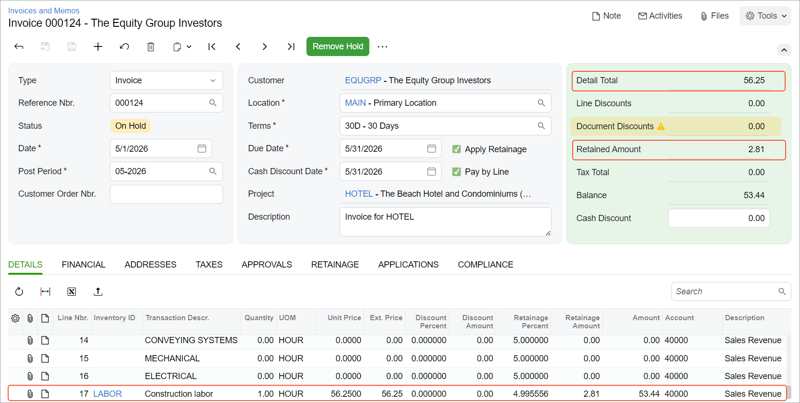

# AR Invoices with Retainage: To Perform Time and Material Billing with Retainage {#_890db2e8-7f65-4405-888b-14a63b8c5a48 .task}

This activity will walk you through the process of performing time and material billing with retainage.

**Attention:** This activity is based on the *U100* dataset. If you are using another dataset or if any system settings have been changed in *U100*, these changes can affect the workflow of the activity and the results of the processing. To avoid issues, restore the *U100* dataset to its initial state.

## Story { .section}

Suppose that the ToadGreen Building Group company is building a hotel for The Equity Group Investors. A ToadGreen project accountant bills the customer for some extra time spent on the project that initially was not budgeted for the project; as was initially agreed with the customer, 5% retainage is held on these invoices.

Acting as the project manager, you need to create a new project task, enter a project transaction that represents the extra work, and create an invoice for that work with the retained amount.

## Configuration Overview { .section}

In the *U100* dataset, the following tasks have been performed to support this activity:

-   On the [Enable/Disable Features](CS_10_00_00.md) \(CS100000\) form, the following features have been enabled:
    -   *Retainage Support*
    -   *Payment Application by Line*
    -   *Construction*
-   On the [Customers](AR_30_30_00.md#) \(AR303000\) form, the *EQUGRP* customer has been created; the **Pay by Line** and **Apply Retainage** check boxes are selected on the **General** tab for this customer.
-   On the [Account Groups](PM_20_10_00.md#) \(PM201000\) form, the *MATERIAL*, *LABOR*, and *SUBCON* account groups have been created.
-   On the [Non-Stock Items](IN_20_20_00.md#) \(IN202000\) form, the *LABOR* item has been created.
-   On the [Billing Rules](PM_20_70_00.md#) \(PM207000\) form, the *TM* billing rule has been created. The rule has three steps for billing of transactions that are posted to *MATERIAL*, *LABOR*, or *SUBCON* account groups. The calculation formula is the following: The amount of expense multiplied by 1.25 equals the billed amount for the transaction.
-   On the [Projects](PM_30_10_00.md#) \(PM301000\) form, the *HOTEL* project has been created with multiple project tasks and their budgets. On the **Summary** tab of the form, the *Standard* option is selected in the **Retainage Mode** box, and *5.00* is specified in the **Retainage \(%\)** box of the **Retainage** section.

## Process Overview { .section}

You will create a project task and assign the time and material billing rule to it on the [Projects](PM_30_10_00.md) \(PM301000\) form. You will then process a project transaction on the [Project Transactions](PM_30_40_00.md) \(PM304000\) form to record the extra work, and run project billing on the [Projects](PM_30_10_00.md) form. Then you will release the generated pro forma invoice on the [Pro Forma Invoices](PM_30_70_00.md) \(PM307000\) form. Finally, you will release the related AR invoice with retainage on the [Invoices and Memos](AR_30_10_00.md) \(AR301000\) form.

## System Preparation { .section}

To prepare to perform the instructions of this activity, do the following:

1.  Launch the Acumatica ERP website, and sign in to a company with the *U100* dataset preloaded. You should sign in as a project manager by using the *ewatson* username and the *123* password.
2.  In the info area, in the upper-right corner of the top pane of the Acumatica ERP screen, make sure that the business date in your system is set to today’s date. For simplicity, in this activity, you will create and process all documents in the system on this business date.

## Step 1: Adding a Task with a Time and Material Billing Rule { .section}

Add a task to the project by doing the following:

1.  On the [Projects](PM_30_10_00.md#) \(PM301000\) form, open the *HOTEL* project. On the **Summary** tab, notice the date in the **Next Billing Date** box. You will need to process the transaction with a date before this date.
2.  On the table toolbar of the **Tasks** tab, click **Add Row**, and add a new project task with the following settings:
    -   **Task ID**: `20`
    -   **Type**: *Cost and Revenue Task*
    -   **Description**: `Ad-hoc miscellaneous expenses`
    -   **Billing Rule**: *TM*
    -   **Status**: *Active*
3.  Click **Save** to save your changes to the project.

## Step 2: Creating and Releasing a Project Transaction { .section}

Enter and process the project transaction by doing the following:

1.  On the [Project Transactions](PM_30_40_00.md) \(PM304000\) form, add a new record.
2.  In the Summary area, make sure *PM* is selected as the **Source**.
3.  In the **Description** box, type `Miscellaneous expenses`.
4.  On the **Details** tab, click **Add Row**, and specify the following transaction details:
    -   **Project**: *HOTEL*
    -   **Project Task**: *20*
    -   **Cost Code**: *00-000*
    -   **Account Group**: *LABOR*
    -   **Inventory ID**: *LABOR*
    -   **UOM**: *HOUR*
    -   **Quantity**: `1`
    -   **Billable**: Selected
    -   **Billable Quantity**: `1`
    -   **Unit Rate**: `45`
    -   **Amount**: *45.00* \(calculated automatically\)
    -   **Date**: 4/28/2026

        **Tip:** If the next billing date differs from 5/1/2026, in this column, you should instead specify the date that is three days before the next billing date.

5.  Save the transaction.
6.  On the form toolbar, click **Release** to release the project transaction.

## Step 3: Running Project Billing { .section}

Perform billing for the entered project transaction as follows:

1.  On the [Projects](PM_30_10_00.md#) \(PM301000\) form, open the *HOTEL* project.
2.  On the form toolbar, click **Run Billing**.

    The system opens the [Pro Forma Invoices](PM_30_70_00.md#) \(PM307000\) form with the pro forma invoice that was created. On the **Time and Material** tab, review the only line, which has been created based on the project transaction that you have processed. The billed amount in the line is 56.25 \(which is calculated by using the billing rule formula, 45 \* 1.25, which is calculated by using the billing rule formula\). The retainage amount is calculated as the retainage percentage applied to the amount to invoice of the line and equals *2.81*.

3.  On the form toolbar, click **Remove Hold** to assign the pro forma invoice the *Open* status, and then click **Release** to release the pro forma invoice.
4.  On the **Financial** tab, click the **AR Ref. Nbr.** link to open the generated AR invoice on the [Invoices and Memos](AR_30_10_00.md#) \(AR301000\) form. In the invoice, which opens, make sure that the invoice has the line with an **Ext. Price** value equal to the sum of the **Amount to Invoice** value from the pro forma invoice line \(*56.25*\) and a **Retainage Amount** of *2.81*.

    

    **Attention:** The retainage percent in the AR invoice line is calculated as `Retainage Amount / Ext. Price` and thus may differ from the retainage percent of the pro forma line because of rounding differences.

5.  On the form toolbar, click **Remove Hold**, and then click **Release** to release the invoice.

You have billed a project for time and material and included the retainage amount in the invoice.

**Parent topic:**[Processing AR Invoices with Retainage](../UserGuide/Construction_ARInvoice_with_Retainage_Mapref.md)

