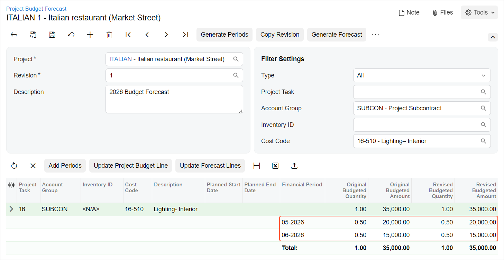

# Budget Forecasts: To Prepare a Budget Forecast {#_be7b4548-af7b-4f22-a090-997e82fddadf .task}

This activity will walk you through the process of working with a project budget forecast in a construction project.

**Attention:** This activity is based on the *U100* dataset. If you are using another dataset or if any system settings have been changed in *U100*, these changes can affect the workflow of the activity and the results of the processing. To avoid issues, restore the *U100* dataset to its initial state.

## Story { .section}

Suppose that the ToadGreen project estimator wants to prepare a budget forecast to be able to compare and analyze monthly budgets versus actual costs broken down by period. Because some work on interior lighting will be performed for the project in May and June of 2026, the project estimator wants to distribute the total lighting budget across the periods when this work is going to be performed. Also suppose that the work performed in June will cost an additional $5,000 that had not been planned in the project budget.

Acting as the project estimator, you will prepare a budget forecast for further review and analysis of budget performance.

## Configuration Overview { .section}

In the *U100* dataset, the following tasks have been performed to support this activity:

-   On the [Account Groups](PM_20_10_00.md#) \(PM201000\) form, the *SUBCON* account group has been created.
-   On the [Projects](PM_30_10_00.md#) \(PM301000\) form, the *ITALIAN* project has been created with multiple project tasks, including *16 - ELECTRICAL*. Also, on the **Cost Budgets** tab, the cost budget is defined for the line with the *16-510* cost code and the *SUBCON* account group for this project.
-   On the [Vendors](AP_30_30_00.md#) \(AP303000\) form, the *HOMEDEP* vendor has been added.

## Process Overview { .section}

To track the changes in the project budget forecast, you will create the first revision of the budget forecast on the [Project Budget Forecast](PM_20_96_00.md#) \(PM209600\) form. Then you will generate periods and distribute budget amounts across these periods. Finally, you will update the project budget and review the budgeted amounts on the [Projects](PM_30_10_00.md) \(PM301000\) form.

## System Preparation { .section}

To prepare to perform the instructions of this activity, do the following:

1.  Sign in to the company as the project estimator by using the *wendell* username and the *123* password.
2.  In the info area, in the upper-right corner of the top pane of the Acumatica ERP screen, make sure that the business date in your system is set to today’s date. For simplicity, in this activity, you will create and process all documents in the system on this business date.
3.  Open the [Enable/Disable Features](CS_10_00_00.md) \(CS100000\) form, and on the form toolbar, click **Modify**.
4.  In the *Projects* group of features, select the **Budget Forecast** check box.
5.  On the form toolbar, click **Enable**.

## Step 1: Creating the First Revision of the Project Budget Forecast { .section}

Prepare a budget forecast by doing the following

1.  On the [Projects](PM_30_10_00.md#) \(PM301000\) form, open the *ITALIAN* project.
2.  On the More menu \(under **Budget Operations**\), click **Project Budget Forecast**. The system opens the [Project Budget Forecast](PM_20_96_00.md#) \(PM209600\) form with the *ITALIAN* project selected in the Summary area.
3.  In the Summary area, in the **Revision** box, type `1`, and press Enter.

    The system displays a list of project tasks in the table.

4.  In the **Description** box, type `2026 Budget Forecast`.
5.  On the form toolbar, click **Save** to save the budget forecast revision, and click **Generate Periods**. The system adds periods to each budget line, along with the **Total** and **Delta** lines.
6.  Save the budget forecast.
7.  In the Summary area, specify the following settings:

    -   **Account Group**: *SUBCON*
    -   **Cost Code**: *16-510*
    The system filters the budget lines and displays the only line that matches the selection criteria you have specified.

8.  Click the line with the *04-**2026* period, and on the table toolbar, click **Delete Row**.
9.  Click **Save** on the form toolbar.
10. On the table toolbar, click **Add Periods**. The system opens the **Add Periods** dialog box.
11. In the **Period From** box, select *05-2026*.
12. In the **Period To** box, select *06-2026*.
13. Click **OK**. The system adds the line for the *05-**2026* and *06-2026* periods to the forecast.
14. Click **Save** on the form toolbar.

## Step 2: Distributing Amounts Across the Periods { .section}

Distribute the budget amounts by doing the following:

1.  While you are still viewing the project budget forecast on the [Project Budget Forecast](PM_20_96_00.md#) \(PM209600\) form, on the form toolbar, click **Generate Forecast**.
2.  In the **Generate Forecast** dialog box, leave the default values, and click **OK**. The system distributes the amount so that for the *05-*2026 and *06-*2026 periods, the **Original Budgeted Amount** is now *15,000*.
3.  Save the forecast.
4.  In the **Original Budgeted Amount** and **Revised Budgeted Amount** columns, for the *05-2026* period, change the specified values to *20000.00*.

    Notice that the **Delta** line has appeared in the table with the *-5000* amount specified; the total in the **Original Budgeted Amount** and **Revised Budgeted Amount** columns is now *35,000.00*.

5.  Save the forecast.
6.  On the table toolbar, click **Update Project Budget Line**.

    The **Delta** line has disappeared from the budget forecast, and the budget forecast should look as shown below. The system has updated the cost budget of the *ITALIAN* project with the **Total** value \($35,000\) for this line.

    

7.  Save the forecast.
8.  On the [Projects](PM_30_10_00.md#) \(PM301000\) form, open the *ITALIAN* project. On the **Cost Budget** tab, notice that in the line with the *16-510* cost code and the *SUBCON* account group, the value in the **Original Budgeted Amount** and **Revised Budgeted Amount** boxes has been updated and is now *35,000.00*.

You have prepared a forecast revision and updated the project budget with the forecasted values.

**Parent topic:**[Working with Project Budget Forecast](../UserGuide/Construction_Budget_Forecast_Mapref.md)

