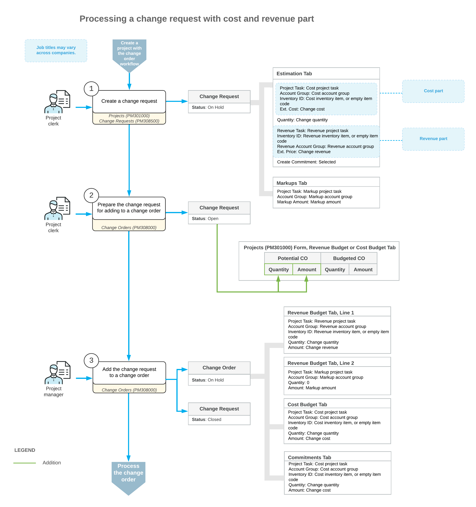

# Change Requests: General Information {#_08d07b42-a2cc-4b7f-b871-9d3032e57852 .concept}

Acumatica ERP provides a two-tier change management capability for projects:

-   Creation of change requests—detailed breakdowns of potential changes to the project budget and commitments, such as additions, deletions, or edits to the existing cost or revenue budget.
-   Grouping of multiple change requests into a single change order to be approved.

With the two-tier change management, you can also set up price markups that can be applied to an individual line of a change request and to the total amount of the document to charge the customer for the changes.

## Learning Objectives { .section}

In this chapter, you will learn how to do the following:

-   Configure a change order class that supports the two-tier change management
-   Configure default markups
-   Create a change request to update the project budget
-   Create a change order based on the change request
-   Process a change request with a cost change order
-   Process a change request with a revenue change order
-   Cancel a change request
-   Close a change request

## Applicable Scenarios { .section}

-   You need to track a project's budgeted and committed values. You'll create change requests because your project’s workflow will have a lot of small changes to the budget, but you don’t want to create a lot of change orders—for example, because of the approval required for each change order. With change requests, you can collect a lot of small changes into one or more change orders.
-   You want to charge the customer for the changes made to the project budget.

## Creation of Change Order Classes {#section_scp_3k3_cpb .section}

A change order class determines which project data—the revenue budget, the cost budget, commitments, or any combination of these—can be adjusted with a change order of this class.

Two-tier change management is controlled at the level of a change order class. If the **Two-Tier Change Management** check box is selected for a class on the [Change Order Classes](../Shared/../UserGuide/PM_20_30_00.md) \(PM203000\) form, change orders of the selected class can include change requests.

The selected check boxes on the form determine how change orders of the class are processed:

-   Cost-only change orders for change requests: The **Revenue Budget** check box is cleared, and the **Cost Budget** and **Commitments** check boxes are selected.
-   Revenue change orders: The **Revenue Budget**, **Cost Budget**, and **Commitments** check boxes are selected.

For revenue change orders, you can release the cost budget and create commitments before releasing revenue budget changes. For details, see [Single-Tier Change Management: Releasing Costs Only](../Shared/../UserGuide/Projects_CO_Cost_Release.md).

If the project cost budget and commitments affected by a change request need to be updated through a separate change order before the revenue part has been approved, for this change request, you process a cost change order and a revenue change order.

A cost change order is a change order that contains only the cost and commitment parts of the change request based on the settings of the selected change order class. This change order created for a change request is shown in the **Cost Change Order Nbr.** box in the Summary area of the [Change Requests](../Shared/../UserGuide/PM_30_85_00.md) form.

A revenue change order is a change order that contains the revenue part of the change request as well as all types of estimation lines—that is, revenue budget lines, cost budget lines, and commitment lines. This change order created for a change request is shown in the **Change Order Nbr.** box in the Summary area of the [Change Requests](../Shared/../UserGuide/PM_30_85_00.md) form.

## Creation of Change Requests { .section}

To make it possible for users to track changes for a particular project by using change requests along with change orders, you select the **Change Order Workflow** check box on the **Summary** tab of the [Projects](../Shared/../UserGuide/PM_30_10_00.md) \(PM301000\) form for the project. Then you can create a change request for the project on the [Projects](../Shared/../UserGuide/PM_30_10_00.md) form by clicking **Create Change Request** on the form toolbar. The system creates a change request with the *On Hold* status and the project selected and opens it on the [Change Requests](../Shared/../UserGuide/PM_30_85_00.md) \(PM308500\) form.

**Important:** In addition to creating a change request from the [Projects](../Shared/../UserGuide/PM_30_10_00.md) form for the selected project, you can create a new change request directly on the [Change Requests](../Shared/../UserGuide/PM_30_85_00.md) form and select the needed project.

In a change request with the *On Hold* status, on the **Estimation** tab of the [Change Requests](../Shared/../UserGuide/PM_30_85_00.md) form, you add rows with potential changes that will affect the revenue budget and the cost budget of the selected project when the related change orders are released. For each estimation line, you specify the following settings:

-   The **Project Task**, **Account Group**, and **Inventory ID** that represent the cost budget line to be updated or created if this combination of settings does not exist in the project budget
-   The **Revenue Task** and **Revenue Account Group** that represent the revenue budget line to be updated or created if this combination of settings does not exist in the project budget
-   The **Quantity**, **Unit Cost**, **Unit Price**, and **UOM** that estimate the change to the budget
-   Optionally, the **Create Commitment** and **Vendor** if you want to create a commitment line based on this estimation line

The amount in the **Ext. Cost** column estimates the change of the cost and is calculated as follows:

`Ext. Cost = Quantity * Unit Cost`

The amount in the **Line Amount** column estimates the change of the revenue and is calculated as follows:

`Line Amount = Ext. Price + Ext. Price * Line Markup (%) / 100`, where

`Ext. Price = Quantity * Unit Price`

`Unit Price = Unit Cost + Unit Cost * Price Markup (%) / 100`

Once you have saved a change request with the *Open* status, the **Quantity** and **Ext. Cost** values of each estimation line increase the **Potential CO Quantity** and **Potential CO Amount** of the corresponding cost budget line of the project on the [Projects](../Shared/../UserGuide/PM_30_10_00.md) form. The **Quantity** and **Line Amount** values of each estimation line increase the **Potential CO Quantity** and **Potential CO Amount** of the corresponding revenue budget line of the project.

## Adding of a Change Request to a Change Order { .section}

On the [Change Requests](../Shared/../UserGuide/PM_30_85_00.md) \(PM308500\) form, you can create a change order for the selected change request by clicking the **Create Change Order** button on the form toolbar. On the [Change Orders](../Shared/../UserGuide/PM_30_80_00.md) \(PM308000\) form, you can also add one or several change requests to the selected change order by clicking **Add Change Requests** on the table toolbar of the **Change Requests** tab.

Based on each estimation line of the change request added to a change order and on the selected change order class, the system creates the following lines for the change order on the [Change Orders](../Shared/../UserGuide/PM_30_80_00.md) form:

-   A cost budget line on the **Cost Budget** tab with **Quantity** and **Amount** values equal to the quantity and extended cost of the estimation line
-   A revenue budget line on the **Revenue Budget** tab with **Quantity** and **Amount** values equal to the quantity and line amount of the estimation line
-   A commitment line on the **Commitments** tab with **Quantity** and **Amount** values equal to the quantity and extended cost of the estimation line if the estimation line has **Create Commitment** check box selected on the [Change Requests](../Shared/../UserGuide/PM_30_85_00.md) form
-   A markup revenue budget line on the **Revenue Budget** tab with the **Amount** equal to the markup amount of this markup line. The system creates a separate line for the markup amount if the change request has a markup line with the project task and account group on the **Markups** tab of the [Change Requests](../Shared/../UserGuide/PM_30_85_00.md) form but has no estimation line with the same revenue task and revenue account group on the **Estimation** tab. Otherwise, the markup amount is added to the existing revenue budget line created based on the estimation line.

Most commonly, a change request relates to a change order that contains both cost estimation lines and revenue estimation lines. Once you have added the change request to the change order, the change request is assigned the *Closed* status. However, in some cases, you may need to process and release the cost change order as early as necessary to create commitments and change the project cost budget accordingly, while the revenue change order may require customer approval and needs to be processed separately.

When both the cost part and the revenue part of a change request have been linked to change orders, the system assigns the *Closed* status to the change request. If the customer has not approved the revenue part of the change request, you do not need to create a revenue change order and can manually close the change request for which the cost change order has been created. To do this, you click **Close** on the form toolbar of the [Change Requests](../Shared/../UserGuide/PM_30_85_00.md) form to assign the change request the *Closed* status.

**Tip:** You can also cancel a change request by clicking **Cancel** on the form toolbar of the [Change Requests](../Shared/../UserGuide/PM_30_85_00.md) form to indicate that the changes will not be processed further. This will assign the change request the *Canceled* status and decrease the potential CO values in the project budget.

For information on further processing of change orders, see [Single-Tier Change Management: General Information](../Shared/../UserGuide/Projects_CO_GeneralInfo.md).

## Workflow of Processing a Change Request {#section_i2l_d4p_mcb .section}

The following diagram illustrates the workflow of processing a change request.

**Parent topic:**[Tracking Changes in Construction Projects](../UserGuide/Construction_Change_Management_Mapref.md)

