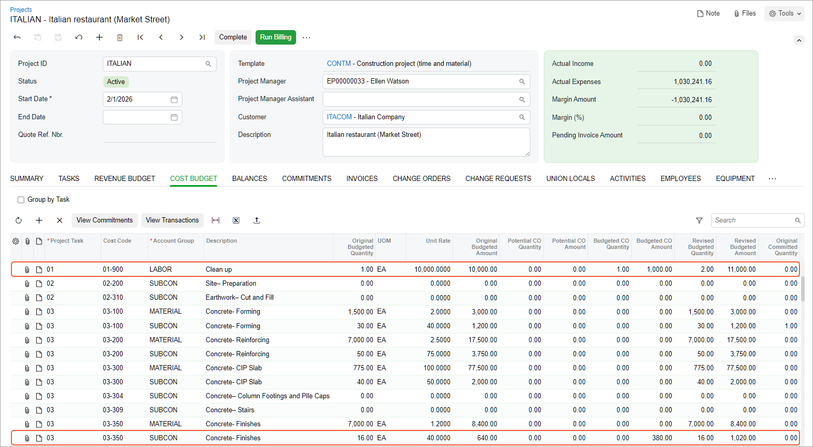

# Change Requests: To Process Cost-Only Changes to a Project {#_8f22e2b2-de72-4785-b9dd-0536cf6673b4 .task}

The following activity will walk you through the process of managing changes to the construction project by using the two-tier change management workflow.

## Story {#section_qlc_b15_gnb .section}

Suppose that ToadGreen is a general contractor building an Italian restaurant for the Italian Company, its customer. The ToadGreen project manager has created a project for the work to be performed, and the budget has been agreed on with the customer. The construction work has been started. Further suppose that on March, 21, 2026, an on-site worker found out that the wet subfloor in the building needs to be dried, cleaned, and aired out, and this worker has notified the project manager about this.

After reviewing the damages, the project manager has decided to hire a subcontractor, Acme Doors &amp; Glass, to perform this work. The subcontractor notifies the project manager that four working days are needed for completing the cleaning. The customer for which the project is being performed did not approve the changes because the damages were the workers' fault.

Acting as the project manager, you need to reflect the additional work in the cost project budget and cancel the changes in the revenue budget.

## Configuration Overview {#section_k44_tw5_gnb .section}

In the *U100* dataset, the following tasks have been performed to support this activity:

-   On the [Enable/Disable Features](CS_10_00_00.md) \(CS100000\) form, the *Construction* and *Change Orders* features have been enabled.
-   On the [Account Groups](PM_20_10_00.md) \(PM201000\) form, the *REVENUE* account group has been configured.
-   On the [Projects](PM_30_10_00.md) \(PM301000\) form, the *ITALIAN* project has been configured; the project tasks have been created, along with the related cost and revenue budget.

## Process Overview {#section_edh_gzf_3nb .section}

You will create a change request on the [Change Requests](PM_30_85_00.md) \(PM308500\) form. After that, you will create a change order for this change request on the [Change Orders](PM_30_80_00.md) \(PM308000\) form and add commitments to this change order. Then you will make sure that the processed documents are correctly reflected in the cost budget of the project. Finally, you will manually close the change request on the [Change Requests](PM_30_85_00.md) form to indicate that revenue part does not require processing.

## System Preparation {#section_ypj_3j5_gnb .section}

To prepare to perform the instructions of this activity, do the following:

1.  As a prerequisite activity, complete the [Change Requests: To Configure Project Markups](Construction_Change_Management_Implem_Activity_Project_Markups.md) to define the markups for the project.
2.  Sign in to a company with the *U100* dataset preloaded. You should sign in as project manager by using the *ewatson* username and the *123* password.
3.  In the info area, in the upper-right corner of the top pane of the Acumatica ERP screen, make sure that the business date in your system is set to *3/21/2026*. If a different date is displayed, click the Business Date menu button, and select *3/21/2026* on the calendar. For simplicity, in this activity, you will create and process all documents in the system on this business date.

## Step 1: Creating a Change Request {#section_tlc_b15_gnb .section}

Create the change request that records the planned work to be performed as follows:

1.  On the [Change Requests](PM_30_85_00.md) \(PM308500\) form, add a new record.
2.  In the Summary area, specify the following settings:
    -   **Project**: *ITALIAN*
    -   **Change Date**: *3/21/2026*
    -   **Contract Change \(Days\)**: `4`
    -   **Description**: `Work on wet subfloor`
3.  On the **Detailed Description** tab, type `Wet subfloor needs to be dried, cleaned, and aired out.`
4.  On the **Estimation** tab, add a line with the following settings:
    -   **Project Task**: `01`
    -   **Account Group**: *LABOR*
    -   **Cost Code**: `01-900`
    -   **Quantity**: `1`
    -   **UOM**: *EA*
    -   **Unit Cost**: `1000`
    -   **Price Markup \(%\)**: `10`
    -   **Revenue Task**: `01`
    -   **Revenue Account Group**: *REVENUE*
    -   **Revenue Code**: `01-000`
5.  Add one more line with the following settings:
    -   **Project Task**: `03`
    -   **Account Group**: *SUBCON*
    -   **Cost Code**: `03-350`
    -   **Quantity**: `10`
    -   **UOM**: *HOUR*
    -   **Unit Cost**: `38`
    -   **Price Markup \(%\)**: `10`
    -   **Revenue Task**: `03`
    -   **Revenue Account Group**: *REVENUE*
    -   **Revenue Code**: `03-000`
    -   **Vendor**: *SUNTECH*
    -   **Create Commitment**: Selected
6.  In the Summary area, make sure that the **Cost Total** is *1380*.
7.  Save the change request.
8.  On the form toolbar, click **Remove Hold**. The change request now has the *Open* status.

    **Tip:** In production use, you can configure an approval map for change requests and specify it in the **Change Request Approval Map** box on the **Approval** tab of the [Projects Preferences](PM_10_10_00.md) \(PM101000\) form, so that the responsible person will need to approve the change request before it is assigned the *Open* status.

## Step 2: Processing the Change Order {#section_ulc_b15_gnb .section}

To create and process a change order, do the following:

1.  On the [Change Orders](PM_30_80_00.md) \(PM308000\) form, create a new record.
2.  In the **Class** box in the Summary area, select *INTERNAL*. This is the class of change orders that is used for processing the cost part of the changes.
3.  In the **Project** box, select *ITALIAN*.
4.  In the **Description** box, type `Additional costs for the Italian Restaurant`.
5.  On the table toolbar of the **Change Requests** tab, click **Add Change Requests**.
6.  In the **Add Change Requests** dialog box, which opens, select the unlabeled check box in the row of the change request that you created earlier \(*Work on wet subfloor*\), and then click **Add &amp; Close**. The system adds the line with the change request to the table on the **Change Requests** tab and specifies the cost budget and commitment details on the **Cost Budget** tab and the **Commitments** tab, respectively. The change request still has the *Open* status because the revenue part of this change request has not yet been processed.
7.  On the **Cost Budget** tab, make sure that the cost budget lines with the *01-900* and *03-350* cost codes have been added.
8.  On the **Commitments** tab, make sure that the potential commitment with the amount of $380 has been added for the change order. The line has *New Document* in the **Status** column, which means that a new document will be prepared when the change order is released.
9.  In the **Commitment Type** column of the only line on the **Commitments** tab, change the type of the commitment to be prepared to *Subcontract*.
10. On the form toolbar, click **Remove Hold**. The system saves the change order and assigns it the *Open* status.
11. On the form toolbar, click **Release** to release the change order.

## Step 3: Reviewing the Project Budget {#section_tc1_c5f_3nb .section}

Make sure that the change order has updated the project budget by doing the following:

1.  On the [Projects](PM_30_10_00.md) \(PM301000\) form, open the *ITALIAN* project.
2.  On the **Cost Budget** tab, review the amounts in the budget lines, and notice that they have been moved from the **Potential CO Amount** column to the **Budgeted CO Amount** column, and the system has also updated the amounts in the **Revised Budgeted Amount** column.

    

3.  On the **Revenue Budget** tab, review the amounts in the budget lines with the *01-000*, *02-000*, and *03-000* cost codes, and notice that the change request values are still included in the potential values.

## Step 4: Closing the Change Request {#section_kmm_mtn_r5b .section}

To clean up the potential values in the revenue budget of the project, while you are still reviewing the project on the [Projects](PM_30_10_00.md) \(PM301000\) form, do the following:

1.  On the **Change Requests** tab, click the link in the **Reference Nbr.** column of the only row.
2.  On the form toolbar of the [Change Requests](PM_30_85_00.md) \(PM308500\) form, which opens, click **Close**. The system assigns the change request the *Closed* status.
3.  Return to the *ITALIAN* project on the [Projects](PM_30_10_00.md) form. Press Esc to refresh the form.
4.  On the **Revenue Budget** tab, review the amounts in the budget lines with the *01-000*, *02-000*, and *03-000* cost codes, and notice that the potential CO values in all the lines have been decreased to *0*.

You have completed the processing of a change order and processed the cost part of the change request for the project.

**Parent topic:**[Tracking Changes in Construction Projects](../UserGuide/Construction_Change_Management_Mapref.md)

