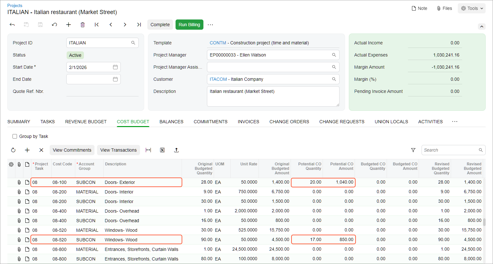

# Change Requests: To Process Cost and Revenue Changes to a Project {#_596c7889-8ba8-45bf-8bd4-6b951e151e33 .task}

The following activity will walk you through the processing of extra costs and revenues for the project by using the two-tier change management workflow.

## Story {#section_qlc_b15_gnb .section}

Suppose that ToadGreen Building Group is a general contractor building an Italian restaurant for the Italian Company customer. The ToadGreen project accountant has created a project for the work to be performed and the budget has been agreed upon with the customer. The construction work has been started.

Then suppose that on April, 15, 2026, a worker of a subcontractor, Acme Doors &amp; Glass, arrived at the construction site to perform cleaning work. The worker found out that the French-style window specified in the plans does not fit the framed opening and notified the ToadGreen project manager about this. The project manager has estimated that five days will be needed to fix this issue, and this will cost $3,500. Also, the ToadGreen manager has decided to add an extra markup in the amount of $1,450 for the work to be performed.

Acting as the project manager, you need to agree upon the cost budget with the engineer and the revenue budget with the customer. For this purpose, you will prepare a change request with the related project issue, and then process the cost change order along with the related commitments to make changes to the project cost budget. After the work is finished in June, you will process the revenue change order to record the revenue.

## Configuration Overview {#section_k44_tw5_gnb .section}

In the *U100* dataset, the following tasks have been performed to support this activity:

-   On the [Enable/Disable Features](CS_10_00_00.md) \(CS100000\) form, the *Construction* and *Change Orders* features have been enabled.
-   On the [Account Groups](PM_20_10_00.md) \(PM201000\) form, the *REVENUE* account group has been configured.
-   On the [Projects](PM_30_10_00.md) \(PM301000\) form, the *ITALIAN* project has been configured. For the project, the **Change Order Workflow** check box is selected on the **Summary** tab.
-   On the [Project Management Classes](PJ_20_10_00.md) \(PJ201000\) form, the *FIELD* class has been created to provide the default settings for project issues.

## Process Overview {#section_edh_gzf_3nb .section}

You will create a change request on the [Change Requests](PM_30_85_00.md) \(PM308500\) form; also, you will create a project issue to be linked to this request on the [Project Issue](PJ_30_20_00.md) \(PJ302000\) form. You will create a change order for the cost part of the change request on the [Change Orders](PM_30_80_00.md) \(PM308000\) form. After that, you will create a second change order for the revenue part of the change request. Finally, you will make sure that the processed documents are correctly reflected in the cost and revenue budgets of the project.

## System Preparation {#section_ypj_3j5_gnb .section}

To prepare to perform the instructions of this activity, do the following:

1.  As a prerequisite activity, complete the [Change Requests: To Configure Project Markups](Construction_Change_Management_Implem_Activity_Project_Markups.md) to define the markups for the project.
2.  Sign in to a company with the *U100* dataset preloaded. You should sign in as construction project manager by using the *ewatson* username and the *123* password.
3.  In the info area, in the upper-right corner of the top pane of the Acumatica ERP screen, make sure that the business date in your system is set to *4/15/2026*. If a different date is displayed, click the Business Date menu button, and select *4/15/2026* on the calendar. For simplicity, in this activity, you will create and process all documents in the system on this business date.
4.  Download the [Window-Rough-Openings.jpg](Files/Window-Rough-Openings.jpg) file to your device.

## Step 1: Creating a Change Request with the Related Project Issue {#section_nyt_mz5_gnb .section}

Create a change request and a project issue by doing the following:

1.  On the [Change Requests](PM_30_85_00.md) \(PM308500\) form, add a new record.
2.  In the Summary area, specify the following settings:
    -   **Project**: *ITALIAN*
    -   **Change Date**: *4/15/2026*
    -   **Contract Change \(Days\)**: `4`
    -   **Description:** `Issue with French-style window`
3.  Click the magnifier button in the **Project Issue** box.
4.  In the lookup table that opens, click the Add New Record button \(**+**\).
5.  On the [Project Issue](PJ_30_20_00.md) \(PJ302000\) form, which opens with the new project issue, specify the following settings:
    -   **Class ID**: *FIELD*
    -   **Summary**: `French Style Window doesn't fit in framed opening`
    -   **Project**: *ITALIAN*
    -   **Owner**: *Ricky Thompson*
    -   **Schedule Impact \(Days\)**: Selected
    -   **Schedule Impact \(Days\)**: `5`
    -   **Cost Impact**: Selected
    -   **Cost Impact**: `3500`
    -   **Details** \(tab\): `The ACME DOORS & Glass on-site worker reported that the French-style window specified on the plans does not fit in the framed opening.`
6.  Click **Save &amp; Close** on the form toolbar to return to the change request on the [Change Requests](PM_30_85_00.md) form. Make sure that the reference number of the created project issue is shown in the **Project Issue** box in the Summary area of the form.
7.  On the **Detailed Description** tab, type: `The ACME DOORS & Glass on-site worker reported that the French-style window specified on the plans does not fit in framed opening. This needs to be addressed with the engineer, architect, and subcontractors.`
8.  Save the change request.
9.  Click **Files** on the form title bar. The **Files** dialog box opens.
10. Click **Upload Files**, navigate to the `Window-Rough-Openings.jpg` file, and select this file. The system uploads the file.
11. Close the **Files** dialog box. On the form title bar, notice **Files \(1\)**, which indicates that the image has been attached to the change request.
12. On the **Estimation** tab, enter a line with the following settings:
    -   **Project Task**: `08`
    -   **Inventory ID**: *SUBCONTR*
    -   **Account Group**: *SUBCON*
    -   **Cost Code**: `08-100`
    -   **Quantity**: `20`
    -   **UOM**: *EA*
    -   **Unit Cost**: `52`
    -   **Price Markup \(%\)**: `7`
    -   **Revenue Task**: `08`
    -   **Revenue Account Group**: *REVENUE*
    -   **Revenue Code**: `08-000`
    -   **Vendor**: *ACMEDO*
    -   **Create Commitment**: Selected
13. Enter another line with the following settings:
    -   **Project Task**: `08`
    -   **Inventory ID**: *SUBCONTR*
    -   **Account Group**: *SUBCON*
    -   **Cost Code**: `08-520`
    -   **Quantity**: `17`
    -   **UOM**: *EA*
    -   **Unit Cost**: `50`
    -   **Price Markup \(%\)**: `7`
    -   **Revenue Task**: `08`
    -   **Revenue Account Group**: *REVENUE*
    -   **Revenue Code**: `08-000`
    -   **Vendor**: *ACMEDO*
    -   **Create Commitment**: Selected
14. On the form toolbar, click **Remove Hold**. The system saves the change request with the *Open* status.
15. On the [Projects](PM_30_10_00.md) \(PM301000\) form, open the *ITALIAN* project, and on the **Change Requests** tab, make sure that the change request is now shown in the table.
16. On the **Cost Budget** tab, review the cost budget lines. In the *08-100 \(Doors - Exterior\)* line with the *SUBCON* account group, and in the *08-520 \(Windows - Wood\)* line with the *SUBCON* account group, based on the amount and quantity of the change request, the system has updated the values in the **Potential CO Quantity** and **Potential CO Amount** columns \(see below\).

    

## Step 2: Processing the Cost Part of the Change Request {#section_ulc_b15_gnb .section}

Process the cost change order for the change request by doing the following:

1.  On the [Change Orders](PM_30_80_00.md) \(PM308000\) form, add a new record.
2.  In the Summary area, specify the following settings:
    -   **Class**: *INTERNAL*
    -   **Project**: *ITALIAN*
    -   **Change Date**: *4/15/2026*
    -   **Approval Date**: *4/15/2026*
    -   **Description**: `Extra costs for the Italian Restaurant project`
3.  On the **Change Requests** tab, click **Add Change Requests** on the table toolbar.
4.  In the **Add Change Requests** dialog box, which opens, select the unlabeled check box in the row of the change request you created earlier \(*Issue with French-style window*\), and then click **Add &amp; Close**. The system adds the line with the change request to the table on the **Change Requests** tab and specifies cost budget and commitment details on the **Cost Budget** tab and the **Commitments** tab, respectively.
5.  On the form toolbar of the [Change Orders](PM_30_80_00.md) form, click **Remove Hold**, and then click **Release** to release the change order.
6.  On the **Change Requests** tab, notice that the status of the change request is still *Open*, because the revenue part of the change request has not been processed yet.

## Step 3: Processing the Revenue Part of the Change Request {#section_m1z_mt5_3nb .section}

Process the revenue part of the change request by doing the following:

1.  On the [Change Orders](PM_30_80_00.md) \(PM308000\) form, create a new change order.
2.  In the Summary area, specify the following settings:
    -   **Class**: *EXTERNAL*
    -   **Project**: *ITALIAN*
    -   **Change Date**: *6/29/2026*
    -   **Approval Date**: *6/29/2026*
    -   **Description**: `Additional revenues for the Italian Restaurant project`
3.  Add the remaining revenue part of the previously created change request as follows:
    1.  On the **Change Requests** tab, click **Add Change Requests**, which opens the **Add Change Requests** dialog box.
    2.  In the dialog box, select the unlabeled check box for the *Issue with French-style window* change request.
    3.  Click **Add &amp; Close**.
4.  Save the change order. On the **Revenue Budget** tab, make sure that two revenue budget lines \(with the *02-000* cost code and *08-000* cost code\) have been added. The line with the *02-000* cost code is the result of the markups being applied to the change request. Notice that on the **Cost Budget** tab and the **Commitments** tab, there are no lines, because you have already processed the cost part of the change request.
5.  On the **Change Requests** tab, make sure that the change request is now closed \(and has *Closed* in the **Status** box\).
6.  On the form toolbar, click **Remove Hold**, and then click **Release** to release the change order.
7.  On the [Projects](PM_30_10_00.md) \(PM301000\) form, open the *ITALIAN* project.
8.  On the **Revenue Budget** tab, review the revenue budget lines. Make sure the values in the **Budgeted CO Amount** column for the lines with the *02-000* and *08-000* cost code have been updated with the amounts from the change order \(*1,574.58* and *2,022.30*, respectively\).

You have finished the processing of a change request with cost and revenue parts.

**Parent topic:**[Tracking Changes in Construction Projects](../UserGuide/Construction_Change_Management_Mapref.md)

