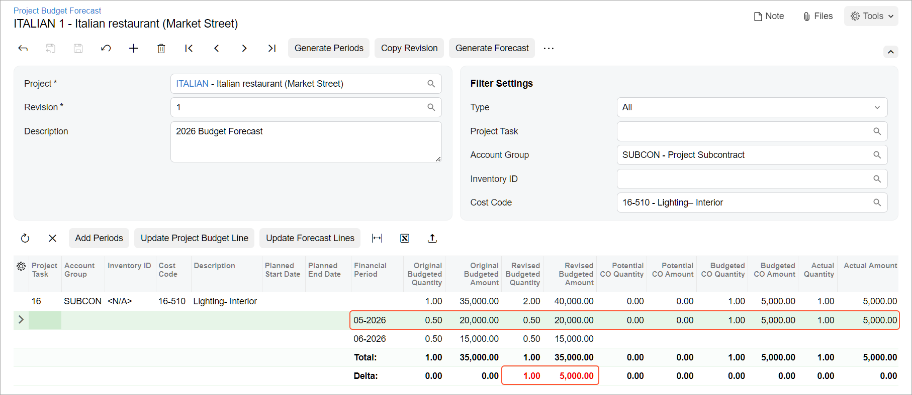

# Change Requests: To Track Changes in the Budget Forecast {#_02bef859-6e22-4666-a84c-2dff927ce3e8 .task}

The following activity will walk you through the process of tracking changes in project budget forecasts.

## Story {#section_jk4_mq2_knb .section}

Suppose that for the restaurant that is being built by the ToadGreen company, some additional work is needed on interior lighting. The work will be performed in July 2026 and will cost an additional $5000 that had not been planned in the project budget. This work must be added to the project budget through the processing of a change order and the related subcontract.

Acting as a project manager, you will create and release the needed documents, and review how these documents affect the budget forecast.

## Configuration Overview {#section_ugy_xq2_knb .section}

In the *U100* dataset, the following tasks have been performed to support this activity:

-   The *Budget Forecast* and *Change Orders* features have been enabled on the [Enable/Disable Features](CS_10_00_00.md) \(CS100000\) form.
-   On the [Account Groups](PM_20_10_00.md#) \(PM201000\) form, the *SUBCON* account group has been created.
-   On the [Projects](PM_30_10_00.md#) \(PM301000\) form, the *ITALIAN* project has been created with multiple project tasks, including the *16 - ELECTRICAL* project task. Also, on the **Cost Budgets** tab, the cost budget has been defined for the line with the *16-510* cost code and the *SUBCON* account group.
-   On the [Vendors](AP_30_30_00.md#) \(AP303000\) form, the *HOMEDEP* vendor has been added.

## Process Overview {#section_yr4_4q2_knb .section}

To track the changes in the project, you will create and release a change order related to the project on the [Change Orders](PM_30_80_00.md#) \(PM308000\) form; then you will track the changes in the forecast revision. On the [Bills and Adjustments](AP_30_10_00.md#) \(AP301000\) form, you will prepare a bill for the subcontract prepared on release of the change order. Finally, you will review the changes in the forecast revision on the [Project Budget Forecast](PM_20_96_00.md#) \(PM209600\) form.

## System Preparation {#section_t3h_cr2_knb .section}

To prepare to perform the instructions of this activity, do the following:

1.  As a prerequisite activity, prepare a project budget forecast by performing the actions described in the [Budget Forecasts: To Prepare a Budget Forecast](Construction_Budget_Forecast_Process_Activity.md).
2.  Launch the Acumatica ERP website, and sign in to a company with the *U100* dataset preloaded. You should sign in as a construction project manager by using the *ewatson* username and the *123* password.
3.  In the info area, in the upper-right corner of the top pane of the Acumatica ERP screen, make sure that the business date in your system is set to *5/19/2026*. If a different date is displayed, click the Business Date menu button, and select *5/19/2026* on the calendar. For simplicity, in this activity, you will create and process all documents in the system on this business date.

## Step 1: Processing a Change Order for a Project {#section_slb_bq2_knb .section}

Process a change order by doing the following:

1.  On the [Change Orders](PM_30_80_00.md#) \(PM308000\) form, add a new record.
2.  In the Summary area, make sure *DEFAULT* is specified in the **Class** box.
3.  In the **Project** box, select *ITALIAN*.
4.  In the **Change Date** box, specify *5/19/2026*.
5.  In the **Approval Date** box, specify *5/19/2026*.
6.  In the **Description** box, type `Additional lighting services`.
7.  On the **Cost Budget** tab, add a row with the following settings:
    -   **Project Task**: `16`
    -   **Cost Code**: `16-510`
    -   **Account Group**: *SUBCON*
    -   **Quantity**: `1`
    -   **UOM**: *EA*
    -   **Unit Rate**: `5000`
8.  On the **Commitments** tab, add a row with the following settings:

    -   **Status**: *New Document* \(specified automatically\)
    -   **Project Task**: `16`
    -   **Cost Code**: `16-510`
    -   **Inventory ID**: *SUBCONTR*
    -   **Quantity**: `1`
    -   **UOM**: *EA*
    -   **Unit Cost**: `5000`
    -   **Vendor**: *HOMEDEP*
    -   **Commitment Type**: *Subcontract*
    Based on this line, the system will create a new subcontract to record a commitment to the project.

9.  On the form toolbar, click **Remove Hold**, and then click **Release**. The system releases the change order and assigns it the *Closed* status.
10. On the [Project Budget Forecast](PM_20_96_00.md#) \(PM209600\) form, select *ITALIAN* in the **Project** box, and select *1* in the **Revision** box.
11. In the **Filtering Settings** section, specify the following settings:

    -   **Account Group**: *SUBCON*
    -   **Cost Code**: *16-510*
    The system displays the only budget line that matches the selection criteria that you have specified.

12. In the **Budgeted CO Amount** column, for the *05*-*2026* period, notice that the amount specified in the change order \(*5000*\) has appeared. \(Potential values are reflected in the financial period of the change date of the change order.\)

## Step 2: Processing a Bill for the Subcontract {#section_m3b_bq2_knb .section}

Process a bill for the subcontract by doing the following:

1.  On the [Subcontracts](SC_30_10_00.md) \(SC301000\) form, open the subcontract to the *HOMEDEP \(Bellevue Home Depot\)* vendor dated *5/19/2026*, which the system automatically created on release of the change order.
2.  On the form toolbar, click **Enter AP Bill**.

    The system opens the [Bills and Adjustments](AP_30_10_00.md#) \(AP301000\) form, where it has created a new bill and copied the corresponding settings of the subcontract to it.

3.  In the **Date** box in the Summary area, specify *5/30/*2026.
4.  On the form toolbar, click **Remove Hold**, and then click **Release** to release the bill.
5.  On the [Project Budget Forecast](PM_20_96_00.md#) \(PM209600\) form, select *ITALIAN* in the **Project** box, and select *1* in the **Revision** box.
6.  In the Summary area, specify the following settings:

    -   **Account Group**: *SUBCON*
    -   **Cost Code**: *16-510*
    Review the forecast lines, and notice that the system has updated the budgeted and actual amounts for the *05-2026* period, as shown below.

    

    Notice that the value in the **Delta** line for the actual amount is highlighted in red. This means that a period for which an actual amount exists is not displayed in the forecast.

You have updated the actual values of the project and reviewed how these updates have affected the project budget forecast.

**Parent topic:**[Tracking Changes in Construction Projects](../UserGuide/Construction_Change_Management_Mapref.md)

