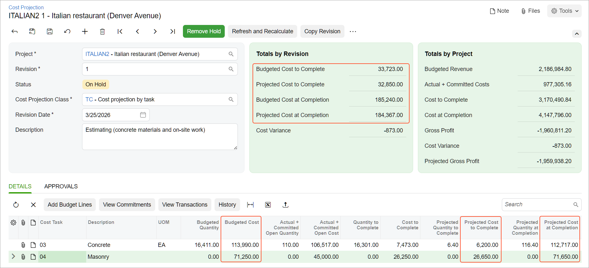

# Project Cost Projections: To Prepare a Cost Projection Revision {#_e9fd5472-2b33-4d63-a010-7276b150e28d .task}

This activity will walk you through the process of estimating the planned costs of a project that is in progress.

**Attention:** This activity is based on the *U100* dataset. If you are using another dataset or if any system settings have been changed in *U100*, these changes can affect the workflow of the activity and the results of the processing. To avoid issues, restore the *U100* dataset to its initial state.

## Story { .section}

Suppose that the ToadGreen company is building an Italian restaurant for the Italian Company, its customer, and is in the middle of the lifecycle of the construction project. The project manager analyzes the current project state and notices the following:

-   For the purchases of concrete and on-site work for the project, $6,200 has to be spent; after that, the work will be finished, and the corresponding project tasks will be considered as completed.
-   For the masonry work, $26,650 has to be spent to complete the on-site work. The project manager wants to know the exact details of the costs to be incurred for the completion of the task.

In response to the project manager's request, the ToadGreen project estimator needs to analyze the current state of the project and estimate how the planned expenses will affect the project budget. Then the project estimator should prepare a construction bonding report with the projected amounts related to masonry work.

Acting as the project estimator, you will prepare a cost projection revision for the project.

## Configuration Overview {#section_k44_tw5_gnb .section}

In the *U100* dataset, the following tasks have been performed to support this activity:

-   On the [Enable/Disable Features](CS_10_00_00.md) \(CS100000\) form, the *Construction* feature has been enabled.
-   On the [Projects](PM_30_10_00.md#) \(PM301000\) form, the *ITALIAN2* project has been created with the *03* and *04* project tasks in the cost budget of the project. The *Task and Cost Code* option is specified in the **Cost Budget Level** box on the **Summary** tab for the project. The cost budget has been defined, including the lines with the *03-100*, *03-200*, *03-300*, *03-350*, *04-220*, and *04-700* cost codes.
-   On the [Cost Projection Classes](PM_20_35_00.md) \(PM203500\) form, the *TC* and *TAC* cost projection classes have been created:
    -   The *TC* cost projection class provides cost projections at the task level of detail \(that is, in a cost projection revision, the budget lines with the same task are consolidated\).
    -   The *TAC* cost projection class provides the same level of detail as the cost project budget of the *ITALIAN2* project.

## Process Overview { .section}

In this activity, you will create a cost projection revision on the [Cost Projection](PM_30_50_00.md) \(PM305000\) form and add budget lines to the projection. Then you will select the calculation mode, update the projected values, and review how this update affects the budgeted values. Finally, you will release the cost projection revision and prepare the construction bonding report for the project, which will include the projected values, on the [Construction Bonding Report](PM_65_05_00.md) \(PM650500\) form.

## System Preparation { .section}

To prepare to perform the instructions of this activity, do the following:

1.  Launch the Acumatica ERP website and sign in to a company with the *U100* dataset preloaded. You should sign in as the project estimator by using the *wendell* username and the *123* password.
2.  In the info area, in the upper-right corner of the top pane of the Acumatica ERP screen, make sure that the business date in your system is set to *3/25/2026*. If a different date is displayed, click the Business Date menu button, and select *3/25/2026* on the calendar. For simplicity, in this activity, you will create and process all documents in the system on this business date.

## Step 1: Creating a Cost Projection Revision { .section}

To create the first cost projection revision for the *ITALIAN2* project, do the following:

1.  On the [Cost Projection](PM_30_50_00.md) \(PM305000\) form, add a new record.
2.  In the Summary area, specify the following settings:
    -   **Project**: *ITALIAN2*
    -   **Revision**: `1`
    -   **Cost Projection Class**: *TC*

        A cost projection class selected for the project must provide the same budget detail level as that of the project, or it can be less detailed. The selected cost projection class has a less detailed budget level than the project budget, so you can estimate values summed by tasks.

    -   **Description**: `Estimating (concrete materials and on-site work)`

## Step 2: Adding Budget Lines { .section}

To add the budget lines to be estimated, while you are still viewing the [Cost Projection](PM_30_50_00.md) \(PM305000\) form with the *ITALIAN2* project selected, do the following:

1.  On the table toolbar of the **Details** tab, click **Add Budget Lines**.
2.  In the **Add Budget Lines** dialog box, which opens, select the unlabeled check boxes in the lines with the *03* and *04* project tasks, and click **Add Lines &amp; Close**. The system adds the budget lines to the cost projection revision.
3.  In the **Description** column of the line with the *03* cost task, type `Concrete`. This is the consolidated line to which the system grouped all cost budget lines with the *03-100*, *03-200*, *03-300*, and *03-350* cost codes because you have selected the cost projection class with the cost task level of detail for the cost projection revision.
4.  In the **Description** column of the line with the *04* cost task, type `Masonry`. This is the consolidated line to which the system grouped all cost budget lines with the *04-220* and *04-700* cost codes. Review the amounts in the lines and notice the following:
    -   In the **Budgeted Cost** column, the budgeted cost is *113,990* for the *Concrete* line, and *71,250* for the *Masonry* line. The same values are shown in the **Projected Cost at Completion** column.
    -   In the **Actual + Committed Open Cost** column, the actual cost is *106,517* for the *Concrete* line, and *45,000* for the *Masonry* line. These values are the sums of the actual amounts and committed open amounts for the corresponding budget lines.
    -   The **Cost to Complete** values are *7,473* for the *Concrete* line, and *26,250* for the *Masonry* line. These values are the costs that would be required to complete the project tasks as they have initially been budgeted for the project. The **Projected Cost to Complete** column shows the same values.
5.  In the **Projected Cost to Complete** column, specify `6,200` in the *Concrete* line, and `26,650` in the *Masonry* line. These values are the planned amounts needed for the completion of the work related to the cost task in the line. The system recalculates the values in the **Projected Cost at Completion** column, as shown below.

    In the Summary area, the total budgeted and projected costs are shown. Although a small budget overrun is expected for the masonry work, the total projected costs are still within the initially budgeted costs because the **Projected Cost at Completion** in the **Totals by Revision** section does not exceed the **Budgeted Cost at Completion** \(also shown below\).

    

6.  Save the cost projection revision.

The cost projection revision that you have created cannot be released because its level of detail does not fit the budget level of detail of the project. So after you have performed the initial analysis, you will create a cost projection revision with the same budget detail level as that of the project.

## Step 3: Creating the Next Cost Projection Revision {#section_x2k_cng_npb .section}

In this step, you will create the second cost projection revision and release it. You will then prepare a construction bonding report with the projected amounts. Do the following:

1.  While you are still viewing the cost projection revision on the [Cost Projection](PM_30_50_00.md) \(PM305000\) form, on the form toolbar, click **Add New Record**.
2.  In the Summary area, specify the following settings:
    -   **Revision**: `2`
    -   **Cost Projection Class**: *TAC*

        This cost projection class has the same level of detail as the project budget \(cost task, account group, and cost code\), so you can release this cost projection revision and see the projected costs directly in the project budget.

    -   **Description**: `Estimating (masonry)`
3.  On the table toolbar of the **Details** tab, click **Add Budget Lines**.
4.  In the **Add Budget Lines** dialog box, which opens, select the unlabeled check boxes in all the lines with the *04* project task, and click **Add Lines &amp; Close**. The system adds four budget lines to the cost projection revision.
5.  Update the values in the **Projected Cost to Complete** column as follows:
    -   In the row with the *LABOR* account group and the *Masonry- Block* description, change *11,250* to `11,500`.
    -   In the row with the *MATERIAL* account group and the *Masonry- Block* description, change *10,000* to `6420`.
    -   In the row with the *LABOR* account group and the *Masonry- Composite Wall* description, change *3,000* to `4860`.
    -   In the row with the *MATERIAL* account group and the *Masonry- Composite Wall* description, change *2,000* to `3870`.
6.  In the Summary area, make sure that the **Projected Cost to Complete** in the **Totals by Revision** section is *26,650* \(as it was in the previous cost projection revision\), and notice that the **Projected Cost at Completion** is greater than the initially budgeted amount in the **Budgeted Cost at Completion** box.
7.  On the form toolbar, click **Remove Hold**, and then click **Release**. The system assigns the cost projection the *Released* status.
8.  On the [Construction Bonding Report](PM_65_05_00.md) \(PM650500\) report form, specify the following settings:
    -   **As of Period**: *03-**2026*
    -   **Project**: *ITALIAN2*
    -   **Planned Cost Estimation**: *By Cost Projection*
9.  On the report form toolbar, click **Run Report**; review the generated report. Notice that the **Projected Cost To Complete** and **Projected Cost At Completion** columns show the projected values from the cost projection revision that you have released \(*26,650* and *71,650*, respectively\).

You have finished working with the cost projection for the project.

**Parent topic:**[Preparing Cost Projections](../UserGuide/Construction_Cost_Projection_Mapref.md)

