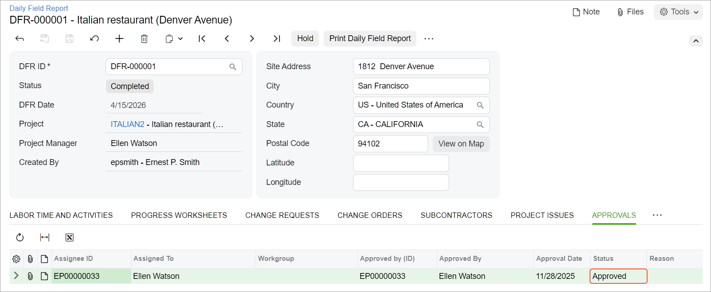

# Daily Field Reports: Process Activity {#_26e10b1f-33cc-42b7-bcf0-7e5bb45a717d .task}

This activity will walk you through the process of working with a daily field report.

**Attention:** This activity is based on the *U100* dataset. If you are using another dataset or if any system settings have been changed in *U100*, these changes can affect the workflow of the activity and the results of the processing. To avoid issues, restore the *U100* dataset to its initial state.

## Story { .section}

Suppose that on April 15, 2026, Ernest Smith, a construction foreman in the ToadGreen company, spent a day on the construction site of the Italian restaurant that the company is building for the Italian Company. During the day, he has recorded the current progress of the work related to electricity installation and made notes about subcontractor activities, weather conditions, visitors, and other important information that relates to the day's work at the project site. Also, he has taken photos to support his report about weather conditions. At the end of the day, Ernest creates a daily field report, adds notes, and sends the daily field report for approval to the construction project manager.

Acting as the construction foreman, you will create and process the daily field report and add all needed information to it. Then acting as the construction project manager, you will approve the daily field report.

## Configuration Overview { .section}

In the *U100* dataset, the following tasks have been performed to support this activity:

-   The following features have been enabled on the [Enable/Disable Features](CS_10_00_00.md) \(CS100000\) form:
    -   *Construction*
    -   *Construction Project Management*
    -   *Time Management*
-   On the [Projects](PM_30_10_00.md#) \(PM301000\) form, the *ITALIAN2* project has been created with multiple project tasks.
-   On the [Vendors](AP_30_30_00.md#) \(AP303000\) form, the *SUNTECH - Suntech Concrete* and *ACMEDO - Acme Doors &amp; Glass* subcontractors have been defined.
-   On the [Employees](EP_20_30_00.md#) \(EP203000\) form, the *EP00000033 - Ellen Watson* employee has been defined.
-   On the [Customers](AR_30_30_00.md#) \(AR303000\) form, the *ITACOM - Italian Company* customer has been created.

## Process Overview { .section}

You will create a daily field report on the [Daily Field Report](PJ_30_40_00.md) \(PJ304000\) form. On the appropriate tabs of the form, you will then add progress worksheet lines, subcontractor activities, weather conditions, and visitors. To finish the processing of the daily field report, you will complete it to submit the report for approval. Finally, you will approve the daily field report.

## System Preparation { .section}

To prepare to perform the instructions of this activity, do the following:

1.  As a prerequisite to the current activity, complete [Daily Field Reports: To Configure Approval for Daily Field Reports](Construction_Daily_Field_Reports_Implem_Activity.md).
2.  Launch the Acumatica ERP website, and sign in to a company with the *U100* dataset preloaded. You should sign in as a construction foreman by using the *epsmith* username and the *123* password.
3.  In the info area, in the upper-right corner of the top pane of the Acumatica ERP screen, make sure that the business date in your system is set to *4/15/2026*. If a different date is displayed, click the Business Date menu button, and select *4/15/2026* on the calendar. For simplicity, in this activity, you will create and process all documents in the system on this business date.
4.  Download the [DFR\_weather1.jpg](Files/DFR_weather1.jpg) and [DFR\_weather2.jpg](Files/DFR_weather2.jpg) files to your device.

## Step 1: Creating the Daily Field Report { .section}

Create the daily field report as follows:

1.  On the [Daily Field Report](PJ_30_40_00.md) \(PJ304000\) form, add a new record.
2.  In the Summary area, specify the following settings:
    -   **DFR Date**: *4/15/2026* \(inserted automatically\)
    -   **Project**: *ITALIAN2*
    -   **Project Manager**: *Ellen Watson* \(inserted automatically\)
3.  On the form toolbar, click **Save**.

    The daily field report is saved with the *On Hold* status. Now you can add the needed information to the report on the appropriate tabs of the form.

## Step 2: Adding Progress Worksheet Lines { .section}

To add progress worksheet lines to the daily field report, do the following:

1.  While you are still viewing the daily field report on the [Daily Field Report](PJ_30_40_00.md) \(PJ304000\) form, on the **Progress Worksheets** tab, click **Load Template** on the table toolbar. The system loads three cost budget lines to the table. These lines are loaded because for these lines, **Productivity Tracking** is set to *Template* on the **Cost Budget** tab of the [Projects](PM_30_10_00.md) \(PM301000\) form.
2.  On the table toolbar, click **Add Budget Lines**. In the **Add Budget Lines** dialog box, which opens, select the unlabeled check box for the line with the *16-200* cost code and the *MATERIAL* account group because you want to record the materials that have been used during the working day.
3.  Click **Add &amp; Close** to close the dialog box and add the line to the table.
4.  In the **Completed Quantity** column, do the following:
    -   In the line with the *16-200* cost code and the *LABOR* account group, enter `15`.
    -   In the line with the *16-200* cost code and the *SUBCON* account group, enter `4`.
    -   In the line with the *16-210* cost code and the *LABOR* account group, enter `25`.
    -   In the line with the *16-200* cost code and the *MATERIAL* account group, enter `1`.
5.  On the form toolbar, click **Save**.

## Step 3: Registering Subcontractor Activities { .section}

Register subcontractors’ activities in the daily field report as follows:

1.  While you are still viewing the daily field report on the [Daily Field Report](PJ_30_40_00.md) \(PJ304000\) form, on the **Subcontractors** tab, click **Add Row** on the table toolbar, and specify the following settings in the row:
    -   **Vendor ID**: *SUNTECH*
    -   **Project Task**: *03*
    -   **Cost Code**: *03-000*
    -   **Number of Workers**: `3`
    -   **Arrived**: *09:00 AM* \(inserted automatically\)
    -   **Departed**: *06:00 PM* \(inserted automatically\)
2.  Add one more row with the following settings:
    -   **Vendor ID**: *ACMEDO*
    -   **Project Task**: *06*
    -   **Cost Code**: *06-000*
    -   **Number of Workers**: `2`
    -   **Arrived**: *09:00 AM* \(inserted automatically\)
    -   **Departed**: *06:00 PM* \(inserted automatically\)
3.  On the form toolbar, click **Save**.

## Step 4: Reporting Weather Conditions { .section}

In this step, you will add records to reflect the weather conditions of the day. Do the following:

1.  While you are still viewing the daily field report on the [Daily Field Report](PJ_30_40_00.md) \(PJ304000\) form, on the **Weather** tab, click **Add Row** on the table toolbar, and specify the following settings in the added row:
    -   **Time Observed**: *07:37 AM*
    -   **Sky**: *Cloudy*
    -   **Temperature**: `60`
    -   **Temperature Perceived**: *Warm*
    -   **Precipitation Description**: *None*
    -   **Wind Description**: *None*
    -   **Site Conditions**: `Dry`
    -   **Delay**: Cleared
    -   **Description**: `Normal weather, no delay`
2.  Save your changes.
3.  Add a second row, and specify the following settings:
    -   **Time Observed**: *04:30 PM*
    -   **Sky**: *Few Clouds*
    -   **Temperature Perceived**: *Mild*
    -   **Precipitation Description**: *None*
    -   **Wind Description**: *Calm*
    -   **Site Conditions**: `Dry`
    -   **Delay**: Cleared
    -   **Description**: `Warm, dry day`
4.  Save your changes.
5.  In the table, at the beginning of the first row, click the button in the **Files** column \(one of the unlabeled columns with icons as column headers\) to open the **Files** dialog box. In the dialog box, click **Upload Files**, select the `DFR_weather1.jpg` file, and close the dialog box.
6.  In the table, at the beginning of the second row, click the button in the **Files** column to open the **Files** dialog box. In the dialog box, click **Upload Files**, select the `DFR_weather2.jpg` file, and close the dialog box.

## Step 5: Recording Visitors and Completing the Report {#section_dqj_bdj_srb .section}

To add records about site visitors, do the following:

1.  While you are still viewing the daily field report on the [Daily Field Report](PJ_30_40_00.md) \(PJ304000\) form, on the **Visitors** tab, click **Add Row** on the table toolbar.
2.  In the new row, specify the following settings:
    -   **Visitor Type**: *Customer*
    -   **Name**: `Adam Smith`
    -   **Business Account**: *ITACOM*
    -   **Arrived**: *5:00 PM*
    -   **Departed**: *6:00 PM*
    -   **Purpose of Visit**: `Visiting construction site for progress control`
    -   **Area Visited/Inspected Entity**: `Basement of site`
3.  Add a second row with the following settings:
    -   **Visitor Type**: *Owner*
    -   **Name**: `Ellen Watson`
    -   **Arrived**: *9:30 AM*
    -   **Departed**: *6:00 PM*
    -   **Purpose of Visit**: `Review proposed changes`
    -   **Area Visited/Inspected Entity**: `Subfloor of site`
    -   **Description**: `Changes approved`
4.  Save your changes.
5.  On the form toolbar, click **Complete**.

    The system changes the report’s status to *Pending Approval*. Also, the system creates a progress worksheet with the *On Hold* status that includes the progress worksheet lines that you have added to the daily field report earlier in this activity. The reference number of the created worksheet is shown in the **Worksheet Nbr.** column on the **Progress Worksheets** tab for the lines you added.

6.  On the **Approvals** tab, make sure that *Ellen Watson* is specified as the approver of the daily field report.
7.  Sign out from the system.

## Step 6: Approving the Daily Field Report {#section_eqj_bdj_srb .section}

To approve the daily field report submitted by the construction foreman, Ernest Smith, perform the following steps

1.  Sign in as a construction project manager by using the *ewatson* username and the *123* password.
2.  On the [Daily Field Report](PJ_30_40_00.md) \(PJ304000\) form, open the daily field report that you have prepared earlier, while acting as a construction foreman.
3.  On the form toolbar, click **Approve**. On the **Approvals** tab, notice that the system has changed the approval status of the daily field report to *Approved*, as shown below.

    

You have prepared the daily field report and approved it.

**Parent topic:**[Reporting On-Site Work Progress](../UserGuide/Construction_Daily_Field_Reports_Mapref.md)

