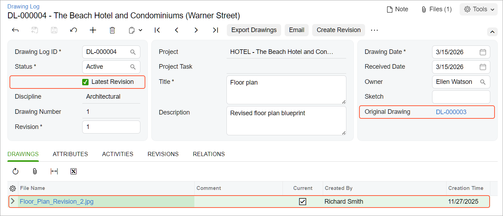

# Drawing Logs: Process Activity {#_d6cf110c-fdc7-4856-a051-f4b190bd5c45 .task}

This activity will walk you through the process of working with a drawing log.

**Attention:** This activity is based on the *U100* dataset. If you are using another dataset or if any system settings have been changed in *U100*, these changes can affect the workflow of the activity and the results of the processing. To avoid issues, restore the *U100* dataset to its initial state.

## Story { .section}

Suppose that the ToadGreen architect has prepared a floor plan blueprint for the Beach Hotel and Condominiums, the project that the ToadGreen company is working on. Then the architect has submitted a request for information about the plan of the first floor to make sure that the current location of the storage room \(next to the service elevator\) is correct. Based on the submitted request for information, a new revision of the blueprint should be created and linked to the original drawing, and the original blueprint must be marked as obsolete.

Acting as the architect, you will process all required documents in the system with the assumption that these changes will not affect the schedule, cost, and design.

## Configuration Overview { .section}

In the *U100* dataset, the following tasks have been performed to support this activity:

-   The *Construction* and *Construction Project Management* features have been enabled in the *Projects* group of features on the [Enable/Disable Features](CS_10_00_00.md) \(CS100000\) form.
-   On the [Project Management Classes](PJ_20_10_00.md#) \(PJ201000\) form, the *DOCRFI* class has been defined with the **Request for Information** check box selected in the **Use For** section of the Summary area.
-   On the [Projects](PM_30_10_00.md#) \(PM301000\) form, the *HOTEL* project has been created with multiple project tasks.
-   On the [Employees](EP_20_30_00.md) \(EP203000\) form, the *EP00000033 – Ellen Watson* and *EP00000013 – Anna Johnson* employee records have been created.

## Process Overview { .section}

You will create a drawing log with the initial floor plan on the [Drawing Log](PJ_30_30_00.md) \(PJ303000\) form. You will then create a request for information on the [Request for Information](PJ_30_10_00.md) \(PJ301000\) form and send an email to the person responsible for receiving the needed information. After that, based on the answer to the request for information that you have received, you will create a new drawing log on the [Drawing Log](PJ_30_30_00.md) form.

## System Preparation { .section}

To prepare to perform the instructions of this activity, do the following:

1.  As a prerequisite to this activity, prepare the system for using drawing logs by completing the [Drawing Logs: Implementation Activity](Construction_Drawing_Logs_Implem_Activity.md).
2.  Launch the Acumatica ERP website, and sign in to a company with the *U100* dataset preloaded. You should sign in as an architect by using the *rsmith* username and the *123* password.
3.  In the info area, in the upper-right corner of the top pane of the Acumatica ERP screen, make sure that the business date in your system is set to *3/15/2026*. If a different date is displayed, click the Business Date menu button, and select *3/15/2026* on the calendar. For simplicity, in this activity, you will create and process all documents in the system on this business date.
4.  Download the [Floor\_Plan\_Revision\_1.jpg](Files/Floor_Plan_Revision_1.jpg) and [Floor\_Plan\_Revision\_2.jpg](Files/Floor_Plan_Revision_2.jpg) files to your device.

## Step 1: Creating a Drawing Log { .section}

To create a drawing log, do the following:

1.  Open the [Drawing Logs](PJ_40_30_00.md) \(PJ403000\) form.
2.  On the form toolbar, click **Add New Record**. The system creates a new drawing log and opens it on the [Drawing Log](PJ_30_30_00.md) \(PJ303000\) form.
3.  In the Summary area of the [Drawing Log](PJ_30_30_00.md) form, specify the following settings:
    -   **Discipline**: *Architectural*
    -   **Drawing Number**: `1`
    -   **Project**: *HOTEL*
    -   **Title**: `Floor plan`
    -   **Description**: `Floor plan blueprint`
    -   **Owner**: *Ellen Watson*
4.  Click **Save** on the form toolbar.

    In the Summary area, note that the status of the drawing log is *Active* and that the **Latest Revision** check box is selected for the drawing log to mark it as up to date.

5.  On the table toolbar of the **Drawings** tab, click **Files**.
6.  In the **Files** dialog box, which opens, click **Upload Files**, select the `Floor_Plan_Revision_1.jpg` file, and close the dialog box. Notice that the line with the uploaded drawing has appeared in the table.

## Step 2: Linking a Request for Information to the Drawing Log { .section}

To create a request for information, do the following:

1.  While you are still viewing the drawing log that you have created on the [Drawing Log](PJ_30_30_00.md#) \(PJ303000\) form, click **Create RFI** on the More menu.
2.  On the [Request for Information](PJ_30_10_00.md#) \(PJ301000\) form, which opens with the new request for information, specify the following settings in the Summary area:
    -   **Summary**: `Storage room should be next to service elevator`
    -   **Class**: *DOCRFI*
    -   **Owner**: *Ellen Watson*
    -   **Project**: *HOTEL* \(inserted automatically\)
    -   **Contact**: *Anna Johnson*
3.  On the **Details** tab, enter the following text:
    -   **Question** pane: `Is the storage room next to the service elevator?`
    -   **Answer** pane: `No. The blueprint should be updated.`
4.  On the **Additional Info** tab, leave the **Schedule Impact**, **Cost Impact**, and **Design Change** check boxes cleared.
5.  On the **Drawings** tab, make sure that the row with the `Floor plan` drawing log that you have prepared is shown.
6.  On the form toolbar, click **Save** to save the request for information.
7.  On the More menu, click **Email**.

    The system opens the [Email Activity](CR_30_60_15.md#) \(CR306015\) form with the *Anna Johnson* contact specified in the **To** box. On the form title bar, notice **Files \(1\)**, which indicates that the system has attached the file from the request for information to the created email.

8.  On the form toolbar, click **Send** to send the email, and return to the [Request for Information](PJ_30_10_00.md) form with the request for information that you have created earlier.

## Step 3: Creating a Revision { .section}

To create a new revision of the drawing log with the updated floor plan, do the following:

1.  Open the [Drawing Logs](PJ_40_30_00.md) \(PJ403000\) form, and in the table, click the link in the **Drawing Log ID** column of the row with the *Floor plan* drawing log that you have created earlier in this activity.
2.  On the form toolbar of the [Drawing Log](PJ_30_30_00.md) \(PJ303000\) form, which opens with the drawing log, click **Create Revision**.
3.  In the **Revision** box of the Summary area, enter the number of the revision: `1`.
4.  In the **Description** box, change the text to `Revised floor plan blueprint`.
5.  Save the drawing log. Notice that in the Summary area, the **Original Drawing** box shows a link to the initial drawing document.
6.  On the table toolbar of the **Drawings** tab, click **Files**.
7.  In the **Files** dialog box, which opens, click **Upload Files**, select the `Floor Plan Revision 2.jpg` file,, and close the dialog box. Notice that the **Latest Revision** check box is selected for the new revision of the drawing log, as shown below.

    

8.  In the Summary area, click the link in the **Original Drawing** box. The [Drawing Log](PJ_30_30_00.md#) form opens with the original drawing log.
9.  In the Summary area of the form, select *Inactive* in the **Status** box.
10. Clear the **Latest Revision** check box to indicate that the original drawing log is obsolete.
11. On the form toolbar, click **Save &amp; Close** to save your changes.

You have finished creating a new revision for a drawing log.

**Parent topic:**[Working with Drawing Logs](../UserGuide/Construction_Drawing_Logs_Mapref.md)

