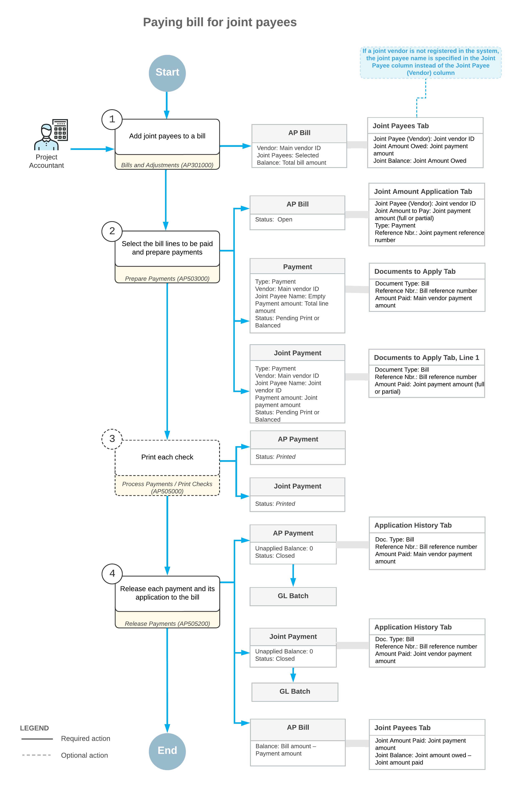

# Joint Payments: General Information {#_6fd4aa8c-7e03-4bab-a764-f2aa79c76fd6 .concept}

A joint payment is a payment generated for an accounts payable bill that is made payable to joint payees: your vendor, whose work is tracked as part of the project, and another supplier or contractor who supplies materials or work for this vendor directly. By issuing a joint payment, you ensure that subcontractors pay their suppliers for their materials or their work on the project.

In Acumatica ERP Construction Edition, you can create an AP bill for the vendor you work with and specify other vendors in the bill who are not a part of a project but partially provide services or materials for the project. Then you can create a joint payment for this bill to the vendor you work with and to its supplier or subcontractor.

## Learning Objectives { .section}

In this chapter, you will learn how to do the following:

-   Create an AP bill to be paid with a joint payment
-   Specify a main vendor and joint payees for a joint bill
-   Specify joint amounts for different lines of a joint bill
-   Create and process joint payments for a joint bill

## Applicable Scenarios { .section}

You process a joint payment to register that the payment for the work performed for a particular project was made jointly to two or more parties.

## Creation of an AP Bill from Joint Payees { .section}

You enter a bill by using the [Bills and Adjustments](AP_30_10_00.md) \(AP301000\) form. The Summary area of a bill includes information about the vendor, the payment terms, the amount, the currency used for the transaction, and other information. In a joint bill, you specify the vendor that is working directly with you on the project as the main vendor of the bill. On the **Details** tab, the bill can have multiple detail lines or it can have a single line that summarizes the performed work or purchases. For details on creating a bill, see [AP Bills: General Information](Finance_ProcessingAPBills_GeneralInfo.md).

After you have specified all the required bill information, you add joint payees to the bill. To indicate that a bill represents the work performed jointly, you select the **Joint Payees** check box in the Summary area. For each joint payee involved, you specify the settings on the **Joint Payees** tab as follows:

-   If a joint payee is registered in your system as a vendor record on the [Vendors](AP_30_30_00.md) \(AP303000\) form, you select this vendor in the **Joint Payee \(Vendor\)** column.
-   If there is no vendor record that corresponds to a joint payee, you type the name to be specified on the joint payment in the **Joint Payee** column.
-   If the bill is paid by line \(that is, if the **Pay by Line** check box is selected in the Summary area of the form\), you select the bill line for which the joint payee is going to receive the payment in the **Bill Line Nbr.** column.
-   In the **Joint Amount Owed** column, you enter the amount to be received by the joint payee. The sum of the joint amounts specified for all joint payees cannot be greater than the total amount of the bill. If the **Pay by Line** check box is selected in the Summary area of the form, the joint amount owed cannot be greater than the amount of the corresponding bill line.

The system shows the amount that has already been paid to joint payee in the **Joint Amount Paid** column and the amount that has to be paid in the **Joint Balance** column. Initially, the joint balance for each line is the same as the **Joint Amount Owed** value you have specified.

## Preparation of Payments to Joint Payees { .section}

While you are viewing an AP bill for joint payees on the [Bills and Adjustments](AP_30_10_00.md) \(AP301000\) form, you create a payment for the joint bill by clicking **Pay** on the form toolbar. The system opens the [Prepare Payments](AP_50_30_00.md) \(AP503000\) form. On the **Documents to Pay** tab of the [Prepare Payments](AP_50_30_00.md) form, the joint payee bill is shown as a set of lines for payment, with a separate line for each joint payee and for the main vendor.

For each line, the system automatically specifies the value in the **Amount Paid** column, which is the maximum available balance of the line at the moment of payment. The system distributes the maximum available payment amount among all joint payee lines; the remaining payment amount is then distributed among the main vendor lines. If needed, you adjust the amounts to be paid both for main vendor lines and for joint payee lines. Then you select the unlabeled check box for the lines to be processed and click **Process** on the form toolbar. The system creates separate payment documents for main vendor and for each joint payee vendor. You print the checks on the [Process Payments / Print Checks](AP_50_50_00.md) \(AP505000\) form if the printing of checks is required. To complete the processing of joint payments, you release the payment and the payment application to the bill on the [Release Payments](AP_50_52_00.md) \(AP505200\) form.

If you create a partial joint payment, the joint balance decreases in the payment amount until it is completely paid and thus reduced to *0*. After the full payment amount is applied to the bill, each payment is assigned the *Closed* status. For more details on processing payments, see [AP Bill Payments: General Information](Finance_PayingAPBills_GeneralInfo.md).

If the joint bill is paid by lines \(that is, if the **Pay by Line** check box is selected in the Summary area of the [Bills and Adjustments](AP_30_10_00.md) form\), on the **Details** tab of this form, the balance of the corresponding line is reduced by the payment amount when the payment is released. If the bill is not paid by lines, the joint payment amount decreases the balance of the entire bill.

## Grouping of Joint Payments { .section}

When a user mass-prepares and mass-processes joint payments, the system aggregates joint payment lines to a single payment document if the same internal vendor is specified in these lines. An internal vendor is one that is defined in the system on the [Vendors](AP_30_30_00.md) \(AP303000\) form.

If a joint payee is an external vendor \(that is, external to the system, with no corresponding record on the [Vendors](AP_30_30_00.md) form\), lines with this vendor cannot be aggregated to a single joint check. Instead, separate joint checks will be created for each payment line with this vendor.

## Workflow of Joint Payments { .section}

The following diagram illustrates the workflow of preparing payments for joint bills.

**Parent topic:**[Processing Joint Payments](../UserGuide/Construction_Joint_Payees_Mapref.md)

