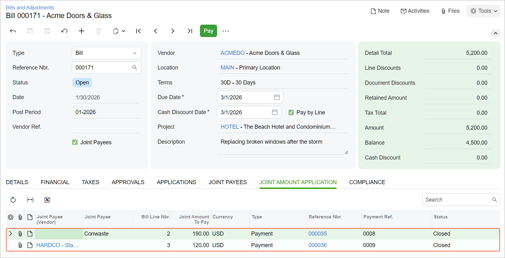

# Joint Payments: Process Activity {#_160880eb-2f5b-42ce-890d-d7b8c50944c5 .task}

This activity will walk you through the process of paying joint payees.

**Attention:** This activity is based on the *U100* dataset. If you are using another dataset or if any system settings have been changed in *U100*, these changes can affect the workflow of the activity and the results of the processing. To avoid issues, restore the *U100* dataset to its initial state.

## Story { .section}

Suppose that a storm broke windows in the hotel that the ToadGreen company is building for its customer, Equity Group Investor. The ToadGreen project manager has decided to hire the Acme Doors &amp; Glass vendor to handle the replacement of the broken windows, the disposal of waste, and the cleaning of the area. In turn, Acme Doors &amp; Glass has hired the Standard Hardware Company and Conwaste subcontractors to dispose of the waste and clean the area. On *1/30/2026*, the subcontractors have performed part of the work and requested a first payment. Acting as the ToadGreen project manager, you need to process all of the documents involved in paying the companies for this part of the work, including joint payment.

## Process Overview { .section}

To make a joint payment, you will first create an AP bill for the provided work on the [Bills and Adjustments](AP_30_10_00.md#) \(AP301000\) form; you will add joint payees to it and specify the joint payment amounts. Then you will create and process a payment for this bill on the [Checks and Payments](AP_30_20_00.md#) \(AP302000\) form.

## Configuration Overview { .section}

In the *U100* dataset, the following tasks have been performed to support this activity:

-   The following features have been enabled on the [Enable/Disable Features](CS_10_00_00.md) \(CS100000\) form:
    -   *Construction*
    -   *Payment Application by Line*
    -   *Cost Codes*
-   On the [Vendors](AP_30_30_00.md#) \(AP303000\) form, the *ACMEDO* vendor has been created. On the **Payment Settings**, the **Pay by Line** check box is selected for the vendor. In the **Cash Account** box, the *10200TG* cash account is specified for the vendor.
-   On the [Projects](PM_30_10_00.md#) \(PM301000\) form, the *HOTEL* project has been created with multiple project tasks, including the *02 - SITEWORK* project task.
-   On the [Non-Stock Items](IN_20_20_00.md) \(IN202000\) form, the *WDISMANT*, *WDISPOS*, and *WCLEAN* items have been created.

## System Preparation { .section}

To prepare to perform the instructions of this activity, do the following:

1.  Launch the Acumatica ERP website, and sign in to a company with the *U100* dataset preloaded. You should sign in as a project manager by using the *ewatson* username and the *123* password.
2.  In the info area at the upper-right corner of the top pane of the Acumatica ERP screen, make sure that the business date is set to *1/30/2026*. If a different date is displayed, click the Business Date menu button and select *1/30/2026* from the calendar. For simplicity, you'll create and process all documents in this activity using this business date.

## Step 1: Processing a Joint Bill { .section}

To create a bill for joint payees, do the following:

1.  On the [Bills and Adjustments](AP_30_10_00.md#) \(AP301000\) form, create a new document, and specify the following settings in the Summary area:
    -   **Type**: *Bill*
    -   **Vendor**: *ACMEDO \(Acme Doors &amp; Glass\)*
    -   **Apply Retainage**: Cleared
    -   **Pay by Line**: Selected

        With this setting, you can prepare separate payment documents for individual bill lines.

    -   **Joint Payees**: Selected
    -   **Description**: `Replacing broken windows after the storm`
2.  On the **Details** tab, add lines with the following settings.

    |Inventory ID|Quantity|Unit Cost|Project|Project Task|Cost Code|
    |------------|--------|---------|-------|------------|---------|
    |*WDISMANT*|*8*|*500.00*|*HOTEL*|*02*|*02-000*|
    |*WDISPOS*|*4*|*200.00*|*HOTEL*|*02*|*02-000*|
    |*WCLEAN*|*4*|*100.00*|*HOTEL*|*02*|*02-000*|

3.  On the **Joint Payees** tab, add lines with the settings specified in the table below.

    |Joint Payee \(Vendor\)|Joint Payee|Bill Line Nbr.|Joint Amount Owed|
    |----------------------|-----------|--------------|-----------------|
    |Empty|`Conwaste`|*2*|*450.00*|
    |*HARDCO*|Empty|*3*|*210.00*|

4.  On the form toolbar, click **Remove Hold**, and then click **Release**.

## Step 2: Processing a Joint Payment { .section}

To create and process a joint payment, do the following:

1.  While you are still on the [Bills and Adjustments](AP_30_10_00.md#) \(AP301000\) form with the bill that you have entered, on the form toolbar, click **Pay**. The system opens the [Prepare Payments](AP_50_30_00.md) \(AP503000\) form and shows the lines of the bill that you have prepared in the table on the **Documents to Pay** tab. Three lines are for the main vendor of the bill, and two lines are for joint payees.
2.  In the table, do the following:
    -   In the line with the *WDISMANT* item and a line number of *1*, change the value in the **Amount Paid** column to *390*, and select the unlabeled check box for the line. This is the amount to be paid to main vendor of the bill.
    -   In the line with the *WDISPOS* item, a line number of *2*, and the *Conwaste* vendor specified in the **Joint Payee Name** column, change the value in the **Amount Paid** column to *190* , and select the unlabeled check box for the line. This is the amount to be paid to first joint payee.
    -   In the line with the *WCLEAN* item, a line number of *3*, and the *Standard Hardware Company* vendor specified in the **Joint Payee Name** column, change the value in the **Amount Paid** column to *120*, and select the unlabeled check box for the line. This is the amount to be paid to second joint payee.
3.  In the Selection area of the form, make sure that the **Selection Total** amount is *700* and that the **Available Balance** amount is greater than the total amount to be paid.
4.  Click **Process** on the form toolbar.
5.  On the [Process Payments / Print Checks](AP_50_50_00.md#) \(AP505000\) form, which opens, click **Process** to print the checks for the three selected lines, which correspond to the prepared payments. The system opens a printable version of the checks.

    **Attention:** For the purposes of this activity, you do not need to actually print the document. In a production setting, you would click **Print** on the form toolbar to print the check before closing the browser tab.

6.  Close the printable checks and return to the [Release Payments](AP_50_52_00.md#) \(AP505200\) form, which the system has opened.
7.  On the [Release Payments](AP_50_52_00.md#) form, make sure that the unlabeled check boxes are selected for all three payments, and on the form toolbar, click **Process** to release the payments.
8.  On the [Bills and Adjustments](AP_30_10_00.md#) form, open the bill to *ACMEDO* for which you have processed the payment, and review the **Joint Amount Application** tab, as shown below.

    

You have prepared joint payments and partially paid the bill.

**Parent topic:**[Processing Joint Payments](../UserGuide/Construction_Joint_Payees_Mapref.md)

