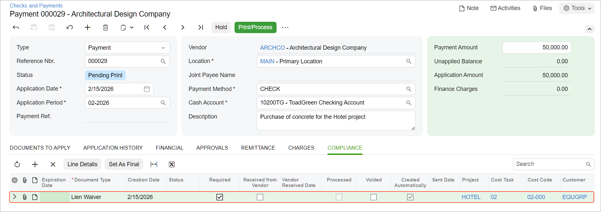

# Lien Waivers: To Process an AP Document with Lien Waivers {#_81816f40-baf1-42a8-89e1-4ba162254861 .task}

This activity will walk you through the process of working with lien waivers.

## Story { .section}

Suppose that the ToadGreen company needs to pay a bill to a subcontractor, the Architectural Design Company. Acting as a project manager, you need to enter a subcontract, create and pay the bill in the system, and make sure that the related lien waiver has been generated and sent to the subcontractor.

## Configuration Overview {#section_exc_ffw_gpb .section}

In the *U100* dataset, the following tasks have been performed to support this activity:

-   On the [Enable/Disable Features](CS_10_00_00.md) \(CS100000\) form, the *Construction* and *Construction Project Management* features have been enabled.
-   On the [Non-Stock Items](IN_20_20_00.md#) \(IN202000\) form, the *CONCRMX* non-stock item has been created.
-   On the [Projects](PM_30_10_00.md) \(PM301000\) form, the *HOTEL* project has been created with multiple project tasks, including *02 - SITEWORK*.

## Process Overview {#section_qjw_hdr_v4b .section}

You will enter a subcontract on the [Subcontracts](SC_30_10_00.md) \(SC301000\) form. Then you will create an accounts payable bill for this subcontract on the [Bills and Adjustments](AP_30_10_00.md#) \(AP301000\) form. You will pay the bill by preparing and releasing a payment on the [Checks and Payments](AP_30_20_00.md#) \(AP302000\) form. Finally, you will print the generated lien waiver on the [Print/Email Lien Waivers](CL_50_20_00.md) \(CL502000\) form, and mark the lien waiver as received on the [Compliance Management](CL_40_10_00.md#) \(CL401000\) form.

## System Preparation {#section_it1_zzm_3nb .section}

Before you start working with lien waivers, do the following:

1.  As a prerequisite to the current activity, perform the [Lien Waivers: To Configure Automatic Generation of Lien Waivers](Construction_Lien_Waivers_Implem_Activity.md) activity to configure the mailing settings for lien waivers and specify the lien waiver settings for the vendor.
2.  Launch the Acumatica ERP website, and sign in as a construction project manager by using the *ewatson* username and the *123* password.
3.  In the info area, in the upper-right corner of the top pane of the Acumatica ERP screen, make sure that the business date in your system is set to *2/15/2026*. If a different date is displayed, click the Business Date menu button, and select *2/15/2026* on the calendar. For simplicity, in this activity, you will create and process all documents in the system on this business date.

## Step: Working with Lien Waivers { .section}

You process a subcontract and review the generated lien waiver by doing the following:

1.  On the [Subcontracts](SC_30_10_00.md) \(SC301000\) form, add a new record.
2.  In the Summary area, specify the following settings:
    -   **Vendor**: *ARCHCO*
    -   **Location**: *MAIN* \(specified automatically\)
    -   **Date**: *2/15/2026*
    -   **Description**: `Purchase of concrete for the Hotel project`
3.  On the **Details** tab, add a row, and specify the following settings in the added row:

    -   **Inventory ID**: *CONCRMX*
    -   **Project**: *HOTEL*
    -   **Project Task**: *02 - SITEWORK*
    -   **Cost Code**: *02-000*
    -   **Order Qty.**: `100`
    -   **Unit Cost**: `500`
    Notice that the subcontract total is *50,000*, which exceeds the minimum commitment amount specified for the vendor in the *HOTEL* project's settings on the [Projects](PM_30_10_00.md#) \(PM301000\) form.

4.  On the form toolbar, click **Remove Hold** to assign the subcontract the *Open* status.
5.  On the form toolbar, click **Enter AP Bill**.

    The [Bills and Adjustments](AP_30_10_00.md#) \(AP301000\) form opens with the new document, which has the *Bill* type and the document details copied from the subcontract to the **Details** tab.

6.  On the form toolbar, click **Remove Hold**, and then click **Release** to release the bill.
7.  On the form toolbar, click **Pay**.

    The [Checks and Payments](AP_30_20_00.md#) \(AP302000\) form opens with the AP payment prepared for the bill. The payment should have the *On Hold* status. Open the **Compliance** tab, and notice that it is empty.

8.  On the form toolbar, click **Remove Hold**, and then click **Save**. The system automatically generates a lien waiver and adds a line on the **Compliance** tab, as shown below.

    

    **Tip:** The same lien waiver record also appears on the **Compliance** tab of the [Projects](PM_30_10_00.md#) \(PM301000\), [Vendors](AP_30_30_00.md#) \(AP303000\), [Subcontracts](SC_30_10_00.md) \(SC301000\), and [Bills and Adjustments](AP_30_10_00.md#) \(AP301000\) forms for the involved records. The record also appears on the [Compliance Management](CL_40_10_00.md#) \(CL401000\) form.

9.  On the [Print/Email Lien Waivers](CL_50_20_00.md) \(CL502000\) form, do the following:
    1.  In the **Action** box, select *Email Lien Waivers*.
    2.  Select the unlabeled check box for the lien waiver that was automatically created earlier in this activity.
    3.  Click **Process** on the form toolbar.
    4.  When the operation has been completed, close the **Processing** dialog box.
10. Open the Outgoing \(CO4092PL\) inquiry form.
11. Review the list of outgoing emails with the *My Emails* filter applied. Make sure that the row for the sent email has been added; the line should have the *Lien waiver* description in the **Summary** column, and *eve.stewart@arc.example.com* must be specified in the **To** column.
12. Open the [Compliance Management](CL_40_10_00.md#) \(CL401000\) form.
13. Review the settings of the processed lien waiver, and make sure that it has the **Processed** check box selected.
14. In the row with the lien waiver, select the **Received from Vendor** check box to indicate that the signed copy of the lien waiver has been received from the vendor.
15. Save your changes.

You have finished working with the lien waiver.

**Parent topic:**[Processing Lien Waivers](../UserGuide/Construction_Lien_Waivers_Mapref.md)

