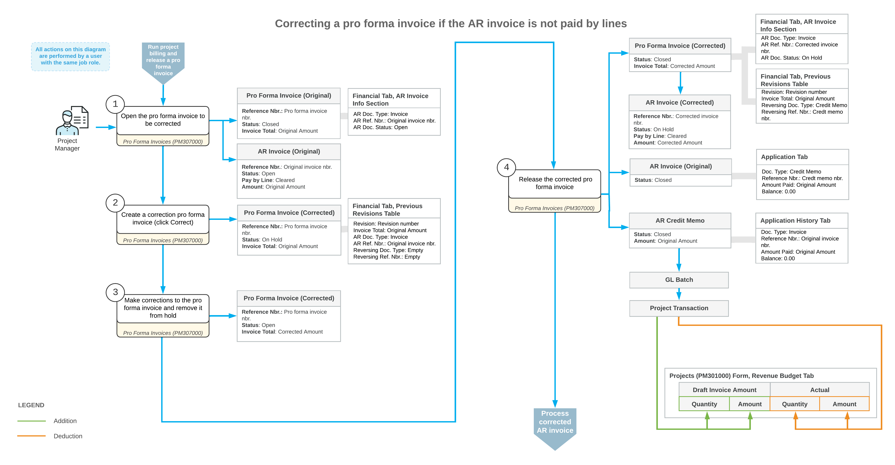
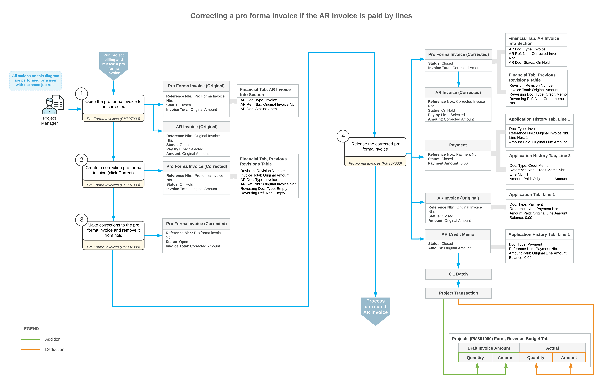

# Pro Forma Invoice Correction: General Information {#_c17cd234-2ac9-412e-a687-cc34cdaa1e16 .concept}

You can make corrections to a pro forma invoice with the *Closed* status even if the corresponding accounts receivable document created based on this pro forma invoice has already been released.

## Learning Objectives { .section}

In this chapter, you will learn how to do the following:

-   Make corrections to a pro forma invoice that has the corresponding AR document released
-   Review the previous revision of the pro forma invoice.

## Applicable Scenarios { .section}

You correct a pro forma invoice if you need to keep its reference and application numbers. For example, you may need to correct an existing pro forma invoice because it has been used for printing the [AIA Report](PM_64_40_00.md) \(PM644000\) report.

## Making Corrections to a Pro Forma Invoice { .section}

You can correct a pro forma invoice for which the corresponding accounts receivable invoice has been released if the following conditions are met:

-   The application of payments are removed or the payments are voided for the corresponding accounts receivable invoices.
-   Corresponding retainage invoices related to the pro forma invoice are reversed or deleted.
-   The billing currency is the same as the project currency.

To assign a pro forma invoice the *On Hold* status so that it can be edited, you click **Correct** on the More menu of the [Pro Forma Invoices](PM_30_70_00.md) \(PM307000\) form. The system changes the status of the pro forma invoice and adds a line with the previous revision of the pro forma invoice to the **Previous Revisions** table on the **Financial** tab.

The previous revision of the accounts receivable document, as well as the reversing AR documents, are shown on the **Financial** tab \(**Previous Revisions** table\) of the [Pro Forma Invoices](PM_30_70_00.md) form and on the **Invoices** tab of the [Projects](PM_30_10_00.md) \(PM301000\) form.

## Release of Correction Documents { .section}

When you make all the needed adjustments to the pro forma invoice and release it, the system creates the accounts receivable document with the full amount of the corrected pro forma invoice. The system also creates a reversing AR document and applies it to the original invoice to completely reverse the previous revision and update the actual values of the project.

The way the system applies the prepared reversing document to the original AR invoice depends on whether the AR invoice can be paid by lines as follows:

-   If the **Pay by Line** check box is cleared for the AR invoice in the Summary area of the [Invoices and Memos](AR_30_10_00.md) \(AR301000\) form\), on release of the correction pro forma invoice, the system automatically releases the credit memo and applies it to the original AR invoice. The reversing credit memo and original AR invoice become closed.
-   If the **Pay by Line** check box is selected for the AR invoice, on release of the correction pro forma invoice, the system performs the following operations:
    1.  Generates and releases the credit memo.
    2.  Generates and releases a payment that includes the credit memo lines and original invoice lines and has a total payment amount of *0*. In the created zero payment, the system uses a payment method and cash account specified either in the original AR invoice or in the settings of the customer.
    3.  Releases the payment and a payment application. The payment document, the reversing credit memo, and the original AR invoice become closed.

## Workflow of Correcting Pro Forma Invoices {#section_i3l_d4p_mcb .section}

The following diagram illustrates the workflow of correcting a pro forma invoice if the corresponding AR invoice is not paid by lines.

The following diagram illustrates the workflow of correcting a pro forma invoice if the corresponding AR invoice is paid by lines.

**Parent topic:**[Correcting Pro Forma Invoices](../UserGuide/Construction_PF_Correction_Mapref.md)

