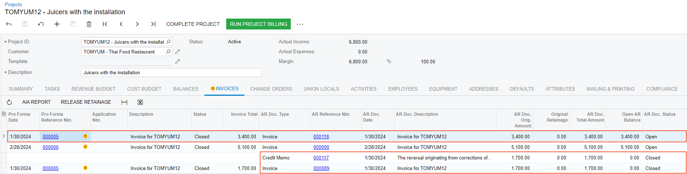

# Project Invoice Correction: To Correct a Closed Pro Forma Invoice {#_c53c0234-16c1-4385-a12e-cc34cd34d4c0 .task}

In this activity, you will learn how to correct a pro forma invoice for which the corresponding accounts receivable document released.

**Attention:** This activity is based on the *U100* dataset. If you are using another dataset or if any system settings have been changed in *U100*, these changes can affect the workflow of the activity and the results of the processing. To avoid issues, restore the *U100* dataset to its initial state.

## Story { .section}

Suppose that in January, the Thai Food Restaurant customer ordered five juicers along with the service of installation from the SweetLife Fruits &amp; Jams company. The parties agreed to pay for the juicers and provided services monthly. SweetLife's project manager created a project for this work. In January, SweetLife delivered and installed two juicers; SweetLife's project accountant billed the customer. In February, SweetLife delivered and installed three juicers and the project accountant billed the customer.

Suppose that the project accountant has realized that in January the customer was billed for one juicer and the corresponding service instead of two juicers. The pro forma invoice was already used for printing the AIA report, so the accountant cannot just create one more invoice but need to adjust the first pro forma invoice. Acting as the project accountant, you will correct the pro forma invoice.

## Configuration Overview { .section}

In the *U100* dataset, the following tasks have been performed to support this activity:

-   On the [Enable/Disable Features](CS_10_00_00.md) \(CS100000\) form, the *Projects* feature has been enabled on the [Enable/Disable Features](CS_10_00_00.md) \(CS100000\) form:
-   On the [Projects](PM_30_10_00.md) \(PM301000\) form, the *TOMYUM12* project has been created, and the *INSTALL* project task has been created for the project.
-   On *1/30/2026*, the *000005* pro forma invoice has been created for the project, and the *000089* accounts receivable invoice has been created and released for the pro forma invoice.
-   On *2/28/2026*, the *000006* pro forma invoice has been created for the project, and the *000090* accounts receivable invoice has been created and released for the pro forma invoice.

## Process Overview { .section}

In this activity, on the [Pro Forma Invoices](PM_30_70_00.md) \(PM307000\) form, you will initiate the correcting of a pro forma invoice for the project. You will adjust and release the pro forma invoice on the same form. On the [Invoices and Memos](AR_30_10_00.md) \(AR301000\) form, you will release the accounts receivable invoice created based on the pro forma invoice and the credit memo created for reversing the previous AR invoice.

## System Preparation { .section}

To prepare to perform the instructions of this activity, do the following:

1.  Launch the Acumatica ERP website, and sign in to a company with the *U100* dataset preloaded as Pam Brawner by using the *brawner* username and the *123* password.
2.  In the info area at the upper-right corner of the top pane of the Acumatica ERP screen, make sure that the business date is set to *1/30/2026*. If a different date is displayed, click the Business Date menu button and select *1/30/2026* from the calendar. For simplicity, you'll create and process all documents in this activity using this business date.

## Step 1: Correcting the Pro Forma Invoice { .section}

To correct the *000005* invoice for the *TOMYUM12* project, do the following:

1.  On the [Projects](PM_30_10_00.md) \(PM301000\) form, open the *TOMYUM12* project.

    On the **Invoices** tab, review the related pro forma invoices and accounts receivable invoices. Notice that the status of both pro forma invoices is *Closed* and the status of both accounts receivable invoices is *Open*, which means the AR invoices are also released.

2.  On the [Pro Forma Invoices](PM_30_70_00.md) \(PM307000\) form, open the *000005* pro forma invoice.

    In the Summary area, notice that the **Invoice Total** is *1700.00*. You need to double this amount.

    On the **Financial** tab, notice that there is the *000089* reference number of the corresponding AR invoice in the **AR Ref. Nbr.** box \(**AR Invoice Info** section\) and the **Previous Revisions** table is empty.

3.  On the More menu, click **Correct** to make corrections to the pro forma invoice. The system assigns the pro forma invoice the *On Hold* status.

    On the **Financial** tab, notice that the **AR Ref. Nbr.** box has been cleared and a row with the previous revision of the pro forma invoice has appeared in the **Previous Revisions** table. The invoice total of the revision is *1700.00* and the AR reference number is *000089*.

4.  On the **Progress Billing** tab, in the lines with the following items, enter the corresponding amount in the **Amount to Invoice** column:

    -   *INSTALL*: `400.00`
    -   *JUICER10*: `3000.00`
    In the Summary area, make sure that the invoice total is *3400.00*.

5.  On the form toolbar, click **Remove Hold**, and then click **Release** to release the pro forma invoice.

    The system creates the accounts receivable invoice based on the pro forma invoice and assigns the *Closed* status to the pro forma invoice. On the **Financial** tab, in the **Previous Revisions** table, notice that the system has created the reversing credit memo for the AR invoice of the previous revision and filled in the **Reversing Doc. Type** and **Reversing Ref. Nbr.** columns in the line with the previous revision.

6.  In the only line of the table, click the link in the **Reversing Ref. Nbr.** column to open the reversing credit memo on the [Invoices and Memos](AR_30_10_00.md) \(AR301000\) form. On the **Applications** tab, notice that the system has automatically applied the credit memo to the previous revision of the AR invoice.

    Both the credit memo and the AR invoice are now assigned the *Closed* status.

7.  Close the [Invoices and Memos](AR_30_10_00.md) form, and return to the correction pro forma invoice on the [Pro Forma Invoices](PM_30_70_00.md) form.
8.  On the **Financial** tab, click the **AR Ref. Nbr.** link to open the accounts receivable invoice that was created on the [Invoices and Memos](AR_30_10_00.md) form.
9.  On the form toolbar, click **Remove Hold**, and then click **Release** to release the accounts receivable invoice.
10. On the [Projects](PM_30_10_00.md) form, open the *TOMYUM12* project.

    On the **Invoices** tab, notice that the invoice total of the *000005* pro forma invoice you have corrected is *3400.00*. Notice that the table also shows the previous revision of the AR invoice and the credit memo that reverses that AR invoice, as shown in the following screenshot.

    

    You have finished correcting the amounts in the pro forma invoice.

**Parent topic:**[Correcting Project Invoices](../UserGuide/Projects_Correcting_Project_Invoices_Mapref.md)

