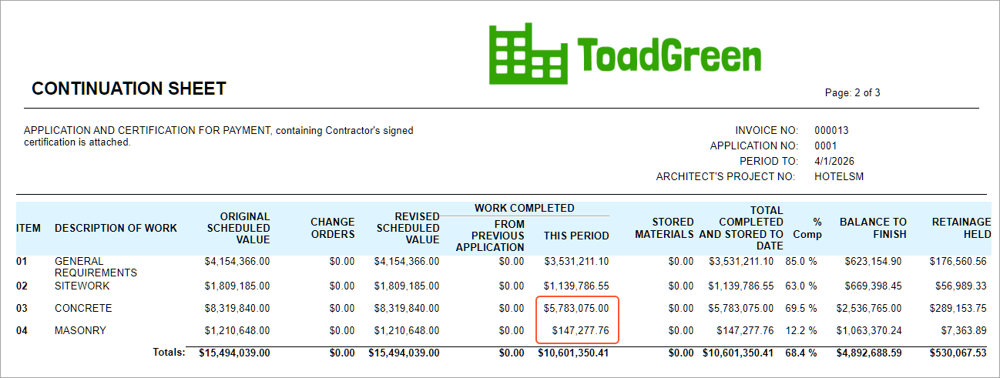

# Pro Forma Invoice Correction: To Correct Actual Amounts in AIA Reports {#_34a195fd-3ae9-4ff8-b247-24e4b47f9d9e .task}

In this activity, you will learn how to make corrections in an AIA report for which the pro forma invoice has been released and closed, and the corresponding accounts receivable invoice has been released.

**Attention:** This activity is based on the *U100* dataset. If you are using another dataset or if any system settings have been changed in *U100*, these changes can affect the workflow of the activity and the results of the processing. To avoid issues, restore the *U100* dataset to its initial state.

## Story {#section_rdp_wkh_npb .section}

Suppose that the ToadGreen Building Group company is building a hotel for the Equity Group Investors customer. The ToadGreen project manager has created a project to track the work progress and to control related revenues and expenses. In April and May 2026, the project accountant has prepared two pro forma invoices, each for part of the performed work; after the customer agreed to the amounts, the project accountant billed the customer.

Further suppose that at the end of May, the ToadGreen construction project manager noticed that a mistake had been made in two lines of the first pro forma invoice. The total of the pro forma invoice is 10,806,560.21, but it should be 10,601,350.41. The construction project manager has reviewed the invoice details and found out that the following corrections must be made:

-   The **Amount to Invoice** in the line with the *03* project task and *03-000* cost code is *5,990,284.80*, but it should be *5,783,075.00*.
-   The **Amount to Invoice** in the line with the *04* project task and *04-000* cost code is *145,277.76*, but it should be *147,277.76*.

The incorrect pro forma invoice was already used for generating the March AIA report. Because the amounts in the first AIA report were incorrect, the April report also needs to be corrected and the AIA report has to be generated again.

Acting as the construction project manager, you need to enter and process the related documents to adjust the actual amounts in AIA reports for March and for April. You then need to regenerate these AIA reports.

## Configuration Overview {#section_whn_qjh_npb .section}

In the *U100* dataset, the following tasks have been performed to support this activity:

-   On the [Enable/Disable Features](CS_10_00_00.md) \(CS100000\) form, the following features have been enabled:
    -   *Projects*, which provides support for the project management functionality
    -   *Construction*, which gives you the ability to make corrections to pro forma invoices with the corresponding AR document released
-   On the [Customers](AR_30_30_00.md#) \(AR303000\) form, the *EQUGRP* customer has been created. On the **Billing** tab, the *CHECK* payment method is specified as the default payment method of the customer. The *10200TG* cash account is used for this payment method by default for the documents created in the *TBGROUP* branch.
-   On the [Projects](PM_30_10_00.md) \(PM301000\) form, the *HOTELSM* project for the *EQUGRP* customer has been created with multiple project tasks, including the *03* and *04* project tasks. Also, on the **Cost Budgets** tab, the cost budget is defined for the line with the *03-000* and *04-000* cost codes.
-   On the [Pro Forma Invoices](PM_30_70_00.md) \(PM307000\) form, a pro forma invoice dated *4/1/2026* has been created for the project and released. On the [Invoices and Memos](AR_30_10_00.md) \(AR301000\) form, the accounts receivable invoice corresponding to the pro forma invoice has been created and released.
-   On the [Pro Forma Invoices](PM_30_70_00.md) form, a pro forma invoice dated *5/1/2026* has been created for the project and released. On the [Invoices and Memos](AR_30_10_00.md) form, the accounts receivable invoice corresponding to the pro forma invoice has been created and released.

## Process Overview {#section_xhn_qjh_npb .section}

In this activity, on the [Pro Forma Invoices](PM_30_70_00.md) \(PM307000\) form, you will initiate the correcting of a pro forma invoice for the project. You will adjust the amounts and release the corrected pro forma invoice. On the [Invoices and Memos](AR_30_10_00.md) \(AR301000\) form, you will release the accounts receivable invoice created based on the pro forma invoice and the credit memo created to reverse the previous AR invoice. Finally, you will regenerate the AIA report for the corrected pro forma invoice and for the subsequent one; you will open the regenerated AIA reports on the [AIA Report](PM_64_40_00.md) \(PM644000\) form to verify that the amounts are correct.

## System Preparation { .section}

To prepare to perform the instructions of this activity, do the following:

1.  Launch the Acumatica ERP website, and sign in to a company with the *U100* dataset preloaded. You should sign in as a construction project manager by using the *ewatson* username and the *123* password.
2.  In the info area, in the upper-right corner of the top pane of the Acumatica ERP screen, make sure that the business date in your system is set to *5/29/2026*. If a different date is displayed, click the Business Date menu button, and select *5/29/2026* on the calendar. For simplicity, in this activity, you will create and process all documents in the system on this business date.

## Step 1: Correcting the Pro Forma Invoice {#section_zhn_qjh_npb .section}

To correct the pro forma invoice for the project, do the following:

1.  On the [Projects](PM_30_10_00.md) \(PM301000\) form, open the *HOTELSM* project.

    On the **Invoices** tab, review the pro forma invoices and accounts receivable invoices generated for the project. Notice that the status of both pro forma invoices is *Closed* and the status of both accounts receivable invoices is *Open* because the AR invoices have been generated for the pro forma invoices and released.

2.  Click the **Pro Forma Reference Nbr.** link in the first line to open the pro forma invoice on the [Pro Forma Invoices](PM_30_70_00.md) \(PM307000\) form. You need to correct the amounts in the lines with the *03* project task and *03-000* cost code and *04* project task and *04-000* cost code.
3.  On the More menu, click **Correct** to make corrections to the pro forma invoice. The system assigns the pro forma invoice the *On Hold* status. Make sure that the **Invoice Date** is the date of the original accounts receivable invoice \(*4/1/2026*\).

    On the **Financial** tab, notice that the **AR Ref. Nbr.** box \(**AR Invoice Info** section\) is empty because this pro forma invoice is being edited and has not been released. Also notice that a row with the previous revision of the accounts receivable invoice \(which has an invoice total of $10,806,560.21\) has appeared in the **Previous Revisions** table.

4.  On the **Progress Billing** tab, correct the amounts in the **Amount to Invoice** column as follows:
    -   In the lines with the *01* and *02* project tasks, leave the existing amounts.
    -   In the line with the *03* project task, enter `5,783,075.00`.
    -   In the line with the *04* project task, enter `147,277.76`.
5.  In the Summary area, make sure that the invoice total is now *10,601,350.41*.
6.  On the form toolbar, click **Remove Hold**, and then click **Release** to release the pro forma invoice. The system creates the accounts receivable invoice based on the pro forma invoice and assigns the *Closed* status to the pro forma invoice.

    In the **Previous Revisions** table of the **Financial** tab, in the line for the previous revision of the AR invoice, notice that a reference number is now shown in the **Reversing Ref. Nbr.** column. This is the number of the credit memo the system has created to reverse this AR invoice.

7.  Click the link in the **Reversing Ref. Nbr.** column to open the reversing credit memo on the [Invoices and Memos](AR_30_10_00.md) \(AR301000\) form. On the **Applications** tab, notice that the system has generated a payment application for each line of the reversed document.
8.  In any of the lines on the tab, click the link in the **Reference Nbr.** column to open the payment application on the [Payments and Applications](AR_30_20_00.md) \(AR302000\) form and review the **Application History** tab.

    The system has generated a reversing credit memo line for each line of the AR invoice, and applied these credit memo lines to the corresponding invoice lines. The payment application, the credit memo and the AR invoice are now assigned the *Closed* status.

9.  Close the [Payments and Applications](AR_30_20_00.md) form, and return to the correction pro forma invoice on the [Pro Forma Invoices](PM_30_70_00.md) form.
10. Click the **AR Ref. Nbr.** link \(**AR Invoice Info** section\) to open the accounts receivable invoice that was created when you released the corrected pro forma invoice.
11. On the form toolbar of the [Invoices and Memos](AR_30_10_00.md) \(AR301000\) form, which opens, click **Remove Hold**, and then click **Release** to release the accounts receivable invoice.

## Step 2: Regenerating AIA Reports {#section_ykt_dgr_xpb .section}

To prepare the updated AIA reports, do the following:

1.  On the [Projects](PM_30_10_00.md) \(PM301000\) form, open the *HOTELSM* project.

    On the **Invoices** tab, notice that the corrected AR invoice and the correction credit memo have appeared in the table. Also, notice the warnings indicating that the AIA reports have to be regenerated for the pro forma invoices because the amounts have changed.

2.  Click the first line in the table, and on the table toolbar, click **AIA Report** to again generate the AIA report for April. The system generates the AIA report and opens it on the [AIA Report](PM_64_40_00.md) \(PM644000\) form. In the Continuation Sheet of the report, make sure the last two lines show the updated amounts, as shown below.

    

3.  Click Back in the browser tab to return to the *HOTELSM* project on the [Projects](PM_30_10_00.md) form. On the **Invoices** tab, notice that the warning is now shown only for the pro forma invoice dated 5/1/*2026*.
4.  Click the line with this invoice in the table, and on the table toolbar, click **AIA Report** to again generate the AIA report for May. The system generates the updated AIA report and opens it on the [AIA Report](PM_64_40_00.md) \(PM644000\) form. Make sure that **Total Completed &amp; Stored to Date** amount on the Application and Certification for Payment page of the report has been updated and now equals *12,602,270.04*.

You have finished correcting the amounts in the pro forma invoice and prepared updated AIA reports.

**Parent topic:**[Correcting Pro Forma Invoices](../UserGuide/Construction_PF_Correction_Mapref.md)

