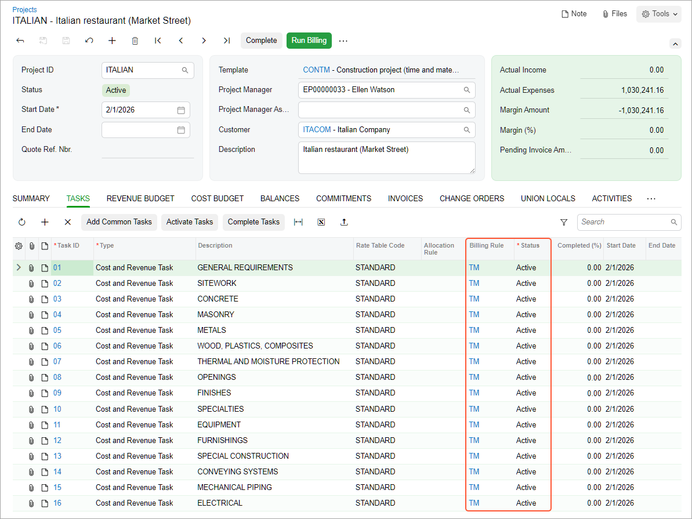
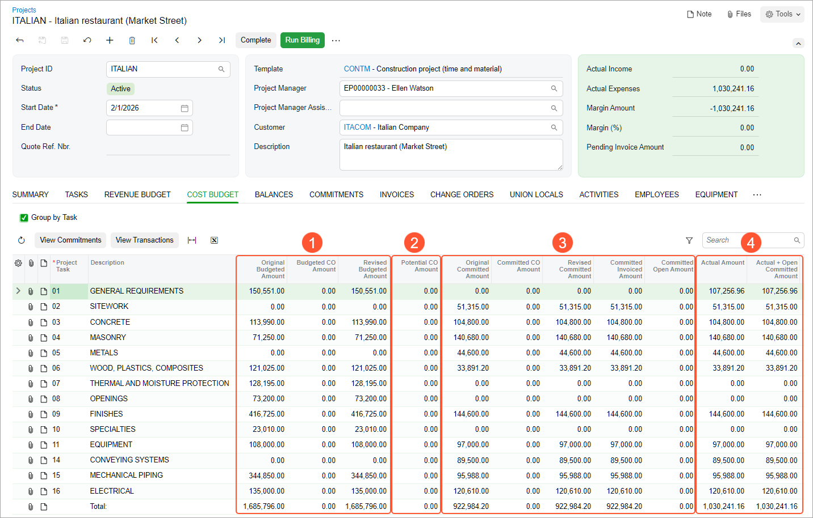

# Construction Project Budget: To Review Project Balance {#_b5ac75d4-f241-4b4f-bfb6-682f67fca7f2 .task}

The following activity will walk you through the process of reviewing the structure, settings, and balances of a project.

**Attention:** This activity is based on the *U100* dataset. If you are using another dataset or if any system settings have been changed in *U100*, these changes can affect the workflow of the activity and the results of the processing. To avoid issues, restore the *U100* dataset to its initial state.

## Story {#section_irv_1kv_brb .section}

Suppose that ToadGreen Building Group is a general contractor building an Italian restaurant for its customer, the Italian Company. A ToadGreen manager has created a project for the work to be performed, and the budget has been agreed on with the customer.

Acting as the construction project manager, you need to review the project balances to become familiar with the project and gather all the information about performed work.

## Configuration Overview {#section_tz4_djx_cnb .section}

In the *U100* dataset, the following tasks have been performed to support this activity:

-   On the [Enable/Disable Features](CS_10_00_00.md) \(CS100000\) form, the *Construction* and *Cost Codes* features have been enabled.
-   On the [Projects](PM_30_10_00.md) \(PM301000\) form, the *ITALIAN* project has been defined.

## Process Overview {#section_qd1_j5q_kdc .section}

You will review project' settings on the [Projects](PM_30_10_00.md) \(PM301000\) form. Then you will review the project revenue budget on the **Revenue Budget** tab of the form, and project cost budget on the **Cost Budget** tab of the form. Finally, you will review the **Invoices** tab to ensure that no invoices have been prepared for the project yet.

## System Preparation {#section_k2n_k5q_kdc .section}

To sign in to the system and prepare to perform the instructions of the activity, do the following:

1.  Launch the Acumatica ERP website, and sign in to a company with the *U100* dataset preloaded; you should sign in as construction project manager by using the *ewatson* username and the *123* password.
2.  On the **General** tab of the [Projects Preferences](PM_10_10_00.md) \(PM101000\) form \(**General Settings** section\), make sure that **Revenue Budget Update** is set to is *Detailed*.
3.  Make sure that **Cost Budget Update** is also set to *Detailed*.
4.  Select the **Internal Cost Commitment Tracking** check box. This exposes the committed values of the budget.
5.  Save your changes to the project accounting preferences.

## Step 1: Reviewing the Billing Settings of the Project {#section_nqg_wfd_mnb .section}

To review the main settings and the structure of the project for the Italian Company, do the following:

1.  On the [Projects](PM_30_10_00.md) \(PM301000\) form, open the *ITALIAN* project.

    In the Summary area of the form, notice that the project's status is *Active*. With this status, transactions and documents can be recorded on this project. Also notice that the project is being performed for the *ITACOM* customer.

2.  On the **Summary** tab, review the billing settings of the project, and notice the following:
    -   The *TM* billing rule is specified in the **Billing Rule** box. This billing rule is used as the default value for newly created project tasks. A billing rule determines how progress billing amounts or project transactions \(or both\) are billed for the project.
    -   **Billing Period** is set to *Month*, which means that **Next Billing Date** is auto-incremented by a month after every run of the project billing process. The billing period is specified for a new project and cannot be changed thereafter.
    -   The **Create Pro Forma Invoice on Billing** check box is selected, which means that during the project billing process, the system creates a pro forma invoice. On release of the pro forma invoice, an AR invoice or credit memo is created.
3.  On the **Tasks** tab, make sure that all the project tasks have the *Active*status \(as shown below\). With this status, transactions and documents can be recorded to those tasks. Notice that the **Billing Rule** column is filled in for all tasks—that is, the billing rule is specified at the project task level. You can change the billing rule for any task, which provides a high level of flexibility of project billing configuration.

    

4.  In the Summary area, notice the amounts in the **Actual Income** and **Actual Expenses** boxes. These amounts indicate that some costs have already been recorded for the project, but there is no revenue yet.
5.  On the **Invoices** tab, notice that there are no documents, which means that the project has not been billed yet.

## Step 2: Reviewing the Cost Budget of the Project {#section_n4v_mgd_mnb .section}

Perform the following instructions to review how the project costs are tracked:

1.  While you are still viewing the *ITALIAN* project on the [Projects](PM_30_10_00.md) \(PM301000\) form, on the **Summary** tab, review the **Cost Budget Level** setting, which defines the level of detail for the budget structure on the **Cost Budget** tab. The selected level of detail, *Task and Cost Code*, indicates that the budget figures and the auto-calculated values are determined for the project by account group, project task, and cost code.
2.  On the **Cost Budget** tab, review the cost budget lines specified for the project. Notice that each record on this tab has a unique combination of values in the **Project Task**, **Cost Code**, and **Account Group** columns \(which together make up the *project budget key*\).

    When a cost project transaction is released, if there is a budget record with the project budget key that matches the transaction, the actual quantity and actual amount are updated in that budget record. If there is no matching budget record, the system creates a new budget line with budgeted amounts of zero and with actual amounts from the transaction. The way the system creates the cost budget line depends on the option that is specified in the **Cost Budget Update** box on the [Projects Preferences](PM_10_10_00.md) \(PM101000\) form.

3.  On the **Cost Budget** tab, select the **Group by Task** check box. The system groups the cost budget lines with the same task into a single line and shows the total for each column of the table in the bottom-most row.
4.  Move the **Potential CO Amount** column by dragging it after the **Revised Budgeted Amount**column, and review the cost budget of the project. The cost budget information is divided into the following *buckets*—that is, groups of columns with similar budget information \(see below\):

    -   Budgeted \(the columns with **Budgeted** in the names; see Item 1 below\): The planned costs of the project. The original budgeted values are entered manually for the project on the **Cost Budget** tab of the [Projects](PM_30_10_00.md) form, or on the [Project Budget](PM_30_90_00.md) \(PM309000\) form. Revised budgeted values can also be entered manually if the change order workflow is not used for the project.
    -   Potential \(the **Potential CO Amount** column; Item 2\): The total quantity of the estimation lines of change requests that have the *Open* status plus the total quantity of the revenue budget lines of the change orders that have the *On Hold*, *Open*, or *Pending Approval* status and are associated with the same project, project task, account group, and cost code or inventory item. These totals are calculated automatically.
    -   Committed \(the columns with **Committed** in their names; Item 3\) The total amounts and total quantities of commitments \(subcontracts and purchase orders\), with a breakdown by the stage of the process \(such as open or invoiced\). These totals are calculated automatically.
    -   Actual \(the columns with **Actual** in their names; Item 4\): The total amounts and total quantities of project transactions released. These totals are calculated automatically.
    

## Step 3: Reviewing the Revenue Budget of the Project { .section}

Perform the following instructions to review how the project revenues are tracked:

1.  While you are still viewing the *ITALIAN* project on the [Projects](PM_30_10_00.md) \(PM301000\) form, on the **Summary** tab of the form, review the **Revenue Budget Level**setting. This setting defines the level of detail for the budget structure on the **Revenue Budget** tab. The selected level of detail, *Task and Cost Code*, indicates that the budget figures and the auto-calculated values are determined for the project by account group, project task, and cost code. Corresponding columns with these settings are available for reviewing and editing on the **Revenue Budget** tab.
2.  On the **Revenue Budget** tab, review the revenue budget lines specified for the project \(which are grouped into similar buckets as those for the cost budget lines\).

    Notice that each record on the **Revenue Budget** tab has a unique combination of values in the **Project Task**, **Cost Code**, and **Account Group** columns \(the *project budget key*\). When a revenue project transaction is released, if there is a budget record with the project task, cost code, and account group that match the transaction, the actual quantity and actual amount are updated in that budget record. If there is no matching budget record, the system creates a new budget line with budgeted amounts of zero and with actual amounts from the transaction.

3.  On the **General** tab of the [Projects Preferences](PM_10_10_00.md) \(PM101000\) form, review the **Revenue Budget Update** setting, which is set to *Detailed*. This means that a new budget record is created with information from the project transaction at the budget level of detail. For the revenue budget of the *ITALIAN* project, this is the project task, cost code, and account group of the project transaction. The same update logic applies to commitments, change orders, and change requests.

    The structure of cost budget is determined independently from the revenue budget structure. Similar rules apply to the cost budget structure of a project. Thus, the **Cost Budget Level** setting can be specified for a project on the **Summary** tab of the [Projects](PM_30_10_00.md) \(PM301000\) form, and the respective **Cost Budget Update** setting \(*Summary* or *Detailed*\) is specified on the **General** tab of the [Projects Preferences](PM_10_10_00.md) form; this setting determines the level of detail for the budget record that is created if there is no matching record \(that is, a record with the same project budget key\) for a cost project transaction being released.

    **Tip:** If you would select *Summary* in the **Revenue Budget Update** or **Cost Budget Update** box, the corresponding budget records will be created with information from the project transaction grouped by project task and account group. This mode is useful if the following conditions are met:

    -   Only certain articles are budgeted at a very detailed level.
    -   There may be many transactions processed with different cost codes and items.
    -   All these transactions are budgeted in a single line of a project.

You have finished reviewing the project settings and project budget.

**Parent topic:**[Managing the Construction Project Budget](../UserGuide/Construction_Project_Budget_Mapref.md)

