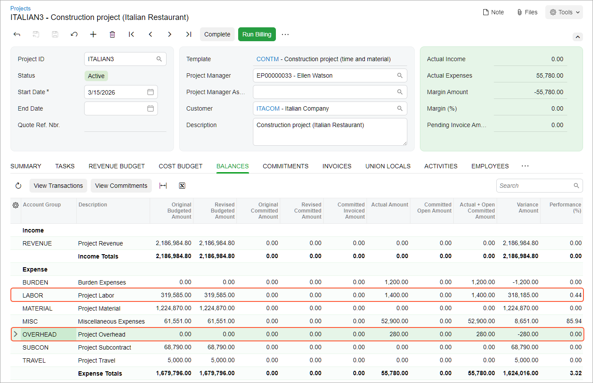

# Construction Project Budget: To Estimate the Budget Overhead {#_6edf331a-9f58-4e03-9fed-248ad1033889 .task}

In this activity, you will learn how to estimate the project overhead calculated based on the project costs.

**Attention:** This activity is based on the *U100* dataset. If you are using another dataset or if any system settings have been changed in *U100*, these changes can affect the workflow of the activity and the results of the processing. To avoid issues, restore the *U100* dataset to its initial state.

## Story { .section}

Suppose that ToadGreen Building Group is a general contractor building an Italian restaurant for its customer, the Italian Company. On March 17, 2026, the construction manager spent 10 working hours on communication related to obtaining construction permits; this time had not initially been budgeted for the project.

Acting as the project accountant, you need to record these additional expenses in the project budget by entering the corresponding project transaction and do not update the general ledger with these expenses. Then you need to estimate the project costs while accounting for the administrative overhead, which is 20% of labor costs.

## Configuration Overview { .section}

In the *U100* dataset, the following tasks have been performed to support this activity:

-   The *Construction* feature has been enabled on the [Enable/Disable Features](CS_10_00_00.md) \(CS100000\) form to provide support for the construction functionality.
-   On the [Projects](PM_30_10_00.md) \(PM301000\) form, the *ITALIAN3* project has been created. Project tasks have been added to the project, and the project budget has been defined.
-   On the [Account Groups](PM_20_10_00.md) \(PM201000\) form, the *OVERHEAD* account group has been created.
-   On the [Allocation Rules](PM_20_75_00.md) \(PM207500\) form, the *OVERHEAD* allocation rule has been created. This allocation rule has been configured to process project transactions that represent labor expenses and to post the overhead, which is calculated as 20% of the transaction amount, to the *OVERHEAD* account group. \(For an example of the configuration of an allocation rule, see [Overhead in the Project Budget: Implementation Activity](Projects_Allocation_Overhead_Implem_Activity.md).\)

## Process Overview { .section}

In this activity, you will first specify the allocation rule for the project task on the [Projects](PM_30_10_00.md) \(PM301000\) form. On the same form, you will then perform allocation for the project and review the project balances.

## System Preparation { .section}

To sign in to the system and prepare to perform the instructions of the activity, do the following:

1.  Launch the Acumatica ERP website, and sign in to a company with the *U100* dataset preloaded; you should sign in as a project accountant by using the *bsanchez* username and the *123* password.
2.  In the info area, in the upper-right corner of the top pane of the Acumatica ERP screen, make sure that the business date in your system is set to 3/17/2026. If a different date is displayed, click the Business Date menu button, and select 3/17/2026 on the calendar. For simplicity, in this activity, you will create and process all documents in the system on this business date.

## Step 1: Creating a Project Transaction {#section_wgt_qfq_crb .section}

To create a project transaction that represents the additional expenses, which do not affect the general ledger, do the following:

1.  On the [Project Transactions](PM_30_40_00.md) \(PM304000\) form, add a new project transaction.
2.  In the Summary area, make sure *PM* is selected as the **Source**.
3.  Enter `Additional operational expenses (March)` as the **Description**.
4.  On the table toolbar, click **Add Row**, and specify the following settings in the added row:

    -   **Project**: *ITALIAN3*
    -   **Project Task**: *01*
    -   **Cost Code**: *01-314*
    -   **Account Group**: *LABOR*
    -   **UOM**: *HOUR*
    -   **Quantity**: `10`
    -   **Billable**: Cleared
    -   **Amount**: `1,400`
    You have left the **Debit Account** and **Credit Account** columns empty so that the corresponding general ledger transaction will not be created. The system also will not use this transaction for billing because you have cleared the **Billable** check box in the row.

5.  On the form toolbar, click **Release** to save your changes to the project transaction and release it.

    Notice that the **GL Batch Nbr.** column of the row is empty, indicating that no corresponding general ledger transaction has been created.

You have finished capturing the costs for the project.

## Step 2: Capturing Project Overhead { .section}

To configure the project for allocation and capture the project overhead, do the following:

1.  On the [Projects](PM_30_10_00.md) \(PM301000\) form, open the *ITALIAN3* project.
2.  On the **Tasks** tab, in the line with the *01* project task, select the *OVERHEAD* allocation rule in the **Allocation Rule** column.
3.  Save your changes to the project.

    On the **Balances** tab, notice the expense line with the *LABOR* account group and the actual amount of $1,400.

4.  On the More menu, under **Billing and Allocations**, click **Run Allocation**.

    The system performs the allocation by using the allocation rule that you have specified for the project task.

    When the allocation is completed, on the **Balances** tab, review the project balance again, as shown below. Notice that one more expense line with the *OVERHEAD* account group has appeared in the table. The actual amount of the line is $280, which is 20% of $1400.

    

5.  In the table, click the line with the *OVERHEAD* account group, and on the table toolbar, click **View Transactions**.

    On the [Project Transaction Details](PM_40_10_00.md) \(PM401000\) form that opens, review the line with the created allocation transaction that corresponds to the account group. In the **Orig. Doc. Type** column, the type of the transaction is *Allocation*. In the **Debit Account Group** column, the *OVERHEAD* account group is specified.

You have recorded expenses and estimated the project overhead.

**Parent topic:**[Managing the Construction Project Budget](../UserGuide/Construction_Project_Budget_Mapref.md)

