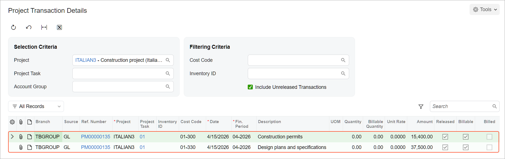
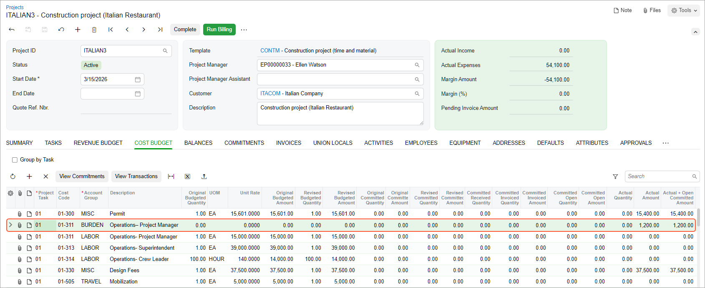

# Construction Project Budget: To Capture Project Costs {#_83cfcfa1-fc62-4fc9-a211-fbd9934d8093 .task}

This activity will walk you through the process of capturing project costs by using project transactions.

**Attention:** This activity is based on the *U100* dataset. If you are using another dataset or if any system settings have been changed in *U100*, these changes can affect the workflow of the activity and the results of the processing. To avoid issues, restore the *U100* dataset to its initial state.

## Story {#section_qgt_qfq_crb .section}

Suppose that ToadGreen Building Group is a general contractor building an Italian restaurant for its customer, the Italian Company. At the start of the project, the construction project manager made sure that the construction permit was promptly obtained for the construction site and that the design plans and specifications were prepared and agreed upon. The expenses related to the work must be reflected in the project budget and categorized in the general ledger because they will later be billed and reflected in financial statements.

Further suppose that the construction manager has spent some time on extra communication, which has not initially been budgeted. This time should not be billed because the project manager's salary is fixed and is billed monthly under a separate project budget line related to labor. However, these expenses must be reflected in the project budget for better estimation of the burden and overhead of the construction project.

Acting as the project accountant, you will enter the general ledger transactions to directly capture the costs and record the work related to gathering the requirements, getting all the necessary construction permits, and preparing the design plans and specifications. Then you will enter the project transaction to capture the additional expenses incurred by the construction project manager.

**Tip:** A project transaction that does not affect the general ledger can also be billed if necessary. In this activity, the processed project transaction will be left as an internal burden expense for informational purposes and will not be billed or allocated.

## Configuration Overview {#section_rgt_qfq_crb .section}

In the *U100* dataset, the following tasks have been performed to support this activity:

-   The *Construction* feature has been enabled on the [Enable/Disable Features](CS_10_00_00.md) \(CS100000\) form to provide support for the construction functionality.
-   On the [Projects](PM_30_10_00.md) \(PM301000\) form, the *ITALIAN3* project has been created. The project tasks were added to the project and the project budget was defined.

## Process Overview {#section_sgt_qfq_crb .section}

On the [Journal Transactions](GL_30_10_00.md) \(GL301000\) form, you will create a batch of general ledger transactions with the project, project task, and cost code specified to record the work related to the first phase of the construction project. You will release the batch, which will generate the corresponding project transaction. Then you will review this transaction on the [Project Transaction Details](PM_40_10_00.md) \(PM401000\) form. Finally, on the [Project Transactions](PM_30_40_00.md) \(PM304000\) form, you will create and release a batch of project transactions that represent additional work that will not be billed and do not affect the general ledger.

## System Preparation { .section}

To prepare to perform the instructions of this activity, do the following:

1.  As a prerequisite activity, complete [Account Groups: To Create an Off-Balance Group](Account_Groups_Implem_Activity_OffBalance.md) to define the account group for collecting statistical information.
2.  Launch the Acumatica ERP website, and sign in to a company with the *U100* dataset preloaded; you should sign in as a project accountant by using the *bsanchez* username and the *123* password.
3.  In the info area, in the upper-right corner of the top pane of the Acumatica ERP screen, make sure that the business date in your system is set to *4/15/2026*. If a different date is displayed, click the Business Date menu button, and select *4/15/2026* on the calendar. For simplicity, in this activity, you will create and process all documents in the system on this business date.

## Step 1: Creating General Ledger Transactions {#section_ugt_qfq_crb .section}

To create a batch of general ledger transactions to represent the work related to the first phase of the construction project, do the following:

1.  Open the [Journal Transactions](GL_30_10_00.md) \(GL301000\) form.
2.  On the form toolbar, click **Add New Record** to create a new batch of general ledger transactions, and in the Summary area, make sure *GL* is selected as the **Module**.
3.  In the **Description** box, type `Construction permits, design plans, specifications`.
4.  On the table toolbar, click **Add Row** to add the first row, which represents the expenses associated with procuring construction permits, and specify the following settings in the row:
    -   **Account**: *54300 - Project Other Expense*
    -   **Project/Contract**: *ITALIAN3*
    -   **Project Task**: *01 - General Requirements*
    -   **Cost Code**: *01-300*
    -   **Debit Amount**: `15,400`
    -   **Transaction Description**: `Construction permits`
5.  Add a second row, which represents the expenses for design plans and specifications, and specify the following settings in the row:
    -   **Account**: *54300 - Project Other Expense*
    -   **Project/Contract**: *ITALIAN3*
    -   **Project Task**: *01 - General Requirements*
    -   **Cost Code**: *01-330*
    -   **Debit Amount**: `37,500`
    -   **Credit Amount**: `0`
    -   **Transaction Description**: `Design plans and specifications`
6.  Add a third row, which balances the batch of transactions, and specify the following settings in the row:
    -   **Account**: *23015 - Accrued Expenses*
    -   **Project**: *X* \(inserted automatically\)
    -   **Cost Code**: *00-000*
    -   **Credit Amount**: `52,900` \(inserted automatically\)
7.  On the form toolbar, click **Remove Hold** to assign the general ledger transaction the *Balanced* status, and then click **Release** to release the transaction.

    When you release the general ledger transaction, for the line with the specified project and project task, the system creates the corresponding project transaction. In the created project transaction, the system inserts the account group to which the account in the transaction line is mapped.

8.  On the [Project Transaction Details](PM_40_10_00.md) \(PM401000\) form, in the Summary area, select *ITALIAN3* as the **Project**. In the table, review the project transaction \(shown below\) that has been created based on the GL transaction that you have processed earlier. In both lines, the **Billable** check box is selected and the **Billed** check box is cleared, indicating that the transactions are pending billing.

    

9.  On the [Projects](PM_30_10_00.md) \(PM301000\) form, open the *ITALIAN3* project, and on the **Cost Budget** tab, review the cost budget lines with the *01-300* and *01-330* cost codes. Notice that the actual amounts in these lines have been updated with the amounts from the project transaction.

## Step 2: Creating a Project Transaction Without Posting to the General Ledger {#section_wgt_qfq_crb .section}

To create a project transaction that represents the additional expenses, which do not affect the general ledger, do the following:

1.  Open the [Project Transactions](PM_30_40_00.md) \(PM304000\) form.
2.  On the form toolbar, click **Add New Record** to create a new project transaction, and in the Summary area, make sure *PM* is selected as the **Source**.
3.  Enter `Additional operational expenses (ITALIAN3 project)` as the **Description**.
4.  On the table toolbar of the **Details** tab, click **Add Row**, and specify the following settings in the added row:

    -   **Project**: *ITALIAN3*
    -   **Project Task**: *01*
    -   **Cost Code**: *01-311*
    -   **Account Group**: *BURDEN*

        Notice that the system warns you that the budget line with this project task, cost code, and account group has not been initially planned in the cost budget of the project.

    -   **UOM**: *HOUR*
    -   **Quantity**: `20`
    -   **Billable**: Cleared
    -   **Amount**: `1,200`
    You leave the **Debit Account** and **Credit Account** columns empty, so that the corresponding general ledger transaction will not be created. The system also will not use this transaction as a basis for billing because you cleared the **Billable** check box in the line.

5.  On the form toolbar, click **Release** to save your changes to the project transaction and release it.

    Notice that the **GL Batch Nbr.** column is empty, indicating that no corresponding general ledger transaction has been created.

6.  On the [Projects](PM_30_10_00.md) \(PM301000\) form, open the *ITALIAN3* project, and on the **Cost Budget** tab, notice that a new cost budget line has been added to the budget \(shown below\) based on the project transaction that you created and released. The original budgeted values in the line are zero; the actual values in the line have been updated based on the project transaction that you have processed.

    

You have finished capturing costs for the project.

**Parent topic:**[Managing the Construction Project Budget](../UserGuide/Construction_Project_Budget_Mapref.md)

