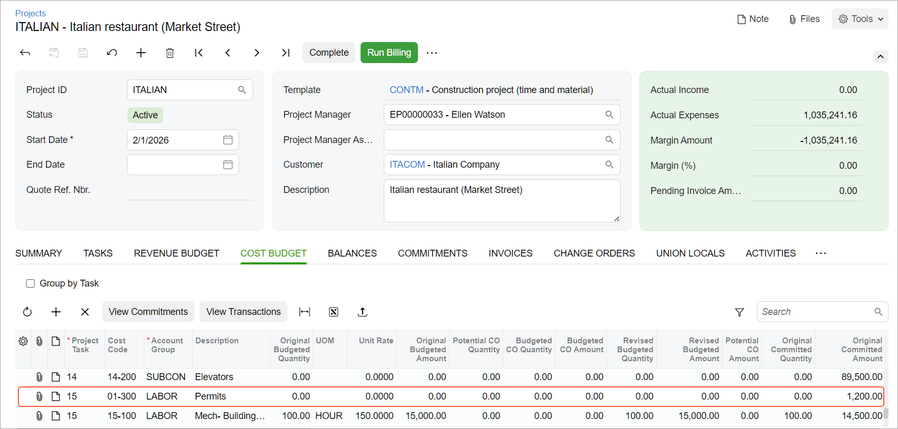

# Construction Project Budget: To Add a New Cost Code to the Project Budget {#_0c1bf17c-c5e4-4167-9aa3-10a89a85e61b .task}

The following activity will walk you through the processing of a subcontract with a cost code that had not been initially specified in the project.

**Attention:** This activity is based on the *U100* dataset. If you are using another dataset or if any system settings have been changed in *U100*, these changes can affect the workflow of the activity and the results of the processing. To avoid issues, restore the *U100* dataset to its initial state.

## Story { .section}

Suppose that ToadGreen is a general contractor building an Italian restaurant for its customer, The Italian Company. On February 15, 2026, the purchasing manager negotiated a subcontract for construction labor with the Harmon Installation subcontractor. This subcontract had not been budgeted initially in the project.

Acting as a ToadGreen project manager, you need to enter a subcontract, record these expenses to a new cost code in the project budget, and make sure that the project cost budget is updated.

## Configuration Overview {#section_tz4_djx_cnb .section}

In the *U100* dataset, the following tasks have been performed to support this activity:

-   On the [Projects](PM_30_10_00.md) \(PM301000\) form, the *ITALIAN* project has been defined. On the **Cost Budget** tab, the cost budget lines have been added along with the appropriate cost codes. On the Summary tab, the **Allow Adding New Items on the Fly** check box is selected.
-   On the [Account Groups](PM_20_10_00.md) \(PM201000\) form, the *SUBCON* account group has been created.
-   On the [Non-Stock Items](IN_20_20_00.md) \(IN202000\) form, the *SUBCONTR* item has been created. The expense account of the item is mapped to the *SUBCON* account group.

## Process Overview { .section}

You will enter a subcontract related to a project on the [Subcontracts](SC_30_10_00.md) \(SC301000\) form, and add a line to the subcontract with the new cost code. Then you will release the subcontract and make sure that the project budget is updated.

## System Preparation { .section}

To prepare to perform the instructions of this activity, do the following:

1.  Launch the Acumatica ERP website, and sign in to a company with the *U100* dataset preloaded. You should sign in as a project manager by using the *ewatson* username and the *123* password.
2.  In the info area, in the upper-right corner of the top pane of the Acumatica ERP screen, make sure that the business date in your system is set to *2/15/2026*. If a different date is displayed, click the Business Date menu button, and select *2/15/2026* on the calendar. For simplicity, in this activity, you will create and process all documents in the system on this business date.

## Step: Entering a Subcontract {#section_jws_vyv_2nb .section}

To enter a subcontract, do the following:

1.  On the [Subcontracts](SC_30_10_00.md) \(SC301000\) form, create a new subcontract.
2.  In the Summary area of the form, in the **Vendor** box, select *HARMINT*, and in the **Description** box, type `Construction labor`.
3.  On the **Details** tab, add a new line with the following settings:
    -   **Inventory ID**: *LABOR*
    -   **Project**: *ITALIAN*
    -   **Project Task**: *15*
4.  In the **Cost Code** column, click the magnifier icon to open the lookup box. On the table toolbar, click **Project Codes**, then click *All Records*.
5.  Click the *01–300* cost code.
6.  Click **Select**. The system closes the lookup box and inserts the cost code in the line. The warning next to the **Cost Code** column of this line indicates that the entered cost code does not exist in the project budget.
7.  In the **Ext. Cost** column of the line, type `1200`.
8.  On the form toolbar, click **Remove Hold**. The system saves the subcontract with the *Open* status.
9.  On the [Projects](PM_30_10_00.md) \(PM301000\) form, open the *ITALIAN* project, and review the **Cost Budget** tab. Notice that the new cost budget line for the *15* project task with the *01-300* cost code has been added, and *1200* is shown in the **Original Committed Amount** column, as shown below. In the added line, the *LABOR* account group is specified because this group includes the expense account of the inventory item specified in the subcontract line.

    

You have processed a subcontract and added a line with a new cost code to the cost budget.

**Parent topic:**[Managing the Construction Project Budget](../UserGuide/Construction_Project_Budget_Mapref.md)

