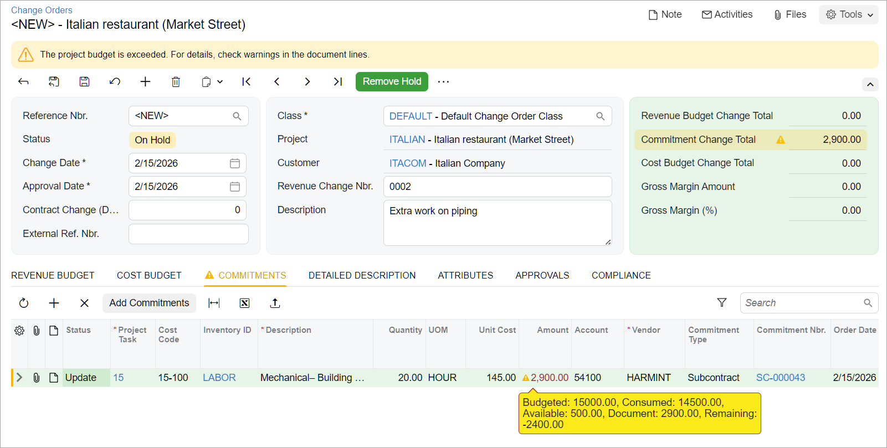
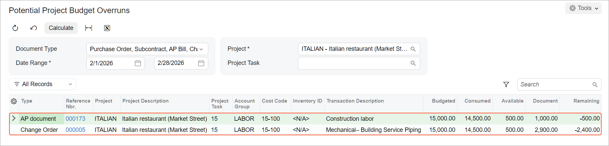

# Construction Project Budget: To Track Project Budget Overrun {#_3dd15d88-fb1f-4e2b-8c20-967e49aeab81 .task}

The following activity will walk you through the process of tracking the budget overrun for a project.

**Attention:** This activity is based on the *U100* dataset. If you are using another dataset or if any system settings have been changed in *U100*, these changes can affect the workflow of the activity and the results of the processing. To avoid issues, restore the *U100* dataset to its initial state.

## Story { .section}

Suppose that ToadGreen Building Group is a general contractor building an Italian restaurant for its customer, Italian Company. The ToadGreen project manager has created a project for the work to be performed, and the budget has been agreed on with the customer. On February 15, 2026, the purchasing agent has negotiated a subcontract for mechanical piping with the Harmon Installation subcontractor at a better price than was initially planned, thus reserving some budget. The subcontractor has started working, and on February 25, 2026, it notified the project manager that an extra 20 hours is necessary to complete the work.

Acting as a project manager, you need to enter all the related documents and review the budget overruns.

## Configuration Overview {#section_tz4_djx_cnb .section}

In the *U100* dataset, the following tasks have been performed to support this activity:

-   On the [Projects](PM_30_10_00.md) \(PM301000\) form, the *ITALIAN* project has been defined. On the **Cost Budget** tab, the cost budget lines have been added. Cost budget lines related to *15 – Mechanical Piping* project task have no budget changes or open commitments, and the actual amount for the lines is 0. Also, the **Change Order Workflow** check box is selected on the **Summary** tab.
-   On the [Vendors](AP_30_30_00.md) \(AP303000\) form, the *HARMINT \(Harmon Installation\)* vendor has been defined.
-   On the [Change Order Classes](PM_20_30_00.md) \(PM203000\) form, the *DEFAULT* change order class has been created and specified as the default change order class on the [Projects Preferences](PM_10_10_00.md) \(PM101000\) form.

## Process Overview { .section}

You will enter a subcontract related to a project on the [Subcontracts](SC_30_10_00.md) \(SC301000\) form. Then you will create the change order for this subcontract on the [Change Orders](PM_30_80_00.md) \(PM308000\) form. After that, you will create an accounts payable bill on the [Bills and Adjustments](AP_30_10_00.md) \(AP301000\) form. Finally, on the [Potential Project Budget Overruns](PM_40_40_00.md) \(PM404000\) form, you will review the documents that have exceeded the project budget.

## System Preparation { .section}

To prepare to perform the instructions of this activity, do the following:

1.  Launch the Acumatica ERP website, and sign in to a company with the *U100* dataset preloaded. You should sign in as a construction project manager by using the *ewatson* username and the *123* password.
2.  On the [Projects Preferences](PM_10_10_00.md) \(PM101000\) form, in the **General Settings** section of the **General** tab, specify the following settings:
    -   **Budget Control**: *Show a Warning*
    -   **Internal Cost Commitment Tracking**: Selected
3.  Save your changes.
4.  In the info area, in the upper-right corner of the top pane of the Acumatica ERP screen, make sure that the business date in your system is set to *2/15/2026*. If a different date is displayed, click the Business Date menu button, and select *2/15/2026* on the calendar. For simplicity, in this activity, you will create and process all documents in the system on this business date.

## Step 1: Recording a Vendor Commitment {#section_ews_vyv_2nb .section}

To record the commitment to the project, do the following:

1.  On the [Subcontracts](SC_30_10_00.md) \(SC301000\) form, add a new record.
2.  In the Summary area, specify the following settings:
    -   **Vendor**: *HARMINT*
    -   **Description**: `Mechanical piping`
    -   **Date**: *2/15/2026*
3.  On the **Details** tab, add two lines to the table as follows:
    1.  Add the first line, and specify the following settings:
        -   **Inventory ID**: *LABOR*
        -   **Project**: *ITALIAN*
        -   **Project Task**: `15`
        -   **Cost Code**: `15-100`
        -   **Line Description**: `Mechanical piping work`
        -   **UOM**: *HOUR*
        -   **Order Qty.**: `100`
        -   **Unit Cost**: `145`
    2.  Add the second line, and specify the following settings:
        -   **Inventory ID**: *PROJMATERIAL*
        -   **Project**: *ITALIAN*
        -   **Project Task**: `15`
        -   **Cost Code**: `15-100`
        -   **Line Description**: `Mechanical piping materials`
        -   **UOM**: *EA*
        -   **Order Qty**: `1`
        -   **Unit Cost**: `17000`
4.  On the form toolbar, click **Remove Hold**. The system saves the subcontract and assigns it the *Open* status. Make sure that the subcontract total is $31,500.
5.  On the [Projects](PM_30_10_00.md) \(PM301000\) form, open the *ITALIAN* project, and on the **Cost Budget** tab, make sure of the following:
    -   In the line with the *15* project task, the *15–100* cost code, and *LABOR* account group, the **Original Committed Amount** is now *14,500*.
    -   In the line with the *15* project task, the *15–100* cost code, and the *MATERIAL* account group, the **Original Committed Amount** is now *17,000*.

## Step 2: Recording the Extra Work {#section_fws_vyv_2nb .section}

To process the extra work needed for the project, create and process a change order by doing the following:

1.  While you are still viewing the *ITALIAN* project on the [Projects](PM_30_10_00.md) \(PM301000\) form, on the More menu \(under **Change Management**\), click **Create Change Order**. The system creates a change order for the project and opens it on the [Change Orders](PM_30_80_00.md) \(PM308000\) form.
2.  In the Summary area, specify the following settings:
    -   **Class**: *DEFAULT* \(inserted automatically\)
    -   **Project**: *ITALIAN* \(inserted automatically\)
    -   **Change Date**: *2/25/2026*
    -   **Approval Date**: *2/25/2026*
    -   **Description**: `Extra work on piping`
3.  On the table toolbar of the **Commitments** tab, click **Add Commitments**, and in the **Add Commitments** dialog box, select the unlabeled check box for the line with the following settings:
    -   **Project Task**: *15*
    -   **Cost Code**: *15-100*
    -   **Inventory ID**: *LABOR*
4.  Click **Add Lines &amp; Close** to add the selected line to the change order and close the dialog box.
5.  In the line that has appeared on the **Commitments** tab, set **Quantity** to `20`.

    Because you have only $500 of the budget available and the change amount exceeds the available budget by $2,400, the overbudget warning is displayed, as shown below. The *Consumed* amount in the warning indicates the total of open commitments and already-processed actual amounts for the project.

    

6.  Save the change order, which has the *On Hold* status.

## Step 3: Creating a Vendor Bill {#section_hws_vyv_2nb .section}

Enter an AP bill for the subcontract as follows:

1.  On the [Bills and Adjustments](AP_30_10_00.md) \(AP301000\) form, create a new document, and specify the following settings in the Summary area:
    -   **Type**: *Bill*
    -   **Vendor**: *HARMINT*
    -   **Date**: *2/15/2026*
    -   **Description**: `Mechanical piping work`
2.  On the **Details** tab, add a new row with the following settings:
    -   **Inventory ID**: *LABOR*
    -   **Quantity**: `10`
    -   **UOM**: *HOUR*
    -   **Unit Cost**: `100`
    -   **Project**: *ITALIAN*
    -   **Project Task**: `15`
    -   **Cost Code**: `15-100`
3.  Save the bill, which has the **On Hold** status, and review the overbudget warning displayed in the **Ext. Cost** column. The amount to be paid by the bill exceeds the budget by $500.

## Step 4: Viewing Documents Exceeding the Project Budget {#section_iws_vyv_2nb .section}

To view all documents that exceed the budgeted amounts, do the following:

1.  Open the [Potential Project Budget Overruns](PM_40_40_00.md) \(PM404000\) form.
2.  In the Selection area, specify the following values:
    -   **Project**: *ITALIAN*
    -   **Date Range**: *2/1/2026*, *2/28/2026*
3.  On the form toolbar, click **Calculate**. The system shows the list of documents, along with the document amounts and the amounts that exceed the budgeted amounts. Notice that the subcontract that you have processed does not exceed the budgeted amounts, and thus is not shown in the table.

    

You have entered the documents for the project and reviewed the budget overruns.

**Parent topic:**[Managing the Construction Project Budget](../UserGuide/Construction_Project_Budget_Mapref.md)

