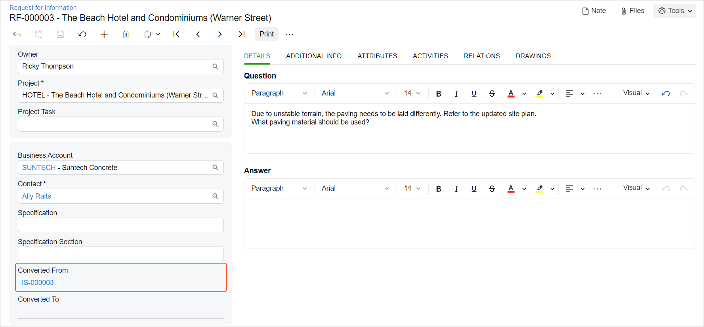

# Requests for Information: To Create a Request for Information from a Project Issue {#_4831f5a8-655f-407e-a64e-37f5bf3e4cd4 .task}

This activity will walk you through the process of creating a request for information from a project issue.

**Attention:** This activity is based on the *U100* dataset. If you are using another dataset or if any system settings have been changed in *U100*, these changes can affect the workflow of the activity and the results of the processing. To avoid issues, restore the *U100* dataset to its initial state.

## Story { .section}

Suppose that a design issue has been discovered on the construction site of the Beach Hotel and Condominiums, a project that the ToadGreen company is working on: Because of the unstable terrain, the paving should be placed differently. The engineer has reported that the issue will take three days to be resolved and it will cost $60,000.

Acting as a construction foreman, you need to enter the project issue in the system, and then you need to clarify which paving material needs to be used by processing a request for information for the project issue.

## Configuration Overview {#section_kt5_lgw_gpb .section}

In the *U100* dataset, the following tasks have been performed to support this activity:

-   On the [Enable/Disable Features](CS_10_00_00.md) \(CS100000\) form, the *Construction* and *Construction Project Management* features have been enabled in the *Projects* group of features.
-   On the [Project Management Classes](PJ_20_10_00.md#) \(PJ201000\) form, the *FIELD* class has been defined with the **Project Issues** check box selected in the **Use For** section of the Summary area.
-   On the [Projects](PM_30_10_00.md#) \(PM301000\) form, the *HOTEL* project has been created with multiple project tasks.
-   On the [Employees](EP_20_30_00.md) \(EP203000\) form, the *EP00000032 – Ricky Thompson* employee record has been created.
-   On the [Vendors](AP_30_30_00.md) \(AP303000\) form, the *SUNTECH* subcontractor has been created.

## Process Overview { .section}

You will create the project issue on the [Project Issue](PJ_30_20_00.md#) \(PJ302000\) form. You will then convert it to a request for information on the [Request for Information](PJ_30_10_00.md) \(PJ301000\) form and send the email to the responsible person on the [Email Activity](CR_30_60_15.md) \(CR306015\) form.

## System Preparation { .section}

To prepare to perform the instructions of this activity, do the following:

1.  As a prerequisite activity, configure the project issue types by performing the instructions in the [Project Issues: Implementation Activity](Construction_Project_Issues_Implem_Activity.md).
2.  Launch the Acumatica ERP website, and sign in to a company with the *U100* dataset preloaded. You should sign in as a construction foreman by using the *epsmith* username and the *123* password.
3.  In the info area, in the upper-right corner of the top pane of the Acumatica ERP screen, make sure that the business date in your system is set to *2/15/2026*. If a different date is displayed, click the Business Date menu button, and select *2/15/2026* on the calendar. For simplicity, in this activity, you will create and process all documents in the system on this business date.

## Step 1: Creating the Project Issue { .section}

To create the project issue, do the following:

1.  On the [Project Issue](PJ_30_20_00.md#) \(PJ302000\) form, add a new record.
2.  In the Summary area, specify the following settings:
    -   **Class ID**: *FIELD*
    -   **Project Issue Type**: *Design Issue*
    -   **Summary**: `Paving should be replaced`
    -   **Project**: *HOTEL*
    -   **Owner**: *Ricky Thompson*
    -   **Due Date**: *2/22/2026* \(inserted automatically\)
    -   **Schedule Impact \(Days\)**: Selected
    -   **Schedule Impact \(Days\)**: `3`
    -   **Cost Impact**: Selected
    -   **Cost Impact**: `60,000`
3.  On the **Details** tab, type the following information: `Due to unstable terrain, the paving needs to be laid differently. Refer to the updated site plan`.
4.  Save the project issue.
5.  On the table toolbar of the **Drawings** tab, click **Add Drawing Log**.
6.  In the **Add Drawing Log** dialog box, which opens, select the check box in the unlabeled column for the drawing log with the *Site plan* title, and click **Add &amp; Close** to add the drawing log and close the dialog box.
7.  Save your changes.

## Step 2: Converting the Project Issue to a Request for Information { .section}

To convert the issue to the request for information, do the following:

1.  While you are still viewing the *Paving should be replaced* project issue on the [Project Issue](PJ_30_20_00.md#) \(PJ302000\) form, click **Convert to RFI** on the form toolbar.

    The [Request for Information](PJ_30_10_00.md) \(PJ301000\) form opens with the new request for information. The system has copied the settings from the original project issue.

2.  In the Summary area, specify the following settings:
    -   **Class**: *DOCRFI*
    -   **Owner**: *Ricky Thompson*
    -   **Business Account**: *SUNTECH* \(the subcontractor to perform the work\)
    -   **Contact**: *Ally Ralts*
    -   In the **Question** pane on the **Details** tab, add the following text: `What paving material should be used?`
3.  Save your changes. Notice that the link to the original project issue is displayed in the **Converted From** box, as shown below.

    

4.  On the More menu, click **Email**. The [Email Activity](CR_30_60_15.md) \(CR306015\) form opens. The contact specified for the request for information \(*Ally Ralts*\) is the default recipient of the email.
5.  On the **Message** tab, type `What paving material should be used?`
6.  Click **Send** on the form toolbar to send the email, close the form and return to the request for information.

You have entered the project issue and converted it to a request for information. After the needed information is received, you could create a change request from this project issue or close the request.

**Parent topic:**[Processing Requests for Information](../UserGuide/Construction_RFI_Mapref.md)

