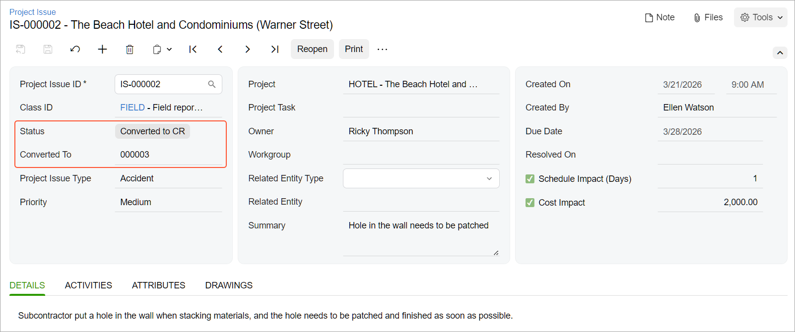

# Project Issues: To Create a Change Request from a Project Issue {#_5831f5a8-655f-407e-a64e-37f5bf3e4cd4 .task}

This activity will walk you through the process of creating a project issue and converting a request for information to a change request.

## Story { .section}

Suppose that on *3/21/2026*, a design issue has occurred on the construction site of the Beach Hotel and Condominiums project that the ToadGreen company is working on: A subcontractor put a hole in a wall when stacking materials. The project engineer has reported that one day is necessary to fix the issue, and it will cost $2000.

Acting as a ToadGreen construction project manager, you need to create the project issue in the system, and then convert it to a change request.

## Configuration Overview {#section_k44_tw5_gnb .section}

In the *U100* dataset, the following tasks have been performed to support this activity:

-   On the [Enable/Disable Features](CS_10_00_00.md) \(CS100000\) form, the *Construction* feature have been enabled.
-   On the [Project Management Classes](PJ_20_10_00.md#) \(PJ201000\) form, the *FIELD* class has been defined with the **Project Issues** check box selected in the **Use For** section.
-   On the [Projects](PM_30_10_00.md) \(PM301000\) form, the *HOTEL* project has been configured; the project tasks have been created, along with the related cost and revenue budget.

## Process Overview { .section}

You will create a project issue on the [Project Issue](PJ_30_20_00.md#) \(PJ302000\) form. You will then convert it to a change request for it on the [Change Requests](PM_30_85_00.md#) \(PM308500\) form.

## System Preparation { .section}

To prepare to perform the instructions of this activity, do the following:

1.  As a prerequisite activity, configure the two-tier change management by performing the instructions in the [Change Requests: Implementation Activity](Projects_Two_Tier_Change_Management_Implem_Activity.md).
2.  As a prerequisite activity, configure the project issue types by performing the instructions in the [Project Issues: Implementation Activity](Construction_Project_Issues_Implem_Activity.md).
3.  Launch the Acumatica ERP website, and sign in to a company with the *U100* dataset preloaded. You should sign in as a construction project manager by using the *ewatson* username and the *123* password.
4.  In the info area, in the upper-right corner of the top pane of the Acumatica ERP screen, make sure that the business date in your system is set to *3/21/2026*. If a different date is displayed, click the Business Date menu button, and select *3/21/2026* on the calendar. For simplicity, in this activity, you will create and process all documents in the system on this business date.

## Step 1: Creating the Project Issue { .section}

To create the project issue, do the following:

1.  On the [Project Issue](PJ_30_20_00.md#) \(PJ302000\) form, add a new record.
2.  In the Summary area, specify the following settings:
    -   **Class ID**: *FIELD*
    -   **Project Issue Type**: *Accident*
    -   **Summary**: `Hole in the wall needs to be patched`
    -   **Project**: *HOTEL*
    -   **Owner**: *Ricky Thompson*
    -   **Due Date**: *3/28/2026* \(specified automatically\)
    -   **Schedule Impact \(Days\)**: Selected
    -   **Schedule Impact \(Days\)**: `1`
    -   **Cost Impact**: Selected
    -   **Cost Impact**: `2000`
3.  On the **Details** tab, type the following information: `Subcontractor put a hole in the wall when stacking materials, and the hole needs to be patched and finished as soon as possible`.
4.  Save the project issue.

## Step 2: Converting the Project Issue to a Change Request { .section}

Create a change request based on the project issue, by doing the following:

1.  While you are still viewing the *Hole in the wall needs to be patched* project issue on the [Project Issue](PJ_30_20_00.md#) \(PJ302000\) form, click **Convert to Change Request** on the form toolbar.

    The [Change Requests](PM_30_85_00.md#) \(PM308500\) form opens with the created change request, with settings copied from the project issue. In the **Project Issue** box of the Summary area, the ID of the original project issue is specified.

2.  On the form toolbar, click **Remove Hold**. The change request is assigned the *Open* status.
3.  Click the link in the **Project Issue** box in the Summary area to open the original project issue.
4.  On the [Project Issue](PJ_30_20_00.md#) form, which opens with the *Hole in the wall needs to be patched* project issue, make sure that the project issue now has *Converted to CR* in the **Status** box \(as shown below\). The reference number of the related change request is displayed in the **Converted To** box.

    

You have converted the project issue to a change request, which can now be processed further to record the expenses to the cost budget of the project.

**Parent topic:**[Processing Project Issues](../UserGuide/Construction_Project_Issues_Mapref.md)

