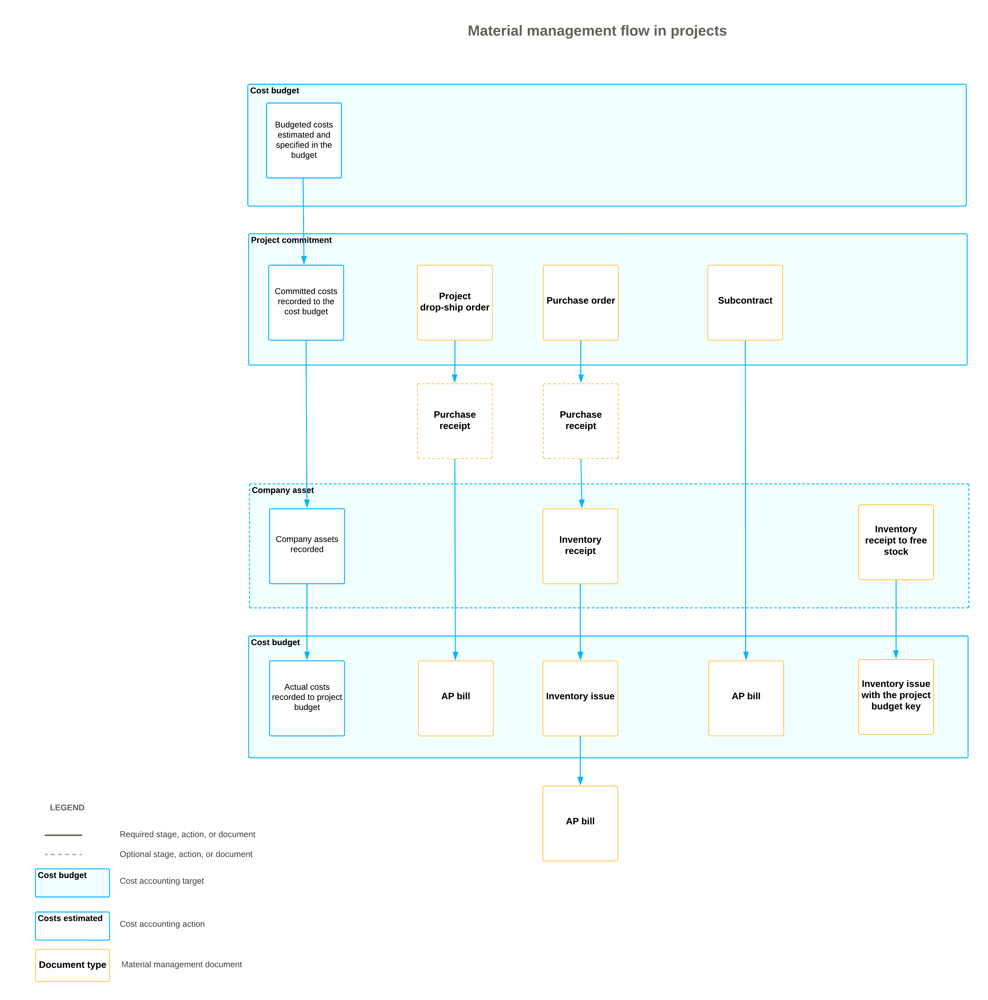

# Project Material Management: General Information {#_c8cd6f12-f687-4206-b3dc-c4aba30581a6 .concept}

A project may require materials that you need to plan before work begins. By budgeting materials and managing them properly, you can ensure that the project runs smoothly and that all the materials are available on time. You can manage all project's material list on the [Project Materials](PM_30_65_00.md) \(PM306500\) form.

A project material is an inventory item defined in Acumatica ERP as either of the following:

-   A stock item
-   A non-stock item that requires receipt and shipment

## Learning Objectives { .section}

-   Create a material list for a project
-   Allocate the materials for the project
-   Purchase project materials to be received in the company warehouse or at the project site
-   Track the receipt of project materials to the company warehouse and move them to the project site, if needed
-   Record the accrued item cost on purchases and sales in the system

## Applicable Scenario { .section}

You need to accurately track materials purchased for projects to avoid delays, minimize costs, and ensure the availability of necessary resources at each stage of the project.

## Project Materials Aligned with the Budget { .section}

On the [Project Materials](PM_30_65_00.md) \(PM306500\) form, you can manage material requirements by project task while keeping costs tied to the project budget.

Each material listed on the form is linked to the project budget key, so its actual costs stay aligned with the related budget lines and commitments. You can allocate stock items, purchase items to be delivered to a warehouse, or have items drop-shipped to the project site, and you can track the materials at each stage of fulfillment.

Each material line represents one material requirement—that is, a specific stock or non-stock item requiring a purchase receipt and shipment and the quantity needed for a specific project task. In each material line, you can view the project task, account group, and cost code. This makes it easy to track each material’s costs against the corresponding budget line and monitor commitments and actual costs in the project budget.

## General Steps of Managing Project Materials { .section}

Managing a project’s materials consists of the following general steps:

1.  Creating the project's material list and selecting provisioning sources on the [Project Materials](PM_30_65_00.md) \(PM306500\) form. For details, see [Project Material Management: Creation of a Material List](Construction_Project_Material_Mgmt_Material_List.md).
2.  Allocating any available materials for the project, as described in [Project Material Management: Allocation of Materials for a Project](Construction_Project_Material_Mgmt_Material_Allocation.md).
3.  Purchasing project materials by using the [Project Materials](PM_30_65_00.md) form as the starting point in either of the following ways:
    -   Drop-shipping directly to the project site. For details, see [Project Material Management: Drop-Shipment of Materials](Construction_Project_Material_Mgmt_Drop-Shipment_of_Materials.md).
    -   Purchasing to one of your company’s warehouses. For details, see [Project Material Management: Purchase of Materials to a Warehouse](Construction_Project_Material_Mgmt_Purchasing_to_Warehouse.md).
    -   Optional: Linking an existing purchase order or drop-ship purchase order to a material line. To link the material line to the purchase order line, you click **PO Link** on the table toolbar of the [Project Materials](PM_30_65_00.md) form and select the corresponding purchase order line in the dialog box that opens.
4.  Tracking the receipt of materials in the company warehouse. On the [Project Materials](PM_30_65_00.md) form, you monitor when the purchase receipt for the purchase order has been released, as described in [Project Material Management: Tracking of the Receipt of Materials in a Warehouse](Construction_Project_Material_Mgmt_Tracking_Material_Receipt.md).
5.  Processing a material issue to record the movement of the project's materials from the company warehouse to the project site. For details, see [Project Material Management: Movement of Materials to the Project Site](Construction_Project_Material_Mgmt_Material_Shipment.md).

## Materials Provided by Subcontractors and from Free Stock { .section}

In addition to the general workflow of project material management in Acumatica ERP, depending on your company’s business processes, you may have the following general cases of using materials for projects:

-   The materials are provided by a subcontractor along with the services related to these materials. In this case, the purchasing manager creates subcontracts on the [Subcontracts](SC_30_10_00.md) \(SC301000\) form. When a subcontract is removed from hold, the system creates a commitment to the project budget. Actual costs are recorded to the project budget on release of the AP bill for the subcontract.
-   The materials are already available at a company warehouse as a free stock, which is not reserved for any project. In this case, the project manager issues the stock directly for the project on the [Issues](IN_30_20_00.md) \(IN302000\) form. These materials will be recorded as actual expenses on release of the inventory issue transaction. The system doesn’t track these materials as project commitments. Actual costs are recorded to the project budget on release of the inventory issue.

If some project inventory is left unused for a completed project, you need to transfer all the leftover material back to the free stock. For more information, see [Project Inventory Tracking: Mass Processing](Projects_Inventory_Tracking_MassProcessing.md).

## Material Management Flow for Project Commitments { .section}

The following diagram illustrates the material management flow in projects for all commitments and shows how costs are recorded to the project budget depending on the type of document being processed.

**Tip:** The system tracks subcontracts as commitments to projects if the **Internal Cost Commitment Tracking** check box is selected on the [Projects Preferences](PM_10_10_00.md) \(PM101000\) form. For details about subcontracts, see [Subcontracts: General Information](Construction_Subcontracts_GeneralInfo.md).

**Parent topic:**[Managing Project Materials](../UserGuide/Construction_Project_Materials_Mgmt_Mapref.md)

