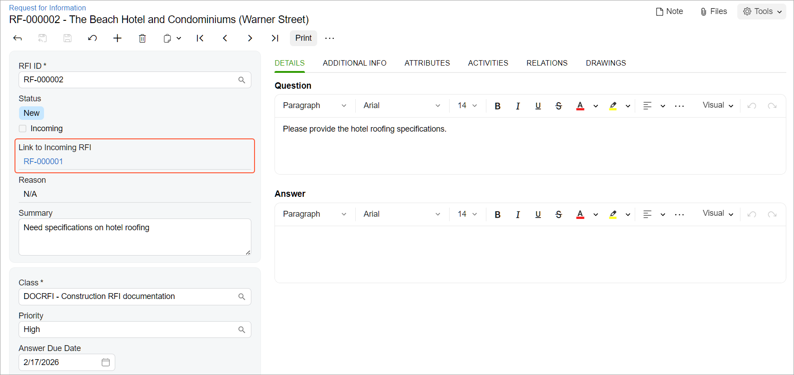

# Requests for Information: To Process Requests for Information {#_3c6c35ca-4659-49fe-a3b9-703301412fb5 .task}

This activity will walk you through the processing of both an incoming request for information \(RFI\) and the corresponding outgoing request for information.

**Attention:** This activity is based on the *U100* dataset. If you are using another dataset or if any system settings have been changed in *U100*, these changes can affect the workflow of the activity and the results of the processing. To avoid issues, restore the *U100* dataset to its initial state.

## Story { .section}

Suppose that the ToadGreen company is building a hotel for the Equity Group Investors customer. Then suppose that the customer has requested a specification for the hotel roofing. In order to provide this specification, the ToadGreen project engineer \(Ricky Thompson\) needs to request these specifications from Balaji Rajan, an engineer of the subcontractor company that performs this part of the work for the project.

Acting as the ToadGreen project engineer, you need to create an incoming request for information from the subcontractor, and then create the related outgoing request for information for an external engineer who can provide the requested specifications. After the specifications are received, you send them to a project engineer for review.

## Configuration Overview { .section}

In the *U100* dataset, the following tasks have been performed to support this activity:

-   On the [Enable/Disable Features](CS_10_00_00.md) \(CS100000\) form, the *Construction* and *Construction Project Management* features have been enabled in the *Projects* group.
-   On the [Project Management Classes](PJ_20_10_00.md#) \(PJ201000\) form, the *DOCRFI* class has been defined with the **Request for Information** check box selected in the **Use For** section.
-   On the [Projects](PM_30_10_00.md#) \(PM301000\) form, the *HOTEL* project for the *EQUGRP* customer has been created. Also, the *DL-000001* drawing log with the *roofing.gif* file for the *HOTEL* project has been added on the [Drawing Logs](PJ_40_30_00.md#) \(PJ403000\) form for this project.
-   On the [Customers](AR_30_30_00.md#) \(AR303000\) form, the *EQUGRP - Equity Group Investors* account has been created. On the **Contacts** tab of this form, a contact for *Jessica Drake* has been added.
-   On the [Contacts](CR_30_20_00.md#) \(CR302000\) form, a contact record for *Balaji Rajan* has been created.

## Process Overview { .section}

You will create an incoming request for information on the [Request for Information](PJ_30_10_00.md#) \(PJ301000\) form. Then you will create an outgoing request for information based on this incoming request for information on the same form. You will and send an email to the external expert by using the [Email Activity](CR_30_60_15.md#) \(CR306015\) form. Then you will add the drawing log with the needed information to the request and send an email to the person responsible for document review by using the [Email Activity](CR_30_60_15.md#) form.

## System Preparation { .section}

To prepare to perform the instructions of this activity, do the following:

1.  Launch the Acumatica ERP website, and sign in to a company with the *U100* dataset preloaded. You should sign in as an engineer by using the *jwagner* username and the *123* password.
2.  In the info area, in the upper-right corner of the top pane of the Acumatica ERP screen, make sure that the business date in your system is set to *2/15/2026*. If a different date is displayed, click the Business Date menu button, and select *2/15/2026* on the calendar. For simplicity, in this activity, you will create and process all documents in the system during this business date.

## Step 1: Creating an Incoming Request for Information { .section}

To create an incoming request for information, do the following:

1.  On the [Request for Information](PJ_30_10_00.md#) \(PJ301000\) form, add a new record.
2.  In the Summary area, specify the following settings:
    -   **Incoming**: Selected \(the request has been received from outside the company\)
    -   **Summary**: `Need specifications on hotel roofing`
    -   **Class**: *DOCRFI*
    -   **Priority**: *High*
    -   **Owner**: *Ricky Thompson*
    -   **Project**: *HOTEL*
    -   **Business Account**: *EQUGRP*
    -   **Contact**: *Jessica Drake*
3.  In the **Question** pane on the**Details**tab, type the following information: `Please provide the hotel roofing specifications.`
4.  In the **Change Impact** section on the **Additional Info** tab, select the **Design Change** check box.
5.  Save the request for information.
6.  On the form toolbar, click **Open**. The system changes the status in the **Status** box to *Open*.

You have created the incoming request for information.

## Step 2: Requesting Information from an External Expert { .section}

To create an outgoing request for information from the incoming one, do the following:

1.  While you are still viewing the created request for information on the [Request for Information](PJ_30_10_00.md) \(PJ301000\) form, click **Convert to Outgoing RFI** on the form toolbar. The system creates the new request for information and opens it on the same form.
2.  In the **Contact** box, select *Balaji Rajan*, and save your changes.

    Outgoing requests for information come from inside the company and are addressed to external experts. Note that the link to the original incoming RFI \(which you created in Step 1\) is displayed in the **Link to Incoming RFI** box, as shown below.

    

3.  On the More menu, click **Email**.

    The system opens the [Email Activity](CR_30_60_15.md) \(CR306015\) form with the appropriate contact, *Balaji Rajan*, specified in the **To** box.

4.  On the **Message** tab, specify the following text: `Please provide the specifications for hotel roofing.`
5.  On the form toolbar, click **Send** to send the email. The system closes the form and returns to the outgoing request for information on the [Request for Information](PJ_30_10_00.md#) form. On the **Activities** tab, notice that the email you sent is listed.

    Suppose that Balaji Rajan replied to the email and attached a new drawing for the hotel roofing.

6.  On the table toolbar of the **Drawings** tab, click **Add Drawing Log**.
7.  In the **Add Drawing Log** dialog box, which opens, select the unlabeled check box for the *DL-000001* drawing log with the *Hotel roofing specification* description, and then click **Add &amp; Close**. The system closes the dialog box and adds a row with the drawing log on the **Drawings** tab.
8.  On the **Details** tab, in the **Answer** pane, type `See the attached drawing`, and save your changes.
9.  On the More menu, click **Email**.
10. On the [Email Activity](CR_30_60_15.md#) form, which opens, do the following:
    1.  In the **To** box, remove *Balaji Rajan*, and add *Ricky Thompson*, who needs to review the materials. On the form title bar, notice **Files \(2\)**, which indicates that the system has attached the files from the request for information to the created email.
    2.  Click **Send** on the form toolbar.

You have processed the outgoing request for information. After the responsible person reviews the provided information, the request for information can be closed or converted to a change request.

**Parent topic:**[Processing Requests for Information](../UserGuide/Construction_RFI_Mapref.md)

