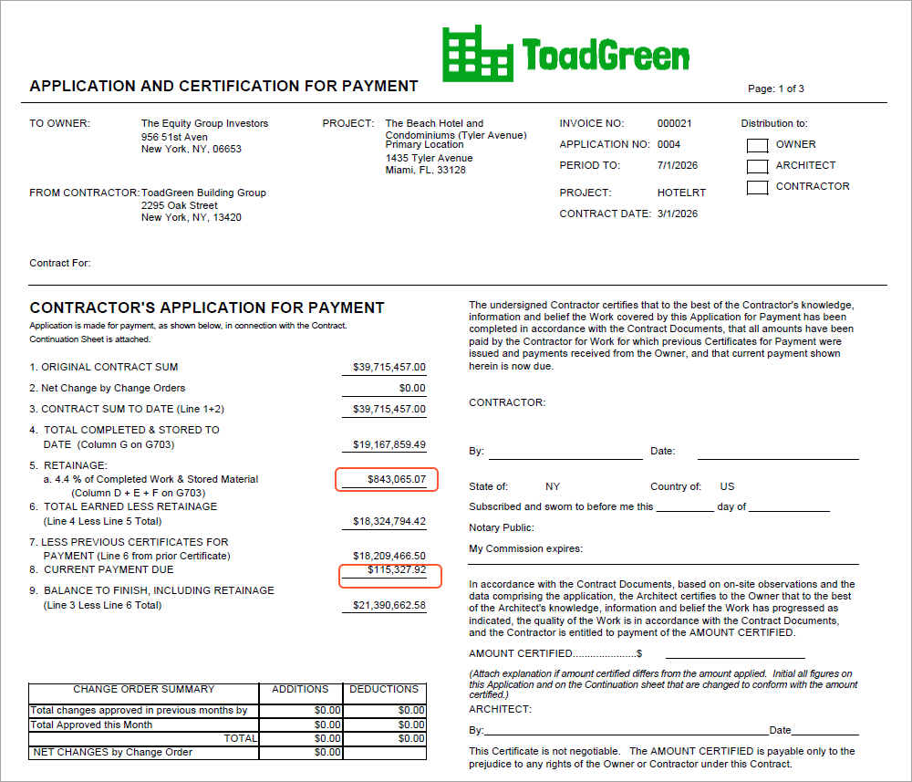

# Construction Reports: To Prepare AIA Report for Released Retainage {#_1ade9f09-d902-4d27-90fb-fe2fb13ea312 .task}

This activity will walk you through the process of preparing AIA report for released retainage.

**Attention:** This activity is based on the *U100* dataset. If you are using another dataset or if any system settings have been changed in *U100*, these changes can affect the workflow of the activity and the results of the processing. To avoid issues, restore the *U100* dataset to its initial state.

## Story {#section_nmk_q5l_4pb .section}

Suppose that the ToadGreen Building Group company is in the middle of building a hotel for the Equity Group Investors. As has been agreed with the customer, the customer is being billed once a month based on the progress of the performed work. The ToadGreen construction project manager is tracking the progress of work as a fixed-price project, billing the customer by the percent of project completion. The project has been billed three times, in April, May and June, *2026*. According to the contract signed with the customer, the customer retains 5% of the amount of each progress billing line in an invoice.

Also suppose that on *6/10/2026*, after a certain part of work is done, the ToadGreen project manager need to prepare to request the release of 20% of the retained amount from customer. Acting as the project manager, you need to release a part of retainage and prepare an AIA report for the released part of retainage for the corresponding financial period.

## Configuration Overview {#section_wzb_x5l_4pb .section}

In the *U100* dataset, the following tasks have been performed to support this activity:

-   The following features have been enabled on the [Enable/Disable Features](CS_10_00_00.md) \(CS100000\) form:
    -   *Construction*
    -   *Construction Project Management*
-   On the [Projects](PM_30_10_00.md#) \(PM301000\) form, the *HOTELRT* project has been created with project tasks and their budgets. In the billing rule assigned to project tasks \(*PROGRRET*\), the only progress billing step is configured on the [Billing Rules](PM_20_70_00.md) \(PM207000\) form and the **Create Zero Lines with Zero Amount and Quantity** check box is selected.
-   For the project, three billing iterations have been performed. The pro forma invoices and corresponding AR invoices has been prepared and released on the [Pro Forma Invoices](PM_30_70_00.md) \(PM307000\) and [Invoices and Memos](AR_30_10_00.md) \(AR301000\) forms, respectively.

## Process Overview { .section}

You will release a part of retainage for the project by using the [Release AR Retainage](AR_51_00_00.md) \(AR510000\) form; then you will release the prepared retainage invoice on the [Invoices and Memos](AR_30_10_00.md) \(AR301000\) form. Then you will run project billing for the project and review the prepared pro forma invoice for the released retainage on the [Pro Forma Invoices](PM_30_70_00.md) \(PM307000\) form. Finally, you will prepare AIA report for the released retainage amount.

## System Preparation { .section}

To prepare to perform the instructions of this activity, do the following:

1.  Launch the Acumatica ERP website, and sign in to a company with the *U100* dataset preloaded. You should sign in as a construction project accountant by using the *bsanchez* username and the *123* password.
2.  In the info area, in the upper-right corner of the top pane of the Acumatica ERP screen, make sure that the business date in your system is set to *6/10/2026*. If a different date is displayed, click the Business Date menu button, and select *6/10/2026* on the calendar. For simplicity, in this activity, you will create and process all documents in the system on this business date.

## Step 1: Reviewing AIA Report {#section_pkf_133_qpb .section}

Review the amounts in AIA report before retainage release, as follows:

1.  On the [Projects](PM_30_10_00.md#) \(PM301000\) form, open the *HOTELRT* project.
2.  On the **Invoices** tab, click the line with the invoice dated *6/1/2026*, and on the table toolbar, click **AIA Report**. On the Application and Certification for Payment page of the AIA report that opens on the [AIA Report](PM_64_40_00.md) \(PM644000\) form, review the **Retainage** amount, which is $958,392.99, and the **Current Payment Due** amount, which is $10,956,152.62.

You will release a part of the retainage for this invoice.

## Step 2: Releasing Retainage { .section}

To release a part of retainage held for the project, do the following:

1.  On the [Invoices and Memos](AR_30_10_00.md) \(AR301000\) form, open the AR invoice for the *HOTELRT* project in the amount of *10,956,152.62* dated *6/1/2026*. This is the invoice that has been prepared on release of the third pro forma invoice for the project.
2.  On the More menu, click **Release Retainage**. The system opens the [Release AR Retainage](AR_51_00_00.md#) \(AR510000\) form with the invoice reference number selected in the Summary area.
3.  In the Selection area, specify the following settings:
    -   **Date**: *6/10/2026*
    -   **Retainage Percent**: `20`
4.  Select the unlabeled check box for all the invoice lines.
5.  In the Selection area, make sure the calculated retainage amount to be released is *115,327.92*, and on the form toolbar, click **Process**.

    The **Processing** dialog box opens. When the process is complete, close the dialog box.

6.  On the [Invoices and Memos](AR_30_10_00.md#) form, find and open the prepared retainage invoice, which is assigned the *On Hold* status. In the Summary area, notice that the **Retainage Document** check box is selected, which means that the invoice has been prepared for the released retainage amount \(which is *115,327.92*\).
7.  In the Summary area, make sure *6/10/2026* is specified as the **Date**.
8.  On the form toolbar, click **Remove Hold**, and click **Release** to release the invoice. The retainage invoice is assigned the *Open* status.

## Step 3: Creating Zero Pro Forma Invoice { .section}

To create a pro forma invoice for the retainage invoice, do the following:

1.  On the [Projects](PM_30_10_00.md#) \(PM301000\) form, open the *HOTELRT* project. In the Summary area, make sure **Pending Invoice Amount** is *0*.
2.  In the **Next Billing Date** box on the **Summary** tab, make sure *7/1/2026* is specified.
3.  On the form toolbar, click **Run Billing**. The system creates a zero pro forma invoice and opens it on the [Pro Forma Invoices](PM_30_70_00.md) \(PM307000\) form. On the **Progress Billing** tab, notice that the system has created lines with the amount of *0* for each project task.

## Step 4: Preparing AIA Report { .section}

To prepare AIA report, do the following:

1.  While you are still viewing the prepared pro forma invoice on the [Pro Forma Invoices](PM_30_70_00.md) \(PM307000\) form, on the form toolbar, click **Remove Hold**, and then click **Release** to release the invoice.
2.  On the form toolbar, click **AIA Report**. The system opens the AIA report on the [AIA Report](PM_64_40_00.md) \(PM644000\) form. On the Application and Certification for Payment page of the report \(see below\), review the updated amounts:

    -   The **Retainage** amount has been decreased by the amount of the released retainage and is now $843,065.07 \($958,392.99 - $115,327.92\). This amount is calculated as the sum of the held retainage amounts on the AIA continuation sheet.
    -   The **Current Payment Due** amount is $115,327.92 \(the amount of retainage that has been released\).
    

You have prepared AIA report with the released retainage amount.

**Parent topic:**[Working with Construction Reports](../UserGuide/Construction_Reports_Mapref.md)

