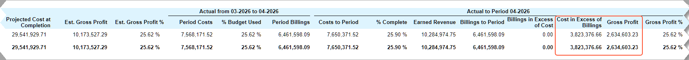

# Construction Reports: To Prepare a Work-in-Progress Report {#_febc820a-26f7-44bd-9488-ce8ab7d3feba .task}

This activity will walk you through the process of working with the work-in-progress \(WIP\) report.

**Attention:** This activity is based on the *U100* dataset. If you are using another dataset or if any system settings have been changed in *U100*, these changes can affect the workflow of the activity and the results of the processing. To avoid issues, restore the *U100* dataset to its initial state.

## Story { .section}

Suppose that the ToadGreen Building Group company is building a hotel for The Equity Group Investors, its customer, and is in the middle of the lifecycle of the construction project. The ToadGreen project estimator needs to track the progress of active project tasks, as well as their financial performance. The company uses the percentage-of-completion method for revenue recognition and includes the work-in-progress reports in the company’s financial statements.

Acting as a project estimator, you will determine whether the project is overbilled or underbilled relative to its progress.

## Configuration Overview { .section}

In the *U100* dataset, the following tasks have been performed to support this activity:

-   On the [Enable/Disable Features](CS_10_00_00.md) \(CS100000\) form, the *Construction* and *Construction Project Management* features have been enabled.
-   On the [Projects](PM_30_10_00.md#) \(PM301000\) form, the *HOTEL* project has been created with project tasks and their budgets.

## Process Overview {#section_qjw_hdr_v4b .section}

You will prepare a work-in-progress report for the project on the [Project WIP](PM_65_15_00.md) \(PM651500\) form and review the project cost and billing information. Then you will drill down to the [Project WIP Detail](PM_65_25_00.md) \(PM652500\) report to review the information broken down by project tasks and account groups.

## System Preparation { .section}

To prepare to perform the instructions of this activity, do the following:

1.  Launch the Acumatica ERP website, and sign in to a company with the *U100* dataset preloaded. You should sign in as the project estimator by using the *wendell* username and the *123* password.
2.  In the info area, in the upper-right corner of the top pane of the Acumatica ERP screen, make sure that the business date in your system is set to today’s date. For simplicity, in this activity, you will create and process all documents in the system on this business date.

## Step 1: Preparing the Project WIP Report { .section}

To prepare the WIP report, do the following:

1.  Open the [Project WIP](PM_65_15_00.md) \(PM651500\) report form, and specify the following report parameters:
    -   **Project**: *HOTEL*
    -   **From Period**: 03-*2026*
    -   **To Period**: 04-*2026*
    -   **Planned Cost Estimation**: *By Cost Budget*
    -   **Actuals to Period**: 04-*2026*
2.  On the report form toolbar, click **Run Report** to generate the WIP report.

    In the prepared report, review the amounts in the **Gross Profit** column in the **Actual** bucket, and the **Cost in Excess of Billings** column, as shown below.

    **Tip:** Your resulting amounts may differ from those shown below, depending on the activities you have performed.

    

    As the report shows, you have to bill the customer more to establish a stable project continuation.

Now you need to investigate the work-in-progress report broken down by revenue budget lines.

## Step 2: Reviewing the Project WIP Detailed Report { .section}

To prepare the detailed work-in-progress report, do the following:

1.  While you are still reviewing the prepared work-in-progress report on the [Project WIP](PM_65_15_00.md) \(PM651500\) form, click the *HOTEL* link in the **Project** column. The system opens the [Project WIP Detail](PM_65_25_00.md) \(PM652500\) report with the work-in-progress information broken down by project tasks and account groups.
2.  On the report toolbar, click **View PDF**. The system prepares and opens a PDF file with the report in which you can review the amounts for each project task and find out which project tasks require billing.

You have prepared the work-in-progress report for the project.

**Parent topic:**[Working with Construction Reports](../UserGuide/Construction_Reports_Mapref.md)

