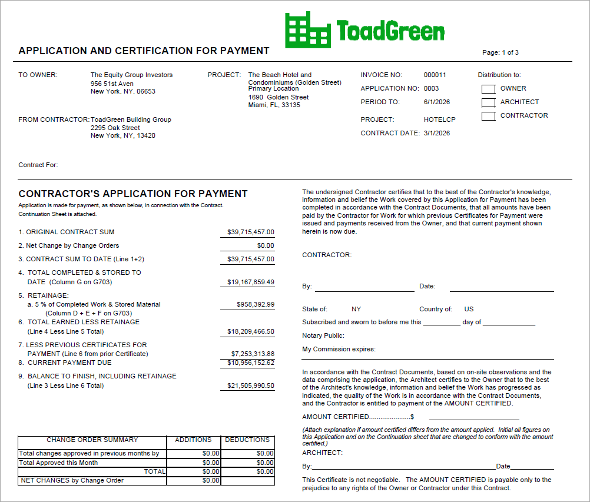
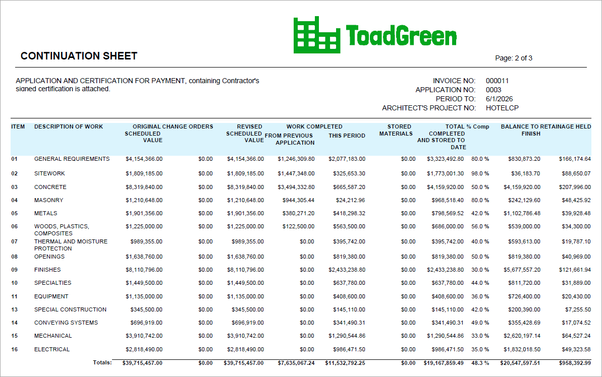
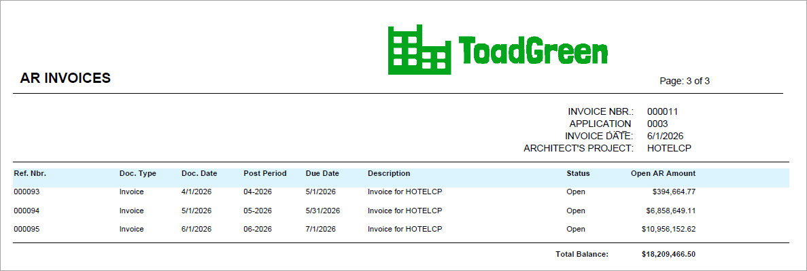

# Construction Reports: To Prepare AIA Report {#_2a8e6d8f-0e1e-4352-a1fa-11227eb4ddc0 .task}

This activity will walk you through the process of working with an American Institute of Architects \(AIA\) report.

**Attention:** This activity is based on the *U100* dataset. If you are using another dataset or if any system settings have been changed in *U100*, these changes can affect the workflow of the activity and the results of the processing. To avoid issues, restore the *U100* dataset to its initial state.

## Story {#section_nmk_q5l_4pb .section}

Suppose that the ToadGreen Building Group company is in the middle of building a hotel for the Equity Group Investors. As has been agreed with the customer, the customer is being billed once a month based on the progress of the performed work. The ToadGreen construction project manager is tracking the progress of work as a fixed-price project, billing the customer by the percent of project completion.

Acting as the construction project manager, you need to prepare the AIA report for the third payment application for the project.

## Configuration Overview { .section}

In the *U100* dataset, the following tasks have been performed to support this activity:

-   On the [Enable/Disable Features](CS_10_00_00.md) \(CS100000\) form, the *Construction* feature has been enabled.
-   On the [Projects](PM_30_10_00.md#) \(PM301000\) form, the *HOTELCP* project has been created with project tasks and their budgets. In the **AIA** section of the **Summary** tab, the **Show Quantity in AIA Report** check box is cleared.

    For the project, three billing iterations have been performed. The pro forma invoices and corresponding AR invoices has been prepared and released on the [Pro Forma Invoices](PM_30_70_00.md) \(PM307000\) and [Invoices and Memos](AR_30_10_00.md) \(AR301000\) forms, respectively.

## System Preparation { .section}

To prepare to perform the instructions of this activity, do the following:

1.  Launch the Acumatica ERP website, and sign in to a company with the *U100* dataset preloaded. You should sign in as a construction project manager by using the *ewatson* username and the *123* password.
2.  In the info area, in the upper-right corner of the top pane of the Acumatica ERP screen, make sure that the business date in your system is set to today’s date. For simplicity, in this activity, you will create and process all documents in the system on this business date.

## Step: Preparing the AIA Report { .section}

To prepare the report, do the following:

1.  On the [Projects](PM_30_10_00.md#) \(PM301000\) form, open the *HOTELCP* project.
2.  On the **Invoices** tab, click the line with the invoice that has an **Invoice Total** of *11,532,792.25*.
3.  On the table toolbar, click **AIA Report**.

    The system opens the [AIA Report](PM_64_40_00.md) \(PM644000\) report for the pro forma invoice, as shown below.

    

    

    

You have prepared the printable AIA report for the third payment application for the project.

**Parent topic:**[Working with Construction Reports](../UserGuide/Construction_Reports_Mapref.md)

