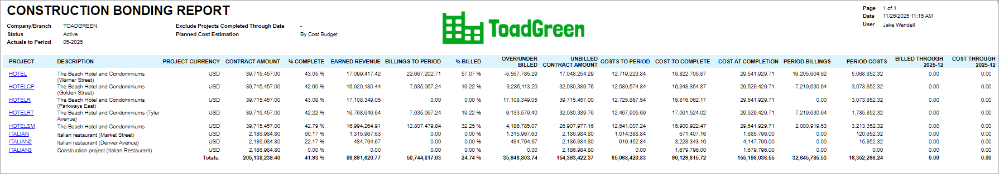

# Construction Reports: To Prepare a Bonding Report {#_a27b05bf-f03b-4ac3-a4d5-720a5da0a3ec .task}

This activity will walk you through the process of working with the bonding report.

**Attention:** This activity is based on the *U100* dataset. If you are using another dataset or if any system settings have been changed in *U100*, these changes can affect the workflow of the activity and the results of the processing. To avoid issues, restore the *U100* dataset to its initial state.

## Story { .section}

Suppose that to ensure profitability, a project estimator of the ToadGreen company wants to see how projects are progressing in May 2026, and which projects may need special attention.

Acting as a project estimator, you will prepare and review the construction bonding report for this purpose.

## Configuration Overview { .section}

In the *U100* dataset, the following tasks have been performed to support this activity:

-   On the [Enable/Disable Features](CS_10_00_00.md) \(CS100000\) form, the *Construction* feature has been enabled.
-   On the [Projects](PM_30_10_00.md#) \(PM301000\) form, multiple projects have been created. These projects are in the middle of the lifecycle.

## Process Overview { .section}

You will prepare the construction bonding report for the project on the [Construction Bonding Report](PM_65_05_00.md) \(PM650500\) form.

## System Preparation { .section}

To prepare to perform the instructions of this activity, do the following:

1.  Launch the Acumatica ERP website, and sign in to a company with the *U100* dataset preloaded. You should sign in as the project estimator by using the *wendell* username and the *123* password.
2.  In the info area, in the upper-right corner of the top pane of the Acumatica ERP screen, make sure that the business date in your system is set to today’s date. For simplicity, in this activity, you will create and process all documents in the system on this business date.

## Step: Reviewing the Bonding Report { .section}

Prepare the report by doing the following:

1.  Open the [Construction Bonding Report](PM_65_05_00.md) \(PM650500\) report form.
2.  On the **Report Parameters** tab, specify 05–2026 in the **As of Period** box. Leave the default values for all the other parameters.
3.  On the report form toolbar, click **Run Report**. The generated report shows the key details of all the active projects, as shown below.

    **Tip:** Your resulting amounts may differ from those shown below, depending on the activities you have performed.

    

**Parent topic:**[Working with Construction Reports](../UserGuide/Construction_Reports_Mapref.md)

