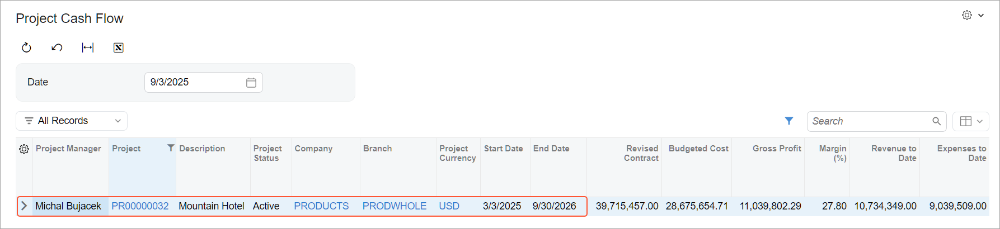
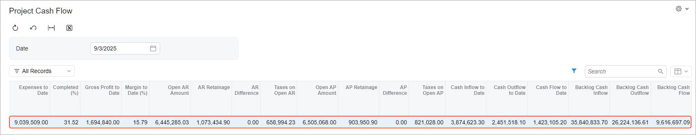

# Construction Reports: Project Cash Flow {#_65114bfd-2a44-4c30-8b6b-05e6daec63a9 .concept}

To keep finances healthy, you need to monitor each project’s cash inflow and outflow and know how much cash is available or needed to finish the project successfully. The [Project Cash Flow](PM_65_10_10.md) \(PM651010\) generic inquiry form gives you the cash flow visibility you need. You can spot possible shortfalls or extra funds and ensure that each project has enough cash to cover expenses.

## Viewing of Projects’ Cash Flow { .section}

The [Project Cash Flow](PM_65_10_10.md) \(PM651010\) generic inquiry form displays data as of a specified date—the current business date by default but you can change it to an earlier date. You can:

-   View each project’s date-specific cash inflow, cash outflow, revenue budget backlog, and cost budget backlog
-   See total amounts for a company or branch across all listed projects
-   Filter projects by any status to see only their data \(initially, the form shows projects with all statuses\)

Each row represents a project. The leftmost columns of the table display the project's basic information—including its project manager, description, status, company and branch, and start and end dates. You can also review the costs, revenue, and margin to date.

## Calculation of a Project’s Cash Outflow and Inflow { .section}

On the [Project Cash Flow](PM_65_10_10.md) \(PM651010\) form, the system calculates each project's cash outflow and cash inflow as of the specified date by using an indirect method.

Cash outflow to date is calculated as the project costs minus the accounts payable amount. The `AP Difference` represents changes to AP amounts—cash discounts, write-offs, withheld taxes, and realized gains or losses—that happened without money being transferred. The full formula is shown below.

```
Cash Outflow to Date = Expenses to Date - Open AP Amount + Taxes on Open AP Amount - AP Retainage - AP Difference
```

Cash inflow to date is calculated as the project revenue minus the accounts receivable amount. The `AR Difference` represents changes to AR amounts—cash discounts, write-offs, withheld taxes, and realized gains or losses—that happened without money being transferred. Below you can see the complete formula the system uses.

```
Cash Inflow to Date = Revenue to Date - Open AR Amount + Taxes on Open AR Amount - AR Retainage - AR Difference
```

**Attention:** The out-of-the-box [Project Cash Flow](PM_65_10_10.md) form is designed for situations when both of the following are true:

-   Taxes **aren’t** included in the project budget and actual revenue and expenses.
-   Taxes **are** included in AP amounts and AR amounts.

In the middle columns of the [Project Cash Flow](PM_65_10_10.md) form, you can view the taxes, cash inflow, cash outflow, base currency, budgeted costs, revenue to date, and expenses to date in the base currency.

The system calculates the data on this form based on the data from the [Project AR Details](PM_65_10_02.md) \(PM651002\) and [Project AP Details](PM_65_10_01.md) \(PM651001\) generic inquiry forms.

**Tip:** These forms exclude documents with the non-project code specified.

## Example 1: Monitoring Project Cash Flow as of a Date { .section}

Suppose that your company is a self-performing contractor building a hotel. The project started in March 2025, and now it's early September. As the project manager, you want to assess the project's cash inflow and outflow.

You’ve already recalculated project balances on the [Recalculate Project Balances](PM_50_40_00.md) \(PM504000\) form with the **Recalculate Project Budget History** check box selected. On the [Project Cash Flow](PM_65_10_10.md) \(PM651010\) form, you select the project and a date of *9/3/2025*, and the table shows a row with its details as of this date.



The cash flow snapshot as of the selected date shows \(see below\):

-   **Cash Inflow to Date**: About $3.9 million
-   **Cash Outflow to Date**: About $2.5 million
-   **Backlog Cash Inflow**: About $35.8 million
-   **Backlog Cash Outflow**: About $26.5 million



The project has generated a positive cash flow of about $1.4 million to date and is expected to generate a $9.6 million positive cash flow in the future. However, the current open AP amount slightly exceeds the open AR amount, so you should closely monitor timely AP payments to maintain good relationships with subcontractors and vendors.

## Example 2: Tracking Project Cash Flow on Different Dates { .section}

Now suppose that your company is a self-performing contractor building a cafe. As the project manager, you want to assess the project's cash inflow and outflow for different dates. The project started on July 2, 2025. At this time, it had no revenue, no expenses, and no processed financial documents, so the [Project Cash Flow](PM_65_10_10.md) \(PM651010\) form displayed only the project budget and the contract amounts. On July 9, 2025, the first invoice for this project was created.

By selecting different dates, such as the following, you can see how cash inflows and outflows change with the time and this helps you monitor the project's financial health:

-   July 22, 2025: The open AR amount and unreleased retainage amount of the first invoice appeared on the form, while the cash inflow backlog still reflected the full contract amount.
-   August 10, 2025: The first expenses were incurred and AP bills were processed. The customer paid the open AR balance, which appeared as a positive cash inflow.
-   September 9, 2025: New invoices appeared as an open AR amount. The system calculated the margin to date based on the gross profit and revenue to date. Also, it calculated taxes and retainage \(both AP and AR\) on a date-sensitive basis directly from the AP and AR documents.

## Verification of Project AP Amounts { .section}

You can verify the AP amounts the system has calculated on the [Project Cash Flow](PM_65_10_10.md) \(PM651010\) form by using the [Project AP Details](PM_65_10_01.md) \(PM651001\) form, where each row represents a document line.

The system proportionally spreads the amounts applied to a project's bills—such as released retainage, payment applications, write-off amounts, and taxes—across the lines of the original AP invoices and bills. With this approach, the system calculates unbilled amounts, paid amounts, and unreleased retainage as of any date. It does so for any project, project task, account group, inventory item, and cost code without additional complex calculations. The leftmost columns of the table display each document line’s basic information—including project task, account group, and document number.

You can verify the total amounts recorded in AP documents by reviewing the **Extended Cost** and **AP Retained Amount \(Project Curr.\)** columns.

This form also shows the use tax in the **Use Tax \(Project Curr.\)** and **Use Tax \(Base Curr.\)** columns.

On the [Project Cash Flow](PM_65_10_10.md) form, you can compare these total amounts with the total amounts in the **Expenses to Date** and **AP Retainage** columns.

## Verification of Project AR Amounts { .section}

You can verify the AR amounts the system has calculated on the [Project Cash Flow](PM_65_10_10.md) \(PM651010\) form by using the [Project AR Details](PM_65_10_02.md) \(PM651002\) form, where each row represents a document line.

On this form, too, the system proportionally spreads all the amounts applied to the project's invoices—such as released retainage, payment applications, write-off amounts, and taxes—across the original AR document lines. With this approach, the system calculates unbilled amounts, paid amounts, and unreleased retainage as of any date. It does so for any project, project task, account group, inventory item, and cost code without additional complex calculations.

The leftmost columns of the table display each document line’s basic information—including project task, account group, and cost code.

You can verify the total amounts recorded in AR documents by reviewing the **Extended Price** and **AR Retained Amount \(Project Curr.\)** columns.

On the [Project Cash Flow](PM_65_10_10.md) form, you can compare these total amounts with the total amounts in the **Revenue to Date** and **AR Retainage** columns.

## Multiple Currencies on the Inquiry Forms { .section}

Project-related amounts are shown in multiple currencies if the *Multicurrency Accounting* and *Multicurrency Projects* features are enabled on the [Enable/Disable Features](CS_10_00_00.md) \(CS100000\) form. On the [Project Cash Flow](PM_65_10_10.md) \(PM651010\), [Project AR Details](PM_65_10_02.md) \(PM651002\), and [Project AP Details](PM_65_10_01.md) \(PM651001\) generic inquiry forms, you can view amounts in:

-   The project currency—that is, the currency specified in the **Project Currency** box on the **Summary** tab of the [Projects](PM_30_10_00.md) \(PM301000\) form
-   The base currency—the one specified in the **Currency** box on the **Ledger** tab of the [Branches](CS_10_20_00.md) \(CS102000\) form for the branch

Also, you can view amounts in the document currency on the [Project AR Details](PM_65_10_02.md) and [Project AP Details](PM_65_10_01.md) inquiry forms.

In the rightmost column of the [Project Cash Flow](PM_65_10_10.md) form, you can view the rate variance for cash flow to date, which is the accumulated difference between:

-   The cash flow converted from the project currency to the project base currency at the current project rate
-   The cash flow converted at the historical rate of the project base currency

The system uses this formula.

```
Rate Variance for Cash Flow to Date (Base Curr.) = Cash Flow to Date / Currency Rate - Cash Flow to Date (Base Curr.)
```

**Parent topic:**[Working with Construction Reports](../UserGuide/Construction_Reports_Mapref.md)

