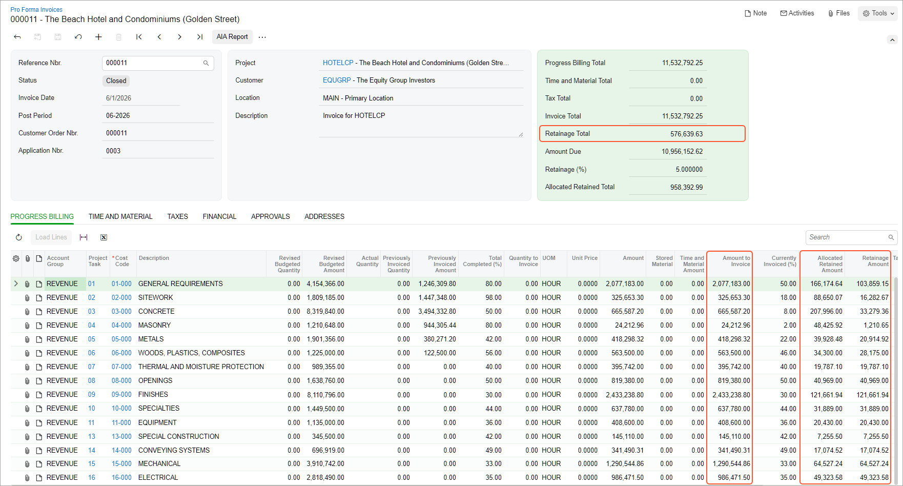
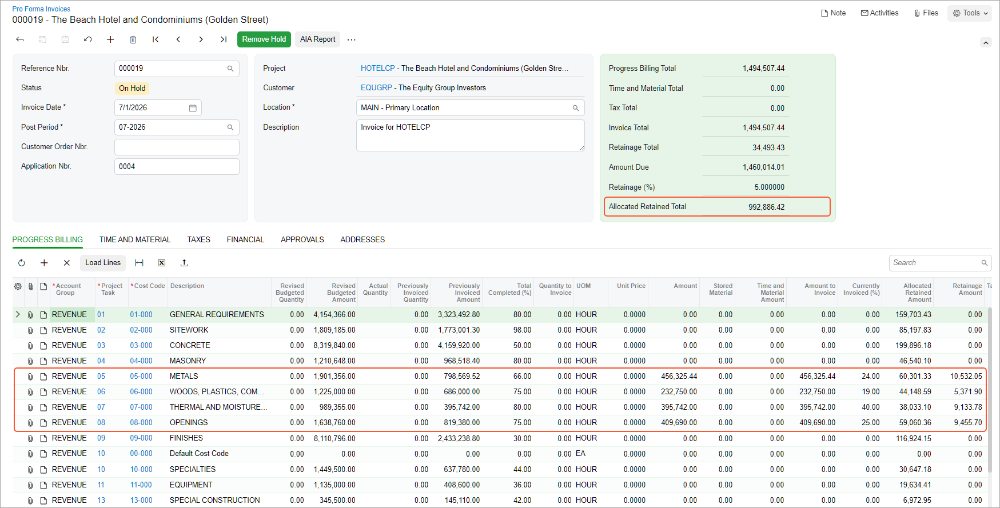

# Retainage with a Cap: Process Activity {#_1771d899-3dd0-4ee7-86dc-ac126d92cdc9 .task}

This activity will walk you through the process of performing progress billing for a project with contract cap retainage.

**Attention:** This activity is based on the *U100* dataset. If you are using another dataset or if any system settings have been changed in *U100*, these changes can affect the workflow of the activity and the results of the processing. To avoid issues, restore the *U100* dataset to its initial state.

## Story { .section}

Suppose that the ToadGreen Building Group company is a general contractor that is building a hotel for The Equity Group Investors. The project manager has created a fixed-price project; for this project, the customer will be billed once a month based on the progress of the performed work. Also, in the project, the project manager has defined the original project budget, which was also agreed upon with the customer. According to the contract, the customer retains 5% from each invoice, which guarantees to the customer that the ToadGreen company will meet its obligations in building the hotel.

Because the ToadGreen company, as a general contractor, needs to have enough resources for performing daily operations, the contract also includes a 50% retainage cap, which specifies the maximum retainage amount that can be held for the project.

Acting as the project manager, you need to make sure that the pro forma invoices prepared for the customer include the correct retainage amounts, and that the retainage is no longer held after the cap has been reached.

## Configuration Overview { .section}

In the *U100* dataset, the following tasks have been performed to support this activity:

-   On the [Enable/Disable Features](CS_10_00_00.md) \(CS100000\) form, the *Construction*, *Payment Application by Line*, and *Retainage Support* features have been enabled.
-   On the [Customers](AR_30_30_00.md#) \(AR303000\) form, the *EQUGRP* customer has been created; the **Pay by Line** and **Apply Retainage** check boxes are selected on the **General** tab for this customer. On the **GL Accounts** tab, *18000* is specified in the **Retainage Receivable Account** box.
-   On the [Billing Rules](PM_20_70_00.md) \(PM207000\) form, the *PROGRRET* billing rule has been created.
-   On the [Projects](PM_30_10_00.md#) \(PM301000\) form, the *HOTELCP* project has been created with multiple project tasks and their budgets. For each task, the *PROGRRET* billing rule is specified. On the **Summary** tab of the form, the contract cap retainage settings have been configured for the project.

    For the project, three billing iterations have been performed. The pro forma invoices and the corresponding AR invoices have been prepared and released on the [Pro Forma Invoices](PM_30_70_00.md) \(PM307000\) and [Invoices and Memos](AR_30_10_00.md#) \(AR301000\) forms, respectively; in each invoice, the retainage amount has been calculated.

## Process Overview { .section}

You will review the billing details of a previously prepared pro forma invoice by using the [Projects](PM_30_10_00.md) \(PM301000\) and [Pro Forma Invoices](PM_30_70_00.md) \(PM307000\) forms. You will then perform billing while the cap has not been reached by using the same forms, and review the retainage that the system will calculate for the invoice. After that, you will perform billing when the cap has been reached so that retainage is not calculated for this invoices.

## System Preparation { .section}

To prepare to perform the instructions of this activity, launch the Acumatica ERP website, and sign in to a company with the *U100* dataset preloaded. You should sign in as a construction project manager by using the *ewatson* username and the *123* password.

## Step 1: Reviewing the Retainage Details of the Project { .section}

Review the details of the project as follows:

1.  On the [Projects](PM_30_10_00.md) \(PM301000\) form, open the *HOTELCP* record.
2.  In the **Retainage** section of the **Summary** tab, review the retainage details for the project. The **Total Retained Amount** is *958,392.99*, while the calculated cap amount is *992,886.42*. The contract completion percentage shown in the **Completed \(%\)** box is *48.26*, which means that the 50% cap has not been reached and that additional retainage could still be withheld from the next invoice.
3.  On the **Invoices** tab, click the **Pro Forma Reference Nbr.** link for the pro forma invoice with the *0003* in the **Application Nbr.** box.

    On the [Pro Forma Invoices](PM_30_70_00.md#) \(PM307000\) form, which opens with the selected pro forma invoice, review the retainage amounts on the **Progress Billing** tab. In each line, the retainage amount is calculated as the retainage percentage applied to the amount to invoice; for example, for the line with the *01-000* cost code, **Retainage Amount** is *103,859.15* \(2,077,183.00 \* 0.05\).

    The **Retainage Total** in the Summary area of the invoice \(see below\) is the sum of the **Retainage Amount** column values for this pro forma invoice. The total project retainage \(held for all three invoices prepared for the project by this moment\) is shown in the **Allocated Retained Total** box in the Summary area; this amount is the sum of the **Allocated Retained Amount** column values.

    

## Step 2: Billing a Project Based on Progress { .section}

Bill a project by doing the following:

1.  Return to the *HOTELCP* project on the [Projects](PM_30_10_00.md#) \(PM301000\) form, and on the **Revenue Budget** tab, in the **Completed \(%\)** box, change the amounts as follows:
    -   In the line with the *05-000* cost code, change **Completed \(%\)** to `66`. The system calculates the **Pending Invoice Amount** in the line to be *456,325.44*.
    -   In the line with the *06-000* cost code, change **Completed \(%\)** to `75`. The system calculates the **Pending Invoice Amount** in the line to be *232,750.00*.
    -   In the line with the *07-000* cost code, change **Completed \(%\)** to `80`. The system calculates the **Pending Invoice Amount** in the line to be *395,742.00*.
    -   In the line with the *08-000* cost code, change **Completed \(%\)** to `75`. The system calculates the **Pending Invoice Amount** in the line to be *409,690.00*.
2.  In the Summary area, make sure the **Pending Invoice Amount** equals *1,494,507.44*, and on the form toolbar, click **Save**.
3.  On the form toolbar, click **Run Billing** to generate a new pro forma invoice for the project. The system opens the prepared document on the [Pro Forma Invoices](PM_30_70_00.md#) \(PM307000\) form, as shown below.

    Notice that the **Allocated Retained Total** equals *992,886.42*: This is the maximum retainage amount that can be held for the project. To avoid exceeding the retainage cap, for this invoice, the system has calculated the rest of the retainage that can be held and has reallocated it proportionally between the invoice lines.

    

4.  On the form toolbar, click **Remove Hold**, and then click **Release**.
5.  On the **Financial** tab, click the **AR Ref. Nbr.** link to open the created AR invoice on the [Invoices and Memos](AR_30_10_00.md#) \(AR301000\) form.

    On the **Details** tab, notice that the calculated retainage percent is the same for all lines with non-zero retainage amount and is less than 5% percent defined in the project.

6.  On the form toolbar, click **Remove Hold**, and then click **Release**.

The cap has been reached, so no more retainage will be calculated for the project. For the remaining invoices prepared for the project, the system will not calculate retainage amounts.

**Parent topic:**[Billing a Project with a Retainage Cap](../UserGuide/Construction_Retainage_with_Cap_Mapref.md)

