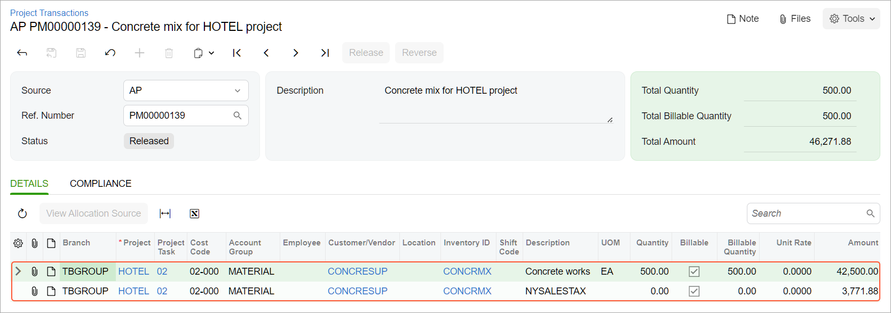

# Purchases with a Sales Tax: To Process a Project-Related Bill with a Tax {#_8d3ef38f-76e2-4a88-826b-e9d1c03d69a4 .task}

This activity will walk you through the process of creating and releasing an AP bill with a sales tax.

## Story { .section}

Suppose that on *1/30/2026*, the ToadGreen company purchases 500 packages of a concrete mix from the Concrete Supply Co. vendor. The vendor is located in the state of New York, and the New York sales tax has to be applied to this purchase. Acting as the project manager, you need to enter the AP bill, release it, and review how the system calculates the sales tax.

## Configuration Overview { .section}

In the *U100* dataset, the following tasks have been performed to support this activity:

-   On the [Enable/Disable Features](CS_10_00_00.md#) \(CS100000\) form, the *Projects*, *Cost Codes*, and *Construction* features have been enabled.
-   On the [Vendors](AP_30_30_00.md#) \(AP303000\) form, the *CONCRESUP* vendor account for the Concrete Supply Co. has been created. On the **Purchase Settings** tab \(**Default Location Settings** section\), in the **Tax Zone** box, the *NYZONE* tax zone is selected for this vendor.
-   On the [Non-Stock Items](IN_20_20_00.md#) \(IN202000\) form, the *CONCRMX* non-stock item has been created.
-   On the [Projects](PM_30_10_00.md#) \(PM301000\) form, the *HOTEL* project has been created with multiple project tasks, including the *02 - SITEWORK* project task. The *02-000* cost code has been created on the [Cost Codes](PM_20_95_00.md#) \(PM209500\) form.

## Process Overview { .section}

You will create and release a bill with a taxable item on the [Bills and Adjustments](AP_30_10_00.md#) \(AP301000\) form. You will then review the transaction generated on release of the bill on the [Journal Transactions](GL_30_10_00.md#) \(GL301000\) form, and the related project transaction on the [Project Transactions](PM_30_40_00.md) \(PM304000\) form.

## System Preparation { .section}

To prepare to perform the instructions of this activity, do the following:

1.  As a prerequisite to this activity, be sure you have configured the sales tax as described in [Purchases with a Sales Tax: To Configure a Sales Tax for Project Purchases](Construction_Sales_Taxes_in_PO_Implem_Activity.md).
2.  Launch the Acumatica ERP website, and sign in to a company with the *U100* dataset preloaded. You should sign in as a project manager by using the *ewatson* username and the *123* password.
3.  In the info area at the upper-right corner of the top pane of the Acumatica ERP screen, make sure that the business date is set to *1/30/2026*. If a different date is displayed, click the Business Date menu button and select *1/30/2026* from the calendar. For simplicity, you'll create and process all documents in this activity using this business date.

## Step 1: Creating and Releasing an AP Bill with a Sales Tax { .section}

Create a bill by doing the following:

1.  On the [Bills and Adjustments](AP_30_10_00.md#) \(AP301000\) form, add a new record.
2.  In the Summary area, specify the following settings:
    -   **Type**: *Bill*
    -   **Vendor**: *CONCRESUP*
    -   **Description**: `Concrete mix for HOTEL project`
3.  On the **Details** tab, add a line with the following settings:
    -   **Inventory ID**: *CONCRMX*
    -   **Quantity**: `500`
    -   **UOM**: *EA*
    -   **Unit Cost**: `85`
    -   **Project**: *HOTEL*
    -   **Project Task**: *02 - SITEWORK*
    -   **Cost Code**: *02-000*
    -   **Tax Category**: *TAXABLE*
4.  Save the bill, and on the **Taxes** tab, review the details of the calculated sales tax. The system applied the *NYSALESTAX* to the bill based on the tax zone settings and the tax category of the item. The taxable amount is $42,500.00, and the calculated total tax is $3,771.88.
5.  On the form toolbar, click **Remove Hold**, and then click **Release** to release the bill.

## Step 2: Reviewing the GL Batch and Related Project Transaction { .section}

Perform the following steps:

1.  While you are still on the [Bills and Adjustments](AP_30_10_00.md#) \(AP301000\) form, on the **Financial** tab, click the **Batch Nbr.** link. The system opens the batch of general ledger transactions on the [Journal Transactions](GL_30_10_00.md#) \(GL301000\) form.
2.  Review the batch that was generated on release of the bill, and make sure the amounts have been recorded to general ledger as follows:
    -   The *Accounts Payable* account of the vendor \(*20000*\) is credited in the total amount of the bill \(the total of the line plus the total of the calculated tax\). The non-project code \(*X*\) is specified in this line.
    -   The *Project Material Expense* account \(*54700*\) is debited in the amount specified in the document line. The material expenses have been recorded to the *HOTEL* project and the *02* project task.
    -   The *Project Tax Expenses* account specified for the tax \(*69000*\) is debited in the calculated tax amount. The tax expenses have been recorded to the *HOTEL* project and the *02* project task.
3.  On the [Project Transactions](PM_30_40_00.md) \(PM304000\) form, open the project transaction with *AP* specified as the **Source** and with the *Concrete mix for HOTEL project* description that was generated from the general ledger transaction. Make sure that the project transaction includes two lines: a line related to the materials bought for the project, and a line for the related tax expenses, as shown below.

    

You have finished processing a taxable bill for a project and have recorded the expenses to the project budget.

**Parent topic:**[Working with Sales Taxes in Purchase Orders](../UserGuide/Construction_Sales_Taxes_in_PO_Mapref.md)

