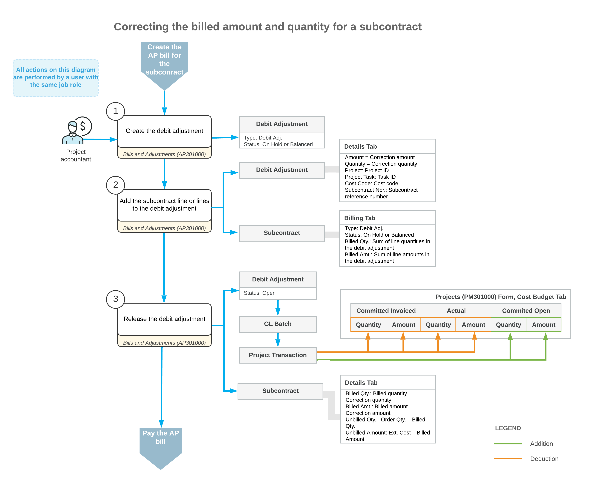

# Correction of a Bill for a Subcontract: General Information {#_337ff22e-8baf-4ece-9f36-c84be80a9caa .concept}

In most cases, a subcontract is considered completed when the services have been provided and the corresponding accounts payable bill has been released to adjust the outstanding balance of the vendor \(subcontractor\). If the subcontract requires any changes, you may want to correct billed amounts and quantities in the subcontract fully or partially. Because a released accounts payable bill cannot be edited or deleted, to correct the billed amount and billed quantity, you need to process a debit adjustment that decreases the accounts payable balance.

## Learning Objectives {#section_h3g_ypf_wnb .section}

In this chapter, you will learn how to do the following:

-   Create a debit adjustment for an AP bill prepared for a subcontract
-   Release the debit adjustment
-   Review how the processed debit adjustment affects the vendor balance
-   Review the GL and project transactions generated on release of a debit adjustment
-   Review how the project budget is updated on release of the debit adjustment

## Applicable Scenarios {#section_i3g_ypf_wnb .section}

You create a debit adjustment for a bill prepared for a subcontract to decrease the amount you owe to a vendor according to this subcontract.

## Debit Adjustment Processing {#section_j3g_ypf_wnb .section}

To decrease the full amount of a bill created for a subcontract, you can reverse the bill by clicking **Reverse** on the More menu of the [Bills and Adjustments](AP_30_10_00.md) \(AP301000\) form. When you reverse the bill, the system automatically creates a debit adjustment with the same details. To partially decrease the billed amount or billed quantity for a subcontract, you manually create a debit adjustment and specify the needed amount and quantity in the lines that are linked to the corresponding subcontract.

You create a debit adjustment on the [Bills and Adjustments](AP_30_10_00.md) form. In the Summary area of the form, you specify such settings as the vendor, the vendor location, and the currency used for the transaction. Then you add the subcontract lines for which you need to decrease the billed amount or billed quantity \(or both\) by clicking the **Add Subcontract** or **Add Subcontract Line** button on the table toolbar of the **Details** tab of the [Bills and Adjustments](AP_30_10_00.md) form. In the dialog box that opens, you select the particular subcontract or subcontract lines with a nonzero billed amount or quantity to be added to the debit adjustment.

In each subcontract line that you add to the debit adjustment by using the **Add Subcontract** or **Add Subcontract Line** dialog box, the system populates the column settings as follows:

-   The project budget key \(**Project**, **Project Task**, **Inventory ID**, and **Cost Code**, if applicable\) is copied from the corresponding subcontract line. The specified project and project task cannot be changed in the debit adjustment line linked to a subcontract line.

    **Tip:** If the non-project code is specified in a debit adjustment line linked to a subcontract, you can change the non-project code to some particular project and specify a project task in this line.

-   The account, subaccount, and tax category are copied from the corresponding subcontract line; you can change these settings, if needed. In the generated project transaction, the system will specify the account group that is linked to the account specified in the debit adjustment line.
-   The extended cost of the line \(**Ext. Cost**\) is copied from the **Billed Amount** of the subcontract line. You could leave it as is to adjust the full billed amount, or change to adjust the billed amount partially.
-   The unit cost and quantity are set to *0*; you can correct these values, if needed. The quantity in a debit adjustment line cannot exceed the billed quantity in the corresponding subcontract line.
-   The line discount \(**Discount Percent** and **Discount Amount**\) is set to *0*.
-   The retainage percent and retainage amount are set to *0*.
-   The reference number of the corresponding subcontract is shown in the **Subcontract Nbr.** column.

After you have specified the details of the debit adjustment, you remove it from hold by clicking **Remove Hold** on the form toolbar, and release by clicking **Release** on the form toolbar. On release of the debit adjustment, a batch of GL transactions is generated to update the account balances in the general ledger; on release of this batch, the system generates the corresponding project transaction to update the values of the project budget. Also, the system automatically updates the billed amount and billed quantity in the lines of the subcontract for which the debit adjustment has been prepared.

If a subcontract line had the **Closed** and **Completed** check boxes selected at the time of its addition to the debit adjustment, on release of this debit adjustment, the system clears the check boxes in the subcontract line. The clearing of both check boxes indicates that the line is not billed in full now.

The released debit adjustment appears on the [Checks and Payments](AP_30_20_00.md) \(AP302000\) form and can be applied to any bills and credit adjustments of the same vendor. For more information on applying debit adjustments, see [Debit and Credit Adjustments: General Information](Finance_Processing_Debit_and_Credit_Adjustments_GeneralInfo.md).

**Attention:** Debit adjustments are always applied to the balance of the main vendor of a bill, which is the same vendor as specified in this debit adjustment. That is, if a debit adjustment is prepared for an AP bill that has joint payee balances specified, the **Amount Paid \(Payment currency\)** that you specify on the **Documents to Apply** tab of the [Checks and Payments](../Shared/../UserGuide/AP_30_20_00.md) form cannot exceed the amount of the bill minus the joint payee amounts.

Along with correcting billed amounts and quantities, you may need to process a change order for a subcontract to decrease its total amount and quantity. For more information on this, see [Change Orders for Commitments: General Information](Projects_Changes_to_Commitments_GeneralInfo.md).

## Workflow of the Processing of a Debit Adjustment for a Subcontract {#section_i5c_bxf_wnb .section}

The following diagram represents the general workflow of the processing of a debit adjustment for a subcontract.

**Parent topic:**[Correcting Subcontract Bills](../UserGuide/Construction_Subcontract_Bill_Correction_Mapref.md)

