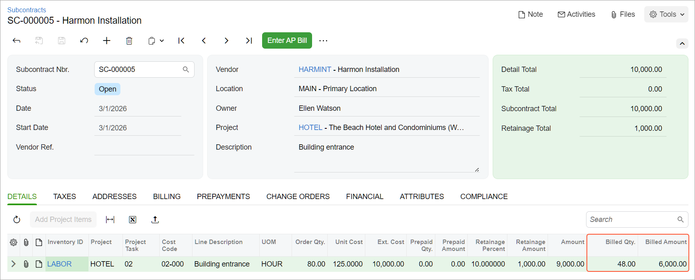

# Correction of a Bill for a Subcontract: Process Activity {#_2b5ccd89-03c0-40c2-9ee0-c1f841a4b97e .task}

This activity will walk you through the process of correcting an AP bill for a subcontract.

**Attention:** This activity is based on the *U100* dataset. If you are using another dataset or if any system settings have been changed in *U100*, these changes can affect the workflow of the activity and the results of the processing. To avoid issues, restore the *U100* dataset to its initial state.

## Story {#section_r2x_4vk_ynb .section}

Suppose that on March 1, 2026, the ToadGreen company hired a subcontractor, Harmon Installation, to build an entrance in the hotel that ToadGreen is building. According to the terms of the subcontract, $10,000 will be paid to the subcontractor for this work, and 10% of each payment will be withheld by the company until the related work is finished.

On March 25, 2026, ToadGreen received the first bill for the completed work from the subcontractor. A ToadGreen project accountant entered and released a bill in the amount of $7,000, which includes the $700 retainage amount.

Then suppose that the project accountant realized that the bill was entered incorrectly, and the billed amount must be $6,000 for the subcontract. Acting as this project accountant, you will correct the billed amount and quantity in the subcontract by processing the debit adjustment.

## Configuration Overview {#section_tz4_djx_cnb .section}

In the *U100* dataset, the following tasks have been performed to support this activity:

-   On the [Enable/Disable Features](CS_10_00_00.md) \(CS100000\), the *Construction* and *Retainage Support* features have been enabled.
-   On the [Vendors](AP_30_30_00.md) \(AP303000\) form, the *HARMINT \(Harmon Installation\)* vendor has been defined. On the **Financial** tab, the **Apply Retainage** check box is selected for this vendor.
-   On the [Non-Stock Items](IN_20_20_00.md) \(IN202000\) form, the *LABOR* non-stock item has been created.
-   On the [Projects](PM_30_10_00.md#) \(PM301000\) form, the *HOTEL* project has been created with multiple project tasks.
-   On the [Subcontracts](SC_30_10_00.md) \(SC301000\) form, the subcontract for the *HARMINT* vendor in the amount of $10,000.00 has been entered.
-   On the [Bills and Adjustments](AP_30_10_00.md) \(AP301000\) form, the partial bill for the *HARMINT* vendor in the amount of $7,000.00 has been entered and released; the retainage amount $700 is calculated for the bill \(which is shown in the **Original Retainage** box on the **Retainage** tab\).

## Process Overview { .section}

On the [Bills and Adjustments](AP_30_10_00.md) \(AP301000\) form, you will create a debit adjustment and add the line of the subcontract to this adjustment. Then you will specify the correction amount and release the adjustment. Finally, you will review the billed amount and quantity in the subcontract to make sure that they have been updated.

## System Preparation {#section_c1z_lxm_ynb .section}

Before you start correcting the bill, do the following:

1.  Launch the Acumatica ERP website, and sign in as a construction project manager by using the *ewatson* username and the *123* password.
2.  In the info area, in the upper-right corner of the top pane of the Acumatica ERP screen, click the Business Date menu button, and select *3/25/2026* on the calendar.

## Step 1: Creating a Debit Adjustment { .section}

You will first create the debit adjustment that will correct the AP bill for the subcontract. Do the following:

1.  On the [Bills and Adjustments](AP_30_10_00.md#) \(AP301000\) form, add a new record.
2.  In the Summary area, specify the following settings:
    -   **Type**: *Debit Adj.*
    -   **Vendor**: *HARMINT*
    -   **Date**: *3/25/2026*
    -   **Description**: `Adjusting overbilled contractor`
3.  On the form toolbar, click **Save**.

## Step 2: Adding the Subcontract Line to the Document { .section}

To add a line of the subcontract to be corrected, while you are still reviewing the debit adjustment on the [Bills and Adjustments](AP_30_10_00.md#) \(AP301000\) form, do the following:

1.  On the table toolbar of the **Details** tab, click **Add Subcontract**. The **Add Subcontract** dialog box opens.
2.  In the dialog box, find the line dated *3/1/2026* with the *HOTEL* project and $10,000 subcontract total. Notice that the **Total Billed Amount** for the subcontract is $7,000.
3.  Select the unlabeled check box in the line, and click **Add &amp; Close**. The system adds the subcontract line to the debit adjustment and closes the dialog box. In the **Subcontract Nbr.** column of the line added to the document, notice that the system has inserted the reference number of the subcontract for which the adjustment is being created.
4.  In the line, change the **Quantity** to `8` and the **Unit Cost** to `125`. The **Ext. Cost** in the line is $1,000 \(which is the amount by which the billed amount will be adjusted\).

    **Tip:** The retainage percent and retainage amount in the line are *0* because the processed debit adjustment does not change the retained amounts.

5.  On the form toolbar, click **Save**.

## Step 3: Releasing the Debit Adjustment and Reviewing the Result { .section}

To release the debit adjustment and see how this affects the subcontract, do the following:

1.  On the form toolbar, click **Remove Hold**. The system assigns the debit adjustment the *Balanced* status.
2.  On the form toolbar, click **Release** to release the debit adjustment.
3.  On the [Subcontracts](SC_30_10_00.md) \(SC301000\) form, open the subcontract for the *HARMINT* vendor, for which you have processed the debit adjustment.
4.  On the **Details** tab, review the billed amount and quantity in the subcontract line, and make sure they have been adjusted for the subcontract, as shown below.

    

You have corrected the bill for the subcontract. You can now apply the debit adjustment to the AP bill to finish the correction process.

**Parent topic:**[Correcting Subcontract Bills](../UserGuide/Construction_Subcontract_Bill_Correction_Mapref.md)

