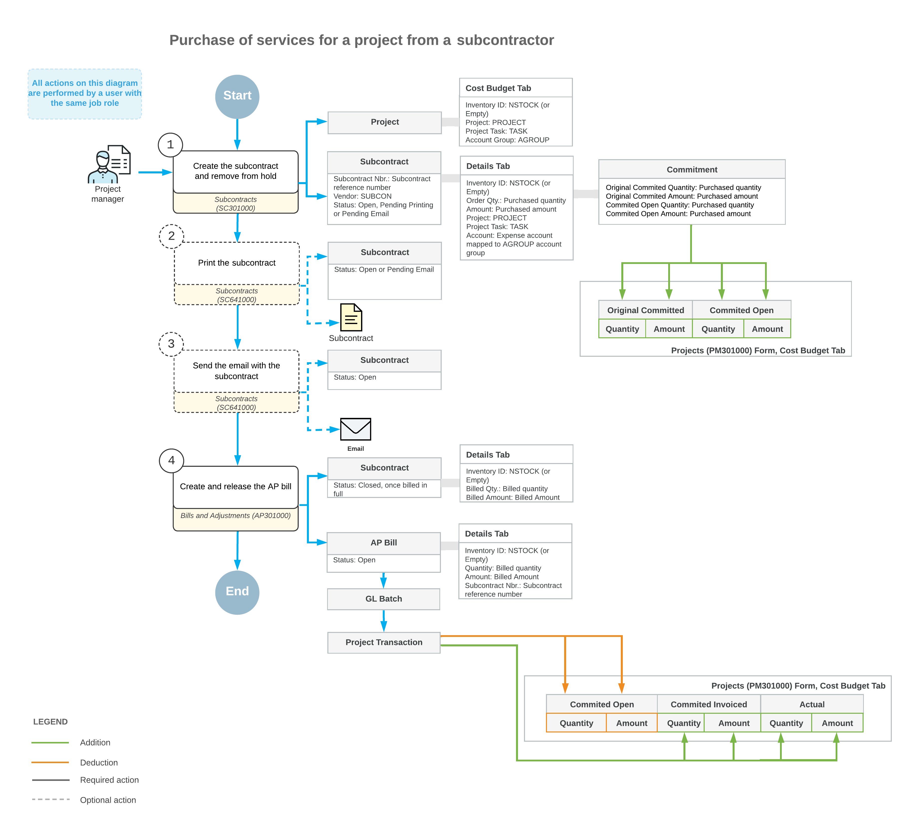

# Subcontracts: General Information {#_092fdfc8-b353-49d2-ad0d-402968d77afc .concept}

In Acumatica ERP Construction Edition, subcontract is a document that represents a commitment with a third-party vendor \(subcontractor\) to provide services for a project.

## Learning Objectives { .section}

In this chapter, you will learn how to do the following:

-   Create a subcontract
-   Add lines related to a particular project to a subcontract
-   Enter the accounts payable bill for the subcontract
-   Process a change order for the commitment created by the subcontract
-   Review the generated general ledger transactions and project transactions
-   Review how the processed subcontract affects the project budget

## Applicable Scenarios { .section}

You enter and process subcontracts for a project when your company hires another company to perform a part of the work for a project.

## Subcontract Processing { .section}

In general, the [Subcontracts](SC_30_10_00.md) \(SC301000\) form is the starting point for creating a subcontract. In a newly created subcontract, you should first select the vendor \(that is, the subcontractor who will provide the services\). Then on the **Details** tab, you list the lines that represent the work and services that will be performed by the subcontractor.

For each line, you specify the project budget key—that is, the project, the project task, and, optionally, the inventory ID and cost code—to record this commitment to the cost budget of the project. In a line, you can leave the **Inventory ID** box empty, or specify a non-stock item that does not require a purchase receipt—that is, an item that has the **Require Receipt** check box cleared on the **General** tab of the [Non-Stock Items](IN_20_20_00.md) \(IN202000\) form.

You can also add lines from a particular project. To do this, you click the **Add Project Items** button on the table toolbar of this tab; in the **Add Project Items** dialog box, which opens, you select the project and the applicable cost budget lines of this project.

Once the services have been provided by the subcontractor, you need to process an accounts payable bill. On release of the bill, the system increases the vendor's balance in the system in the amount to be paid for received goods and updates the project's actual amount and quantity. If all the lines in the subcontract have been billed in full, the system assigns the subcontract the *Closed* status.

**Tip:** If the **Internal Cost Commitment Tracking** check box is selected on the **General** tab of the [Projects Preferences](PM_10_10_00.md) \(PM101000\) form, the system tracks subcontracts as commitments to related projects. For more information, see [Committed Costs: General Information](Projects_Commitments_GeneralInfo.md) and [Change Orders for Commitments: General Information](Projects_Changes_to_Commitments_GeneralInfo.md).

## Workflow of the Processing of a Subcontract { .section}

The typical process of working with subcontracts involves the actions and generated documents shown in the following diagram.

**Parent topic:**[Processing Subcontracts](../UserGuide/Construction_Subcontracts_Mapref.md)

