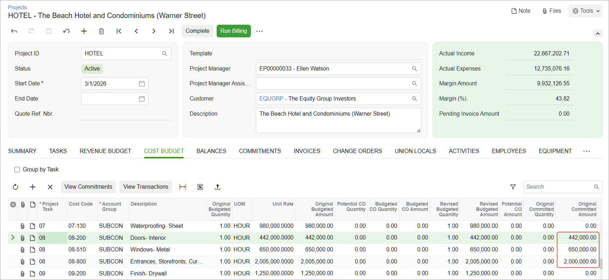
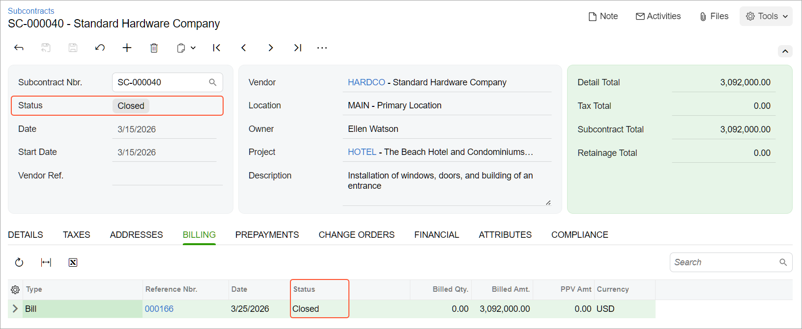

# Subcontracts: Process Activity {#_113f0d01-a5db-4b03-93e3-68a08e6acf0a .task}

This activity will walk you through the process of working with a subcontract.

**Attention:** This activity is based on the *U100* dataset. If you are using another dataset or if any system settings have been changed in *U100*, these changes can affect the workflow of the activity and the results of the processing. To avoid issues, restore the *U100* dataset to its initial state.

## Story { .section}

Suppose that on March 15, 2026, the ToadGreen company hires a subcontractor, Standard Hardware Company, to install windows and doors in the hotel that is being built by ToadGreen. Both parties agree that the Standard Hardware Company will perform the installation of windows, the installation of doors and frames, and the building an entrance. Normally, this subcontractor does not require the printing of documents, but for this subcontract, the construction project manager of the ToadGreen company has decided to create and print the subcontract. On March 25, 2026, when the subcontractor finishes its part of the work and sends an invoice to ToadGreen, ToadGreen’s project manager will create a bill and pay for the provided services.

Acting as the construction project manager, you will process all the needed documents in the system.

## Configuration Overview {#section_qkw_q4s_dnb .section}

In the *U100* dataset, the following tasks have been performed to support this activity:

-   On the [Enable/Disable Features](CS_10_00_00.md) \(CS100000\) form, the *Construction* feature has been enabled.
-   On the [Vendors](AP_30_30_00.md) \(AP303000\) form, the *HARDCO \(Standard Hardware Company\)* vendor has been created.
-   On the [Projects](PM_30_10_00.md#) \(PM301000\) form, the *HOTEL* project has been created.
-   On the [Non-Stock Items](IN_20_20_00.md) \(IN202000\) form, the *SUBCONTR* non-stock item, which represents the work performed by subcontractors, has been created.

## Process Overview { .section}

To record the work performed by a subcontractor for the project, you will create a subcontract document with the subcontractor \(vendor\) on the [Subcontracts](SC_30_10_00.md) \(SC301000\) form. Then you will print the subcontract. After that, you will create a bill for the provided services on the [Bills and Adjustments](AP_30_10_00.md#) \(AP301000\) form, create a payment for the bill on the [Checks and Payments](AP_30_20_00.md#) \(AP302000\) form, prepare the check on the [Process Payments / Print Checks](AP_50_50_00.md#) \(AP505000\) form, and release it on the [Release Payments](AP_50_52_00.md#) \(AP505200\) form.

## System Preparation { .section}

Before you start working with subcontracts, do the following:

1.  Launch the Acumatica ERP website, and sign in as a construction project manager by using the *ewatson* username and the *123* password.
2.  In the info area, in the upper-right corner of the top pane of the Acumatica ERP screen, make sure that the business date in your system is set to *3/15/2026*. If a different date is displayed, click the Business Date menu button, and select *3/15/2026* on the calendar. For simplicity, in this activity, you will create and process all documents in the system on this business date.
3.  On the [Projects Preferences](PM_10_10_00.md) \(PM101000\) form, on the **General** tab \(**General Settings** section\), select the **Internal Cost Commitment Tracking** check box. Save your changes to the project accounting preferences. This exposes the committed values of the budget.

## Step 1: Creating a Subcontract { .section}

To create a subcontract, do the following:

1.  On the [Subcontracts](SC_30_10_00.md) \(SC301000\) form, add a new record.
2.  In the Summary area, specify the following settings:
    -   **Vendor**: *HARDCO \(Standard Hardware Company\)*
    -   **Date**: *3/15/2026*
    -   **Start Date**: *3/15/2026*
    -   **Description**: `Installation of windows, doors, and building of an entrance`
3.  On the **Details** tab, add lines with the following settings.

    |Inventory ID|Project|Project Task|Cost Code|Line Description|UOM|Ext. Cost|
    |------------|-------|------------|---------|----------------|---|---------|
    |*SUBCONTR*|*HOTEL*|*08*|*08-510*|`Windows`|*EA*|`650000`|
    |*SUBCONTR*|*HOTEL*|*08*|*08-200*|`Doors and frames`|*EA*|`442000`|
    |*SUBCONTR*|*HOTEL*|*08*|*08-800*|`Entrance`|*EA*|`2000000`|

4.  In the Summary area, in the **Subcontract Total** box, make sure that the total is *3,092,000*.
5.  On the **Financial** tab, clear the **Do Not Print** check box.
6.  On the form toolbar, click **Remove Hold** to assign the subcontract the *Pending Printing* status.
7.  On the [Projects](PM_30_10_00.md#) \(PM301000\) form, open the *HOTEL* project.
8.  On the **Cost Budget** tab, make sure that the committed cost budget lines have been updated with the subcontract line amounts with the same project task and cost code, as shown below. The **Original Committed Amount** and **Committed Open Amount** have been increased by the amounts in the corresponding subcontract lines.

    

## Step 2: Printing the Subcontract { .section}

To prepare the printable version of the subcontract, do the following:

1.  On the [Subcontracts](SC_30_10_00.md) \(SC301000\) form, open the subcontract that you have created earlier in this activity, and click **Print** on the form toolbar. The system opens the printable version of the subcontract on the [Subcontract \(SF\)](SC_64_10_00.md#) \(SC641000\) report form.
2.  Review the printable version of the subcontract, and close the browser tab with the printable subcontract to return to the subcontract on the [Subcontracts](SC_30_10_00.md) form.

    **Attention:** For the purposes of this activity, you do not need to actually print the subcontract. In a production setting, you would click **Print** on the form toolbar to print the subcontract before closing the browser tab.

3.  Press Esc to refresh the form. Notice that the system has changed the subcontract status to *Open*.

## Step 3: Paying for the Performed Work { .section}

To create the bill to pay for the subcontractor work, do the following:

1.  In the info area, in the upper-right corner of the top pane of the Acumatica ERP screen, set the business date to *3/25/2026*.
2.  While you are still on the [Subcontracts](SC_30_10_00.md) \(SC301000\) form, click **Enter AP Bill** on the form toolbar. The [Bills and Adjustments](AP_30_10_00.md#) \(AP301000\) form opens with the prepared accounts payable bill.
3.  On the form toolbar, click **Remove Hold** to assign the bill the *Balanced* status, and then click **Release** to release the bill.

    On release of the bill for the subcontract, the system transfers the billed amount from the **Committed Open Amount** to the **Committed Invoiced Amount** in the corresponding cost budget lines on the **Cost Budget** tab of the [Projects](PM_30_10_00.md#) \(PM301000\) form.

4.  On the form toolbar, click **Pay**. The system prepares a payment and opens it on the [Checks and Payments](AP_30_20_00.md#) \(AP302000\) form.
5.  On the form toolbar, click **Remove Hold** to assign the payment the *Pending Print* status, and then click **Print/Process**.
6.  On the [Process Payments / Print Checks](AP_50_50_00.md#) \(AP505000\) form, which opens, click **Process** to process the only selected line, which corresponds to the prepared payment. The system opens a printable version of the check.

    **Attention:** For the purposes of this activity, you do not need to actually print the document. In a production setting, you would click **Print** on the form toolbar to print the check before closing the browser tab.

7.  Close the tab with the printable check. The system returns you to the tab with the [Release Payments](AP_50_52_00.md#) \(AP505200\) form, which it has opened.
8.  On the [Release Payments](AP_50_52_00.md#) form, make sure that the unlabeled check box is selected for the only line in the table, and on the form toolbar, click **Process** to release the AP payment. The system releases the payment and the payment application to the bill.
9.  In the **Processing** dialog box, which opens, click **Close**.
10. On the [Subcontracts](SC_30_10_00.md) form, again open the subcontract that you have created earlier in this activity, which is now assigned the *Closed* status. On the **Billing** tab, review the line that corresponds to the bill that you have prepared for the subcontract. The bill is also assigned the *Closed* status because it was paid in full.

    

You have finished processing the subcontract.

**Parent topic:**[Processing Subcontracts](../UserGuide/Construction_Subcontracts_Mapref.md)

