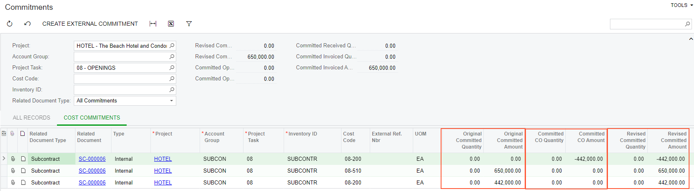

# Subcontracts: To Decrease a Commitment with a Change Order {#_f4478d89-f21d-40d9-b545-0fe097ee5508 .task}

In this activity, you will learn how you can decrease a project commitment by processing a change order with a negative amount.

## Story {#section_i2l_mxc_tpb .section}

Suppose that on *4/22/2026*, the ToadGreen company hires a subcontractor, Standard Hardware Company, to perform a part of work for the hotel that is being built by ToadGreen. Initially, both parties agree that Standard Hardware Company will install the watering system and prepare the area around the hotel to landscape design.

After some consideration, because of scheduling issues, ToadGreen has agreed with the subcontractor that the subcontractor will install only watering system communications, and another subcontractor will later handle the landscape preparation. When the subcontractor finishes its part of the work and sends an invoice to ToadGreen, ToadGreen’s project manager will create a bill and pay for the provided services. Then, project manager will process a change order to decrease the project commitment.

Acting as the construction project manager, you will process all the needed documents in the system.

## Configuration Overview {#section_qkw_q4s_dnb .section}

In the *U100* dataset, the following tasks have been performed to support this activity:

-   On the [Enable/Disable Features](CS_10_00_00.md) \(CS100000\) form, the *Construction* and *Change Orders*features have been enabled.
-   On the [Vendors](AP_30_30_00.md) \(AP303000\) form, the *HARDCO \(Standard Hardware Company\)* vendor has been created.
-   On the [Projects](PM_30_10_00.md#) \(PM301000\) form, the *HOTEL* project has been created.
-   On the [Cost Codes](PM_20_95_00.md) \(PM209500\), the *02-510 \(Underground - Water\)* and *02-990 \(Landscaping Maintenance\)* cost codes have been created.
-   On the [Stock Items](IN_20_25_00.md) \(IN202500\) form, the *SUBCONTR* non-stock item, which represents the work performed by subcontractors, has been created.

## Process Overview {#section_a35_f1d_tpb .section}

To record the work performed by a subcontractor for the project, you will create a subcontract document with the subcontractor specified on the [Subcontracts](SC_30_10_00.md) \(SC301000\) form. Then on the [Bills and Adjustments](AP_30_10_00.md#) \(AP301000\) form, you will create a bill for the provided services, and remove the planned services that were not provided from the bill. You will create a payment for the bill on the [Checks and Payments](AP_30_20_00.md#) \(AP302000\) form. When all the work has been paid for, you will process a change order to remove the unprovided services from the subcontract. Finally, you will complete the subcontract on the [Subcontracts](SC_30_10_00.md) form.

## System Preparation {#section_s4n_ftc_tpb .section}

To prepare to perform the instructions of this activity, do the following:

1.  Create the *COMMITMENT* change order class as described in [Change Orders for Commitments: To Create a Change Order Class](Projects_Changes_to_Commitments_Implem_Activity.md).
2.  Launch the Acumatica ERP website and sign in as construction project manager using the *ewatson* username and *123* password.
3.  In the info area at the upper-right corner of the top pane of the Acumatica ERP screen, make sure that the business date is set to *1/30/2026*. If a different date is displayed, click the Business Date menu button and select *1/30/2026* from the calendar. For simplicity, you'll create and process all documents in this activity using this business date.
4.  Open the [Projects Preferences](PM_10_10_00.md) \(PM101000\) form, and on the **General** tab \(**General Settings** section\), select the **Internal Cost Commitment Tracking** check box to expose commitments and committed values in the project budget, and save your changes to the project accounting preferences.

## Step 1: Creating a Project Commitment {#section_anp_w1d_tpb .section}

To create a subcontract, do the following:

1.  On the [Subcontracts](SC_30_10_00.md) \(SC301000\) form, create a subcontract, and specify the following settings in the Summary area:
    -   **Vendor**: *HARDCO \(Standard Hardware Company\)*
    -   **Date**: *1/30/2026*
    -   **Start Date**: *1/30/2026*
    -   **Description**: `Watering system and landscape preparation work`
2.  On the **Details** tab, add lines with the following settings.

    |Inventory ID|Project|Project Task|Cost Code|Line Description|UOM|Ext. Cost|
    |------------|-------|------------|---------|----------------|---|---------|
    |*SUBCONTR*|*HOTEL*|*02*|*02-510*|`Watering system`|*EA*|`350,000.00`|
    |*SUBCONTR*|*HOTEL*|*02*|*02-990*|`Landscape preparation`|*EA*|`242,000.00`|

3.  In the Summary area, in the **Subcontract Total** box, make sure that the total is *592,000.00*.
4.  In the Summary area, click **Remove Hold** to assign the subcontract the *Open* status. The system creates commitments to the project.
5.  In the Summary area of the [Commitments](PM_30_60_00.md) \(PM306000\) form, select *HOTEL* in the **Project** box and *02* in the **Project Task** box. Make sure other boxes are cleared, and on the **Cost Commitments** tab, review commitments that the system has created when you saved the subcontract with the *Open* status. There are two commitments:
    -   The commitment with the *SUBCONTR* item and committed original and revised amounts of $350,000
    -   The commitment with the *SUBCONTR* item and committed original and revised amounts of $242,000
6.  Open the [Projects](PM_30_10_00.md#) \(PM301000\) form, and in the **Project ID** box, select *HOTEL*. On the **Cost Budget** tab, for the budget lines with the *02-510* and *02-990* cost codes, notice that the committed open amount for these lines equals the amount of the lines of the subcontract that you have processed. The original committed values of each line equal to the revised committed values.

## Step 2: Paying for the Performed Work {#section_ulk_wcd_tpb .section}

To create the bill to pay for the subcontractor work, do the following:

1.  On the [Subcontracts](SC_30_10_00.md) \(SC301000\) form, open the subcontract that you have created earlier in this activity, and click **Enter AP Bill** on the form toolbar. The [Bills and Adjustments](AP_30_10_00.md#) \(AP301000\) form opens with the prepared accounts payable bill.
2.  On the **Details** tab, remove the line with the $442,000 amount.
3.  In the Summary area, click **Remove Hold** to assign the bill the *Balanced* status, and then click **Release** to release the bill.
4.  On the form toolbar, click **Pay**. The system prepares a payment and opens it on the [Checks and Payments](AP_30_20_00.md#) \(AP302000\) form.
5.  In the Summary area, click **Remove Hold** to assign the payment the *Pending Print* status, and on the form toolbar, click **Print/Process**,
6.  On the [Process Payments / Print Checks](AP_50_50_00.md#) \(AP505000\) form, which opens, click **Process** on the form toolbar to process the only selected line that corresponds to the prepared payment. The system opens the printable document for the check in a separate browser tab. Review the prepared document and close the tab.
7.  Navigate to the [Release Payments](AP_50_52_00.md#) \(AP505200\) form, make sure that the unlabeled check box is selected for the only line in the table, and on the form toolbar, click **Process** to release the AP payment.

    As a result, the payment and the payment application to the bill are released; the subcontract, the payment and the AP bill are assigned the *Closed* status and the appropriate transactions are posted to the general ledger.

## Step 3: Adjusting the Project Commitments {#section_u4n_ftc_tpb .section}

To change the project commitments by using a change order, do the following:

1.  On the [Projects](PM_30_10_00.md) \(PM301000\) form, open the *HOTEL* project and on the form toolbar, click **Create Change Order**. The system creates a change order for the project and opens it on the [Change Orders](PM_30_80_00.md) \(PM308000\) form.
2.  In the Summary area, specify the following settings:
    -   **Class**: *COMMITMENT*
    -   **Project**: *HOTEL* \(specified automatically\)
    -   **Description**: `Adjustment to the subcontract (doors and frames)`
3.  On the **Commitments** tab, add a new line with the following settings:
    -   **Project Task**: *08*
    -   **Cost Code**: *08-200*
    -   **Inventory ID**: *SUBCONTR*
    -   **Quantity**: `0`
    -   **Amount**: `-442,000`
    -   **Vendor**: *HARDCO*
    -   **Commitment Type**: *Subcontract*
    -   **Commitment Nbr.**: Reference number of the subcontract that you have created

        When you specify the subcontract, the system automatically specifies *New Line* in the **Status** box thus indicating that a new line with the negative amount will be added to the subcontract.

4.  Save your changes to the change order.

    The **Commitments Change Total** in the Summary area must be equal to -$442,000.

5.  On the form toolbar, click **Remove Hold** to assign the change order the *Open* status, and then click **Release** to release the change order.
6.  On the [Subcontracts](SC_30_10_00.md) \(SC301000\) form, open and review the subcontract for which you have processed the change order. On the **Details** tab, notice that the subcontract now includes the third line with the negative amount. In the Summary area notice that the **Subcontract Total** amount has been adjusted and is now $650,000.
7.  On the **Finanical** tab, make sure that the **Unbilled Quantity** and **Unbilled Amount** of the subcontract are now equal to zero.
8.  On the form toolbar, click **Complete**.

## Step 4: Reviewing the Updated Commitments {#section_v4n_ftc_tpb .section}

To review the commitments that the system has updated based on the change order you have processed earlier in this activity, do the following:

1.  In the Summary area of the [Commitments](PM_30_60_00.md) \(PM306000\) form, select *HOTEL* in the **Project** box and *08* in the **Project Task** box, make sure other boxes are cleared, and on the **Cost Commitments** tab, review the commitments that have been updated.

    Notice that the commitment that has been updated with the change order have nonzero **Committed CO Amount**.

    

2.  On the [Projects](PM_30_10_00.md) \(PM301000\) form, open the *HOTEL* project.
3.  On the **Cost Budget** tab, review the updated committed values of the cost budget in the line with the *08-200* cost code.

    Notice that the system has updated the revised committed amount in the line. This amount is calculated as the sum of the original committed amount and committed CO amount, and is equal zero.

4.  On the **Commitments** tab, review the list of subcontracts related to the project. Notice that the subcontract that you have processed now has the **Order Total** of *650,000*.
5.  On the **General** tab \(**General Settings** section\) of the [Projects Preferences](PM_10_10_00.md) \(PM101000\) form, clear the **Internal Cost Commitment Tracking** check box, and save your changes to the project accounting preferences.

You have finished processing a change order for the project commitment.

**Parent topic:**[Processing Subcontracts](../UserGuide/Construction_Subcontracts_Mapref.md)

