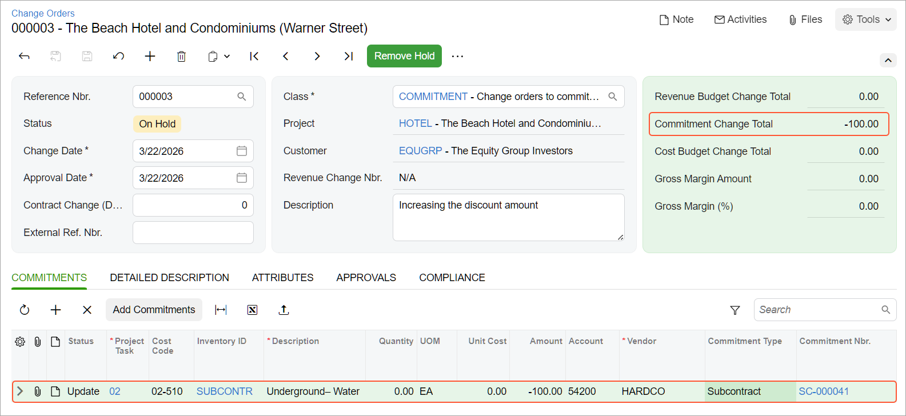

# Subcontracts: To Update a Negative Line in a Subcontract {#_1d5e819d-e3db-4496-a89c-12e0841a8b38 .task}

In this activity, you will learn how you can update a negative line in a subcontract with a change order.

**Attention:** This activity is based on the *U100* dataset. If you are using another dataset or if any system settings have been changed in *U100*, these changes can affect the workflow of the activity and the results of the processing. To avoid issues, restore the *U100* dataset to its initial state.

## Story {#section_i2l_mxc_tpb .section}

Suppose that on *3/22/2026*, the ToadGreen company hires a subcontractor, Standard Hardware Company, to perform a part of work for the hotel that is being built by ToadGreen. According to contract, Standard Hardware Company will install the watering system for the hotel and the price of performed work will be $450,000. The subcontractor agrees to provide the discount for the subcontract in the amount of $1,500.

Later, because of minor scheduling issues, Standard Hardware Company has agreed to increase the discount amount to $1,600. Acting as the construction project manager, you will process all the needed documents in the system.

## Configuration Overview {#section_qkw_q4s_dnb .section}

In the *U100* dataset, the following tasks have been performed to support this activity:

-   On the [Enable/Disable Features](CS_10_00_00.md) \(CS100000\) form, the *Construction*, *Cost Codes*, and *Change Orders* features have been enabled.
-   On the [Vendors](AP_30_30_00.md) \(AP303000\) form, the *HARDCO \(Standard Hardware Company\)* vendor has been created.
-   On the [Projects](PM_30_10_00.md#) \(PM301000\) form, the *HOTEL* project has been created. On the **Summary** tab, the **Change Order Workflow** check box is selected.
-   On the [Stock Items](IN_20_25_00.md) \(IN202500\) form, the *SUBCONTR* non-stock item, which represents the work performed by subcontractors, has been created.

## Process Overview {#section_a35_f1d_tpb .section}

To record the work performed by a subcontractor for the project, you will create a subcontract document on the [Subcontracts](SC_30_10_00.md) \(SC301000\) form. Then on the [Change Orders](PM_30_80_00.md) \(PM308000\) form, you will create and process a change order with the negative line for this subcontract. On the [Commitments](PM_30_60_00.md) \(PM306000\) form, you will review the resulting commitments that the system has created based on the subcontract.

## System Preparation { .section}

To prepare to perform the instructions of this activity, do the following:

1.  As a prerequisite activity, complete the [Change Orders for Commitments: To Create a Change Order Class](Projects_Changes_to_Commitments_Implem_Activity.md) to create the change order class.
2.  Launch the Acumatica ERP website and sign in as construction project manager using the *ewatson* username and *123* password.
3.  In the info area, in the upper-right corner of the top pane of the Acumatica ERP screen, make sure that the business date in your system is set to *3/22/2026*. If a different date is displayed, click the Business Date menu button, and select *3/22/2026* on the calendar. For simplicity, in this activity, you will create and process all documents in the system on this business date.
4.  Open the [Projects Preferences](PM_10_10_00.md) \(PM101000\) form, and on the **General** tab \(**General Settings** section\), make sure the **Internal Cost Commitment Tracking** check box is selected.

## Step 1: Entering a Subcontract {#section_anp_w1d_tpb .section}

To create a subcontract, do the following:

1.  On the [Subcontracts](SC_30_10_00.md) \(SC301000\) form, add a new record.
2.  In the Summary area, specify the following settings:
    -   **Vendor**: *HARDCO \(Standard Hardware Company\)*
    -   **Date**: *3/22/2026*
    -   **Start Date**: *3/22/2026*
    -   **Description**: `Watering system installation for HOTEL`
3.  On the **Details** tab, add lines with the following settings.

    |Inventory ID|Project|Project Task|Cost Code|Line Description|UOM|Ext. Cost|
    |------------|-------|------------|---------|----------------|---|---------|
    |*SUBCONTR*|*HOTEL*|*02*|*02-510*|`Watering system`|*EA*|`450,000`|
    |*SUBCONTR*|*HOTEL*|*02*|*02-510*|`Discount on installation`|*EA*|`-1500`|

4.  In the Summary area, in the **Subcontract Total** box, make sure that the total is *448,500.00*.
5.  On the form toolbar, click **Remove Hold** to assign the subcontract the *Open* status. The system creates commitments to the project based on the subcontract lines.
6.  On the [Projects](PM_30_10_00.md#) \(PM301000\) form, open the *HOTEL* project and review the cost budget of the project. On the **Cost Budget** tab, make sure the budget line with the *02-510* cost code has appeared in the cost budget, and notice that the committed open amount for the lines equals the amount of the subcontract that you have processed \($448,500\). The original committed values of the line equals the revised committed values.

## Step 2: Processing Changes to the Subcontract {#section_yr2_12n_5pb .section}

To change the project commitments by processing a change order to subcontract, while you are still viewing the [Projects](PM_30_10_00.md) \(PM301000\) form, do the following:

1.  On the More menu \(under **Change Management**\), click **Create Change Order**. The system creates a change order and opens it on the [Change Orders](PM_30_80_00.md) \(PM308000\) form.
2.  In the Summary area, specify the following settings:
    -   **Class**: *COMMITMENT*
    -   **Description**: `Increasing the discount amount`
3.  On the table toolbar of the **Commitments** tab, click **Add Commitments**.
4.  In the **Add Commitments** dialog box, which opens, select the unlabeled check box in the commitment line with the *02* project task, *02-510* cost code, *SUBCONTR* inventory item, and *-1500* line amount; click **Add Lines &amp; Close**.

    The system adds the selected purchase order line to the change order and closes the dialog box. Notice that the status of the added line is *Update*.

5.  In the added line, enter `-100` in the **Amount** box.

    The system calculates the **Potentially Revised Amount** in the line, which is equal to *-1600*, as the sum of the **Ext. Cost** and **Amount** values. This is the revised amount of the subcontract line after processing the change order will be finished.

6.  Save your changes to the change order.

    The **Commitment Change Total** in the Summary area must be equal to -$100, as shown below.

    

7.  On the form toolbar, click **Remove Hold** to assign the change order the *Open* status, and then click **Release** to release the change order.
8.  On the [Subcontracts](SC_30_10_00.md) \(SC301000\) form, open the subcontract that you have created earlier in this activity, and on the **Details** tab, review the subcontract lines. Notice that the **Ext. Cost** of the line with the *Discount on installation* description is now *-1,600*. In the Summary area, notice that the total amount of subcontract has been adjusted and is now *$448,400.00*.
9.  Open the [Commitments](PM_30_60_00.md) \(PM306000\) form.
10. In the Summary area, select *HOTEL* in the **Project** box and *02-510* in the **Cost Code** box. Make sure other boxes are cleared and review commitments that the system has created when you saved the subcontract with the *Open* status. There are two commitments:
    -   The commitment with the *SUBCONTR* item and committed original and revised amounts of $450,000
    -   The commitment with the *SUBCONTR* item and committed original amount of *-1,500* and revised committed amount of *-1,600*
11. On the **General** tab \(**General Settings** section\) of the [Projects Preferences](PM_10_10_00.md) \(PM101000\) form, clear the **Internal Cost Commitment Tracking** check box, and save your changes to the project accounting preferences.

You have finished processing a negative commitment for the project.

**Parent topic:**[Processing Subcontracts](../UserGuide/Construction_Subcontracts_Mapref.md)

