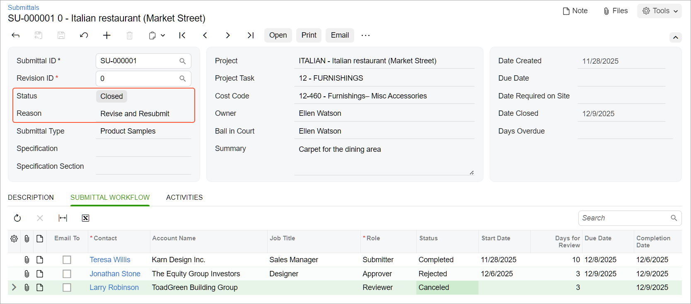

# Submittals: Process Activity {#_df1b0a6b-f9ac-42ce-a756-175564668635 .task}

This activity will walk you through the processing of a submittal.

**Attention:** This activity is based on the *U100* dataset. If you are using another dataset or if any system settings have been changed in *U100*, these changes can affect the workflow of the activity and the results of the processing. To avoid issues, restore the *U100* dataset to its initial state.

## Story { .section}

Suppose that the ToadGreen Building Group company is building an Italian restaurant for the Equity Group Investors customer. The company needs to confirm that the customer wants to use the carpet being proposed for the dining area of the restaurant.

Ellen Watson, as the construction project manager, is managing the submittal process. Jonathan Stone, the customer’s designer, needs to approve a sample of the carpet. Teresa Willis—a new sales manager of Karn Design Inc., for which the construction project manager needs to add a contact in the system—needs to send the carpet sample to Jonathan Stone, who should approve the color and the material of the carpet. Also, the construction project manager needs to send the approved sample for an informational review to Larry Robinson, a purchase manager of the ToadGreen company.

Also suppose that after reviewing the sample, the designer rejects the submittal because a part of the carpet's pattern was cut off; the designer requests a larger sample.

Acting as the construction project manager, you need to create a new contact to be used in the submittal, enter the submittal in the system, open it, and add the necessary information during the processing of the submittal. Then you need to close the submittal and create a new revision for it.

**Important:** For simplicity, in this activity, you will perform all actions while remaining signed in as Ellen Watson. In a production system, all actions would be performed by the responsible persons.

## Configuration Overview { .section}

In the *U100* dataset, the following tasks have been performed to support this activity:

-   On the [Enable/Disable Features](CS_10_00_00.md) \(CS100000\) form, the *Construction* and *Construction Project Management* features have been enabled.
-   On the [Contacts](CR_30_20_00.md#) \(CR302000\) form, a contact record for *Jonathan Stone* has been created, and on the [Employees](EP_20_30_00.md#) \(EP203000\) form, employee accounts for *Larry Robinson* and *Ellen Watson* have been created.
-   On the [Projects](PM_30_10_00.md#) \(PM301000\) form, the *ITALIAN* project with the *12 - FURNISHINGS* project task has been created. Also, on the [Cost Codes](PM_20_95_00.md#) \(PM209500\) form, the *12-460 - Furnishings- Misc Accessories* cost code has been added.

## Process Overview { .section}

To process the submittal in the system, you will create and open it on the [Submittals](PJ_30_60_00.md#) \(PJ306000\) form. During the entry of the submittal, you will add a new contact for the submitter on the [Contacts](CR_30_20_00.md#) \(CR302000\) form. You will send the emails to the submitter and then the approver by using the [Email Activity](CR_30_60_15.md#) \(CR306015\) form, and will change the status of the corresponding rows on the **Submittal Workflow** tab to indicate that a response from the responsible person is pending. After the response is received, you will indicate this in the submittal document. After the approver rejects the submittal, you will close the submittal and prepare a new submittal revision.

## System Preparation { .section}

To prepare to perform the instructions of this activity, do the following:

1.  As a prerequisite to this activity, complete the [Submittals: Implementation Activity](Construction_Submittals_Implem_Activity.md).
2.  Launch the Acumatica ERP website, and sign in to a company with the *U100* dataset preloaded. You should sign in as Ellen Watson, the construction project manager, by using the *ewatson* username and the *123* password.
3.  In the info area, in the upper-right corner of the top pane of the Acumatica ERP screen, make sure that the business date in your system is set to today's date.

## Step 1: Entering and Opening a Submittal { .section}

To enter a submittal for the carpet sample, including the employees with roles in the submittal, and then open the submittal, do the following \(acting as Ellen Watson\):

1.  On the [Submittals](PJ_30_60_00.md#) \(PJ306000\) form, add a new record.
2.  In the Summary area, specify the following settings:

    -   **Submittal Type**: *Product Samples*
    -   **Project**: *ITALIAN*
    -   **Project Task**: *12 - FURNISHINGS*
    -   **Cost Code**: *12-460*
    -   **Owner**: *Ellen Watson* \(inserted automatically\)
    -   **Summary**: `Carpet for the dining area`
    In the Summary area, notice that the status and the reason of the submittal are both set to *New*.

3.  On the **Description** tab, type `Sample of the carpet to be laid in the dining area`.
4.  On the form toolbar, click **Save**.
5.  On the table toolbar of the **Submittal Workflow** tab, click **Add Row**. In this row, you will add Teresa Willis as the submitter, but you need to create a contact in the system for her.
6.  In the added row, click in the **Contact** column, and then click the magnifier button to open the lookup table with the list of existing contacts.
7.  On the table toolbar of the lookup table, click Add New Record. The system opens the [Contacts](CR_30_20_00.md#) \(CR302000\) form.
8.  In the Summary area, select *KADESIGN* as the **Business Account**.
9.  On the **General** tab of the form, specify the following settings:
    -   **First Name**: `Teresa`
    -   **Last Name**: `Willis`
    -   **Job Title**: `Sales Manager`
    -   **Email**: `twillis@kadesign.example.com`
    -   **Business 1**: `+1 (212) 209-0982`
10. On the form toolbar, click **Save &amp; Close** to save the record, close the form, and return to the **Submittal Workflow** tab of the [Submittals](PJ_30_60_00.md#) form. The system has inserted the newly created contact in the **Contact** column of the row you added.
11. In the row, specify the following settings:
    -   **Role**: *Submitter*
    -   **Status**: *Planned*

        This is the status of this contact's work on the submittal.

    -   **Days for Review**: `10`
12. To add the designer approving the submittal, on the table toolbar, click **Add Row**, and specify the following settings in the row:
    -   **Contact**: *Jonathan Stone*
    -   **Role**: *Approver*
    -   **Status**: *Planned*
    -   **Days for Review**: `3`
13. To add the purchase manager performing an informational review, on the table toolbar, click **Add Row**, and specify the following settings in the row:
    -   **Contact**: *Larry Robinson*
    -   **Role**: *Reviewer*
    -   **Status**: *Planned*
    -   **Days for Review**: `3`
14. On the form toolbar, click **Save**.
15. On the form toolbar, click **Open**. In the **Details** dialog box, which opens, leave *Issued* as the reason, and click **OK**.

    In the Summary area, notice that the system has changed the status of the submittal to *Open* and the reason to *Issued*.

## Step 2: Sending an Email to the Submitter {#section_kch_x5j_4pb .section}

In this step, you will continue managing the submittal, acting as Ellen Watson. To send an email to the sales manager of Karn Design Inc., to the following:

1.  While you are still viewing the submittal on the [Submittals](PJ_30_60_00.md#) \(PJ306000\) form, on the **Submittal Workflow** tab, select the **Email To** check box in the row with the *Teresa Willis* contact, and click **Email** on the form toolbar.

    The [Email Activity](CR_30_60_15.md#) \(CR306015\) form opens with the email address of Teresa Willis inserted in the **To** box.

2.  On the **Message** tab, type the following text:

    `Dear Teresa,`

    `Please provide a sample of the carpet that you proposed for the dining area.`

    `Best regards,`

    `Ellen Watson`

    **Important:** In a production system, you would also attach any needed documents to the email. In this activity, for simplicity, you are skipping this step for all emails you send.

3.  On the form toolbar, click **Send** to send the email, close the form, and return to the submittal on the [Submittals](PJ_30_60_00.md#) form. Press Esc to refresh the form.
4.  On the **Activities** tab, make sure that the email you sent is now listed.
5.  On the **Submittal Workflow** tab, in the **Status** column of the row for Teresa Willis, select *Pending* to indicate that you are waiting on a response from the submitter.
6.  Click **Save** on the form toolbar.

    In the **Ball in Court** box in the Summary area, notice that the system has specified *Teresa Willis* to reflect the person who currently has to perform an action for the submittal. Also, on the **Submittal Workflow** tab, in the row for Teresa Willis, the system has set the **Start Date** to the current business date and calculated the **Due Date** based on the start date and the days for review that you specified earlier in this row.

## Step 3: Receiving an Answer from the Submitter {#section_lch_x5j_4pb .section}

In this step, you will prepare and send an email response from the submitter \(which the submitter would instead do in a production environment\) and indicate that the requested sample has been provided. Do the following:

1.  In the info area, in the upper-right corner of the top pane, change the business date to eight days after the previously specified date.
2.  While you are still viewing the submittal on the [Submittals](PJ_30_60_00.md#) \(PJ306000\) form, on the **Activities** tab, click **Create Email**.
3.  In the **To** box on the [Email Activity](CR_30_60_15.md#) \(CR306015\) form that opens, specify *Ellen Watson*.
4.  On the **Message** tab, type the following text:

    `Dear Ellen,`

    `The sample of the carpet has been sent to you by delivery service.`

    `Best regards,`

    `Teresa Willis`

5.  On the form toolbar, click **Send** to send the email and close the form.

    On the **Activities** tab of the [Submittals](PJ_30_60_00.md#) form, notice that the email is listed. Suppose that the sample from the delivery service has arrived.

6.  On the **Submittal Workflow** tab, in the **Status** column of the row for Teresa Willis, select *Completed* to indicate that she has submitted the needed sample. Notice that in the **Completion Date** column, the system inserts the current business date \(that is, the date you specified at the beginning of this step\).
7.  Click **Save** on the form toolbar to save your changes.

    In the Summary area, notice that the system has changed the name in the **Ball in Court** box to Ellen Watson because currently there are no rows with the *Pending* status on the **Submittal Workflow** tab.

## Step 4: Requesting the Approval of the Submitted Sample {#section_eyr_zwj_4pb .section}

To request approval from the designer for the documents, do the following \(acting as Ellen Watson\):

1.  While you are still viewing the submittal on the [Submittals](PJ_30_60_00.md#) \(PJ306000\) form, on the **Submittal Workflow** tab, select the **Email To** check box in the row with the *Jonathan Stone* contact, and on the form toolbar, click **Email**.

    The [Email Activity](CR_30_60_15.md#) \(CR306015\) form opens with the email address of Jonathan Stone automatically specified in the **To** box.

2.  On the **Message** tab, type the following text:

    `Dear Jonathan,`

    `I have sent you the sample of the carpet that Karn Design Inc. provided us. Please let me know if this is what you want to see in the dining area of the restaurant.`

    `Best regards,`

    `Ellen Watson`

3.  On the form toolbar, click **Send** to send the email and close the form to return to the submittal on the [Submittals](PJ_30_60_00.md#) form. Refresh the form, and on the **Activities** tab, notice that the email to Jonathan is now listed.
4.  On the **Submittal Workflow** tab, in the **Status** box of the row for Jonathan Stone, select *Pending* to indicate that you are waiting on a response from the approver.
5.  Click **Save** on the form toolbar. In the Summary area, notice that the system has changed the name in the **Ball in Court** box to *Jonathan Stone* because you changed the status in his row. Also, on the **Submittal Workflow** tab, the system has set the **Start Date** to the current business date \(which you set in Step 3\) and calculated the **Due Date** accordingly.

## Step 5: Rejecting the Submitted Documents {#section_fyr_zwj_4pb .section}

To prepare and send an email from the designer \(which Jonathan Stone himself would do in a production environment\) and indicate that the provided sample has been rejected, do the following:

**Important:** For simplicity, in this step, you will perform the actions while remaining signed in as Ellen Watson. In a production system, all actions would be performed by the responsible persons.

1.  In the info area, in the upper-right corner of the top pane, change the business date to three days after the previously specified date.
2.  While you are still viewing the submittal on the [Submittals](PJ_30_60_00.md#) \(PJ306000\), on the **Activities** tab, click **Create Email**.
3.  In the **To** box of the [Email Activity](CR_30_60_15.md#) \(CR306015\) form that opens, specify *Ellen Watson*.
4.  On the **Message** tab, type the following text:

    `Dear Ellen,`

    `I like the color and material. But the sample is too small, and part of the pattern was cut off from the sample. Could you please provide a larger sample?`

    `Best regards,`

    `Jonathan Stone`

5.  On the form toolbar, click **Send** to send the email and close the form. On the **Activities** tab of the [Submittals](PJ_30_60_00.md#) form, notice that the new email is listed.
6.  On the **Submittal Workflow** tab, in the **Status** box of the row for *Jonathan Stone*, select *Rejected* to indicate that the approver rejected the submittal.
7.  On the form toolbar, click **Save**.

## Step 6: Creating and Opening a New Revision of the Submittal { .section}

To close the submittal and prepare a new submittal revision, do the following \(acting as Ellen Watson\):

1.  While you are still viewing the submittal on the [Submittals](PJ_30_60_00.md#) \(PJ306000\) form, on the **Submittal Workflow** tab, in the **Status** column of the row for *Larry Robinson*, select *Canceled*.
2.  On the form toolbar, click **Save** , and then click **Close**.
3.  In the **Details** dialog box, which opens, select *Revise and Resubmit* in the **Reason** box, and click **OK**.

    In the Summary area, notice that the system has changed the status of the submittal to *Closed* and the reason to *Revise and Resubmit*, as shown below.

    

4.  On the More menu, click **Create Revision**.

    The system creates a new revision of the submittal with the same submittal ID, a new revision ID \(*1*\), and the *New* status. Other settings in the Summary area have been copied from the previous submittal revision.

5.  Review the **Submittal Workflow** tab, and make sure that the new revision contains all the rows from the original submittal.
6.  On the form toolbar, click **Open**.
7.  In the **Details** dialog box, which opens, leave *Issued* as the reason, and click **OK**.

You have finished working with the first submittal and created a new revision.

**Parent topic:**[Processing Submittals](../UserGuide/Construction_Submittals_Mapref.md)

