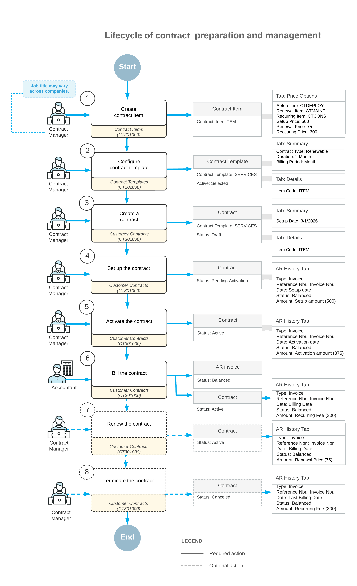

# Contract Functionality Implementation: General Information {#_28983a4b-8aa9-4dfa-8ffb-98b849897bab .concept}

In Acumatica ERP, contracts reflect the binding agreements your organization has with its customers and the specific terms of these agreements. During the implementation process, you perform the initial system configuration, define the entities used in a contract, and enter the basic terms of each contract into Acumatica ERP.

These initial tasks must be performed before you can implement the steps related to the fulfillment of a contract, such as setting it up, activating it, recording contract usage, billing the contract, changing the terms of the contract, renewing, or terminating the contract.

## Learning Objectives { .section}

In this chapter, you will learn how to do the following:

-   Configure the contract management functionality
-   Create contract items and contract templates
-   Create preliminary contract drafts

## Applicable Scenarios { .section}

You perform the tasks involved in contract implementation if your company needs to create configurable contracts that reflect the services that your company regularly provides to customers.

## Preparation for Contract Creation { .section}

Before you create a contract, you need to perform the system configuration tasks and then create all the entities that will be used during the creation of contracts, such as non-stock items \(to represent specific services in the contract\), contract items, and contract templates.

Before you perform the system configuration tasks, on the [Enable/Disable Features](CS_10_00_00.md) \(CS100000\) form, you activate the *Contract Management* feature in your Acumatica ERP instance. Then on the **General** tab of the [Accounts Receivable Preferences](AR_10_10_00.md) \(AR101000\) form, you clear the **Hold Documents on Entry** check box, which affects on the status of an invoice that the system generates when you bill a contract. In the final configuration step, you enable auto-numbering for contracts. For more information, see [Managing Segmented Keys](SM__con_Managing_Segmented_Keys.md).

After configuring the system, you create the main contract entities \(non-stock items, contract items, and contract templates\):

1.  On the [Non-Stock Items](IN_20_20_00.md) \(IN202000\) form, a non-stock item must be created for each item to be included in the contract. You create these items if they do not already exist in Acumatica ERP.

    For more information, see [Non-Stock Item: General Information](Non_Stock_Item_Fin_GeneralInfo.md).

2.  After you have created any needed non-stock items, on the [Contract Items](CT_20_10_00.md) \(CT201000\) form, you create the contract items that you may want to include in a contract template.

    A *contract item* is an entity that includes at least one service \(which is represented by a non-stock item that you have defined\) as well as related information about pricing and provisioning.

    For more information, see [Contract Item Creation: Contract Items](Contracts_Configuring_Contract_Items_ContractItems.md).

3.  On the [Contract Templates](CT_20_20_00.md) \(CT202000\) form, you create a contract template to provide all the settings to the contract, except for the customer name and location. The contract template provides basic settings, as well as those related to billing, refund, and renewal for a typical contract of the type.

    For more information, see [Contract Template Creation: Contract Templates](Contracts_Configuring_Contract_Contract_Templates.md).

## Creation of a Contract { .section}

After you have created the contract template, you create a contract. On the [Customer Contracts](CT_30_10_00.md) \(CT301000\) form, you select a template and a customer account. The system inserts the default settings provided by the selected template and customer account. Also, it assigns the *Draft* status to the newly created contract.

You can change the included quantity of contract items within the allowed limits, specify the setup and activation dates, and modify the billing information. You can modify the list of contract items if these modifications are allowed, based on the settings of the selected contract template. Also, you can change the prices if the pricing policy of the contract item allows these changes. For more information, see [Contract Management: Contract Upgrade](Contracts_Managing_Contracts_ContractChanges.md).

For step-by-step instructions on the initial creation of a contract, see [Contract Configuration: To Create a Regular Contract Draft](config_Contract_Management_Implem_Activity_To_Create_Contract_Draft.md).

After the contract has been created, it can then proceed to setup and activation, which are described in [Contract Setup and Activation: General Information](Contracts_Setting_Up_Contract_Setup_GeneralInfo.md).

## Lifecycle of Contract Preparation and Management {#section_vv2_1y4_y4b .section}

The following diagram shows the entire lifecycle of contract preparation and management. The implementation of contract management functionality is the earliest part of this lifecycle \(Items 1 through 3 in the diagram\).

## Fulfillment of the Contract { .section}

After you have created a draft of the contract with appropriate conditions, you set up and activate the contract. These actions trigger the contract fulfillment process.

The fulfillment process of the contract includes mandatory steps:

-   Contract setup and contract activation: Depending on the business processes of your company, the system gives you the opportunity to start the contract fulfillment process in either of the following ways:

    -   To set up the contract separately \(which actually corresponds to its signing\) and then activate it \(which defines the moment from which a company starts providing services\)
    -   To perform two actions simultaneously: set up and activate the contract
    Once you have prepared a contract, you can set it up. If the service covered by a contract requires setup before contract activation, you may initiate billing for the setup separately. For example, contracts involving internet access may require the installation of a router or other equipment.

    When you initiate the contract setup, the contract becomes effective and the customer is billed for any services associated with setup. For more information, see [Contract Setup and Activation: General Information](Contracts_Setting_Up_Contract_Setup_GeneralInfo.md). When setup is finished, you activate the contract and start providing the service. After the activation of the contract, you can bill the customer for the service rendered.

    If you do not need to separate the setup of the contract and the activation, these steps can be done simultaneously.

-   Contract fulfillment: During this stage, the customer obtains the services described in the contract, and billing is performed according to the terms defined in the contract and the contract items. For details, see [Contract Billing: General Information](Billing_Contracts_Contract_Billing_GeneralInfo.md) and [Contract Usage: Contract Usage](Billing_Contracts_Contract_Billing_ContractUsage.md).

## Contract Upgrade and Renewal { .section}

The contract upgrade and renewal processes let you modify or extend existing contracts. These processes are optional. This section outlines how the *Renewable*, *Expiring*, and *Unlimited* contract types behaves during contract fulfillment.

**Contract upgrade:** You or the customer may want to change \(upgrade or downgrade\) the set of services within the scope of an active contract. Contract upgrading has two steps: preparation and activation. During preparation, contract billing and service provision are done according to the initial settings of the contract. For details, see [Contract Management: Contract Upgrade](Contracts_Managing_Contracts_ContractChanges.md).

**Contract renewal:** The renewal scenario depends on the type of the expired contract, which is determined by the contract template.

The three types of contracts are *Renewable*, *Expiring*, and *Unlimited*:

-   A contract of the *Renewable* type can be prolonged \(its expiration date will be moved to the future\) if it is renewed within the grace period. After renewal, the contract has the *Active* status. If the grace period has been finished, the renewal process creates a copy of the contract with the *Draft* status. You need to activate the copied contract to start the provision of services. During the renewal process, the system changes the expiration date of the contract and generates an invoice for the renewal fee, if any. After renewal is completed, the contract is again in the fulfillment stage. For details about renewing contracts, see [Contract Management: Contract Renewal](Contracts_Setting_Up_Contract_Setup_ContractRenewal.md).
-   A contract of the *Expiring* type cannot be prolonged; the renewal process creates a new contract as a copy of an existing contract. A contract of this type expires at the end of its duration, but it is available for a renewal operation—manual or automatic. When this contract is renewed, a copy of the expired contract is created with the *Draft* status, and you need to activate the copied contract to start the provision of services.
-   A contract of the *Unlimited* type has no expiration date and can end only when it is terminated.

    For more information, see [Contract Management: Contract Renewal](Contracts_Setting_Up_Contract_Setup_ContractRenewal.md).

## Contract Expiration and Termination { .section}

The contract expiration and termination processes define how contracts end—either automatically at expiration or manually through termination. Expiration occurs when a contract reaches its end date, while termination can happen at any time when the parties decide to discontinue the agreement. These processes are optional.

This section explains how the system handles billing, status changes, and refunds during contract expiration and termination.

Each time you run the contract billing process, it checks whether the next billing date is later than or the same as the contract expiration date. If it is, the contract billing process sets the next billing day to be the same as the contract expiration date. The next time you run the contract billing process, the system generates an invoice for the rendered service or contract usage and changes the contract status to *Expired*. You can not record any contract usage for an expired contract.

Contract termination may be done at any point in the contract lifecycle if you or the customer decide to discontinue the relationship between the parties defined by the contract. You can terminate an expired contract if you are not going to renew it. When you initiate the contract termination, the system gathers information on the unbilled usage and unfulfilled services of the contract and generates an invoice or a credit memo, if needed.

The termination date must be within the current billing period \(between the last and the next billing date\). You can check these dates on the Summary tab of the [Customer Contracts](CT_30_10_00.md) \(CT301000\) form \(**Billing Schedule** section\). For more information, see [Contract Management: General Information](Contracts_Managing_Contracts_GeneralInfo.md).

If the contract termination date is within the refund period specified in the **Refund Period** box on the **Summary** tab of the [Contract Templates](CT_20_20_00.md) \(CT202000\) form and the contract termination date is earlier than or the same as the contract expiration date, the system will generate a credit memo for any refundable items.

When the termination operation completes successfully, the status of the contract is *Canceled*.

**Parent topic:**[Implementing the Contract Functionality](../UserGuide/Contracts_Implementing_Contracts_Functionality_Mapref.md)

