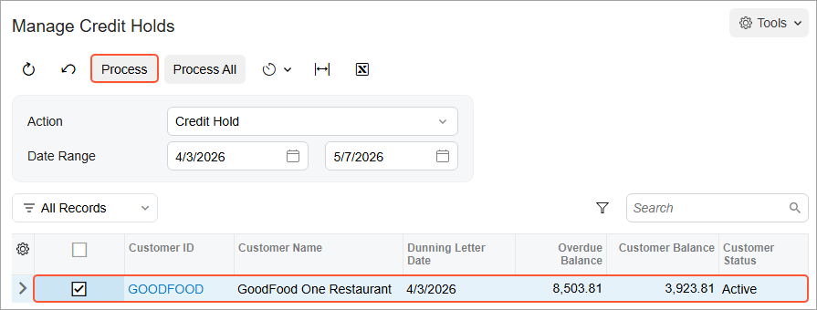

# Credit Status: Process Activity {#_87d93cf9-52ed-4456-b43f-d771ba3b3076 .task}

The following activity will walk you through the process of managing the credit status of a customer.

## Story {#section_mk2_hjv_vxb .section}

Suppose that the Credit Control team of SweetLife Fruits &amp; Jams regularly reviews a list of customers that have not paid for a long time and have ignored dunning letters. One of the customers, *GOODFOOD* has already received two dunning letters, but failed to pay the outstanding invoices. This customer has be put on credit hold to prevent users from creating documents for it.

Further suppose that on May 15, 2026 the customer called SweetLife to inform them that a bank transfer has been sent to pay the debt. The Credit Control team decided to remove the credit hold for the customer on the same day.

Acting as Yona Jones, you need to generate the final dunning letter for *GOODFOOD*, put this customer on credit hold, and remove the credit hold for the customer.

## Configuration Overview {#section_tz4_djx_cnb .section}

In the *U100* dataset, the following tasks have been performed to support this activity:

-   On the [Enable/Disable Features](CS_10_00_00.md) \(CS100000\) form, the *Dunning Letter Management* feature has been enabled.
-   On the [Customers](AR_30_30_00.md) \(AR303000\) form, the *GOODFOOD* customer has been created and assigned to the *DEFAULT* customer class.

## Process Overview {#section_rk2_hjv_vxb .section}

In this activity, you will prepare the final dunning letter on the [Prepare Dunning Letters](AR_52_10_00.md) \(AR521000\) form and print it on the [Print/Release Dunning Letters](AR_52_20_00.md) \(AR522000\) form. On the [Manage Credit Holds](AR_52_30_00.md) \(AR523000\) form, you will put the customer on credit hold and review its status on the [Customers](AR_30_30_00.md) \(AR303000\) form. Finally, on the [Manage Credit Holds](AR_52_30_00.md) form, you will remove the credit hold for the customer.

## System Preparation {#section_tk2_hjv_vxb .section}

Before you begin preparing dunning letters, do the following:

1.  Launch the Acumatica ERP website with the *U100* dataset preloaded, and sign in as Yona Jones by using the *jones* username and the *123* password.
2.  In the info area, in the upper-right corner of the top pane of the Acumatica ERP screen, make sure that the business date in your system is set to *4/3/2026*. If a different date is displayed, click the Business Date menu button, and select *4/3/2026* on the calendar.
3.  As a prerequisite activity, in the company to which you are signed in, be sure you have set up the dunning process, as described in [Dunning Process Setup: Implementation Activity](CreditPolicy_Dunning_Process_Setup_Implem_Activity.md).
4.  As a prerequisite activity, be sure that you have prepared dunning letters for the customer, as described in [Preparation of Dunning Letters: To Prepare Dunning Letters](CreditPolicy_Preparing_Dunning_Letters_To_Prepare_Letters.md).
5.  On the Company and Branch Selection menu on the top pane of the Acumatica ERP screen, select the *SweetLife Head Office and Wholesale Center* branch.

## Step 1: Preparing the Final Dunning Letter {#section_vk2_hjv_vxb .section}

To prepare the final dunning letter for the *GOODFOOD* customer, do the following:

1.  Open the [Prepare Dunning Letters](AR_52_10_00.md) \(AR521000\) form.
2.  In the Selection area, specify the following settings:

    -   **Company/Branch**: *SWEETLIFE*
    -   **Customer Class**: *DEFAULT*
    -   **Dunning Letter Date**: *4/3/2026*
    -   **Add Coming-Due Documents**: Selected
    The *GOODFOOD* customer appears in the table along with other customers because its overdue invoices match the level 3 settings and because two dunning letters have already been prepared for the customer. In the **Dunning Letter Level** column, you can see the level of the dunning letter to be generated, which is *3*.

3.  Select the check box in the unlabeled column for the *GOODFOOD* customer, and on the form toolbar, click **Process** to generate the dunning letter for the customer.
4.  On the [Print/Release Dunning Letters](AR_52_20_00.md) \(AR522000\) form, make sure that the following settings are specified:

    -   **Action**: *Print Dunning Letter*
    -   **Date Range**: *4/3/2026* to *4/3/2026*
    Notice that for the only row in the table, the check box in the **Final Reminder** column is selected, indicating that this is the final dunning letter.

5.  Select the check box in the unlabeled column for row, and on the form toolbar, click **Process** to view a printable preview of the dunning letter.

    The system displays the preview of the dunning letter; you can then print the letter.

    The dunning letter lists all of the customer's outstanding documents. The generated letter shows seven overdue invoices, including the dunning fee invoice, and asks the customer to settle the documents by 4/6/2026, which is the dunning letter date of 4/3/2026 plus 3 days. The 3 days is the **Days to Settle** that you have specified for level 3 of dunning letters on the [Accounts Receivable Preferences](AR_10_10_00.md) \(AR101000\) form.

## Step 2: Putting the Customer on Credit Hold {#section_bl2_hjv_vxb .section}

To put the customer on credit hold, do the following:

1.  Open the [Manage Credit Holds](AR_52_30_00.md) \(AR523000\) form.
2.  In the Selection area, specify the following settings:

    -   **Action**: *Credit Hold*
    -   **Date Range**: *4/3/2026* to *5/7/2026*
    The *GOODFOOD* customer with the overdue balance of $8,503.81 appears in the table \(see the following screenshot\), because with the specified settings, the system displays the customers with the *Active* status, which have an overdue balance on 4/3/2026 and to which the last-level dunning letter has been sent in the specified time interval \(3/3/2026 to 4/3/2026\).

3.  Select the check box for the only row in the table, and on the form toolbar, click **Process** to put the selected customer on credit hold.

    

## Step 3: Reviewing the Customer Record {#section_el2_hjv_vxb .section}

To review the settings of the *GOODFOOD* customer, do the following:

1.  On the [Customers](AR_30_30_00.md) \(AR303000\) form, open the *GOODFOOD* customer.
2.  Review the customer's settings.

    Notice that the customer record has *Credit Hold* displayed in the **Customer Status** box. Because of this status, users cannot create new invoices and debit memos for this customer. On the [Invoices and Memos](AR_30_10_00.md) \(AR301000\) form, the customer record does not appear in the lookup table of the **Customer** box.

## Step 4: Removing Credit Hold for the Customer {#section_hl2_hjv_vxb .section}

To remove the credit hold for the *GOODFOOD* customer, do the following:

1.  In the info area, click the Business Date menu button and select *5/15/2026* on the calendar.
2.  Open the [Manage Credit Holds](AR_52_30_00.md) \(AR523000\) form.
3.  In the **Action** box, select *Remove Credit Hold*.

    The *GOODFOOD* customer appears in the table, because with this action selected, the form shows all customers that have the *Credit Hold* status.

4.  Select the unlabeled check box for the customer, and on the form toolbar, click **Process** to release the customer from credit hold.

    **Tip:** Alternatively, you can release the customer from credit hold manually by changing the status of the customer on the [Customers](AR_30_30_00.md) \(AR303000\) form.

**Parent topic:**[Managing Customers' Credit Status](../UserGuide/CreditPolicy_Managing_Credit_Status_Mapref.md)

