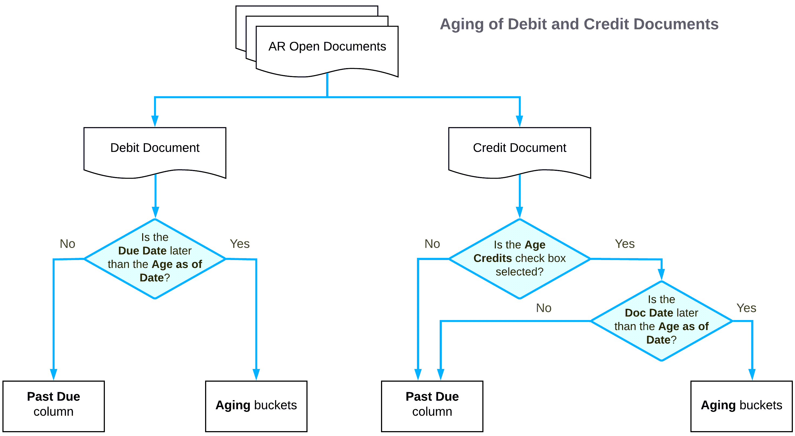

# Preparation of Dunning Letters: Related Reports {#_2aed2def-30aa-458f-b4df-903e20124fa9 .concept}

In the following sections, you can find details about the reports you may want to review to gather information about overdue documents.

**Attention:** If you don’t see a particular report or form that is described, you may have signed in to the system with a user account that doesn’t have access rights to the report or form. Contact your system administrator to obtain access to any needed reports or forms.

## Reviewing the AR Aging by Project Report {#section_hh2_hjv_vxb .section}

You use the [AR Aging by Project](AR_63_12_00.md) \(AR631200\) report to determine which documents are overdue for payment and for how long.

The report shows all outstanding AR documents in the system and the document balances on the date specified in the **Age as of Date** box on this report form. That is, the report shows all released AR documents in the system that are still open or were closed later than the aging date you specify in the **Age as of Date** box. These documents are grouped by project \(that is, the project assigned to the AR document\), by statement cycle, and by customer.

**Tip:** To see overdue customer balances at the end of the particular period, use the [AR Aged Period-Sensitive](AR_63_05_00.md) \(AR630500\) report and the [AR Aged Period-Sensitive by Project](AR_63_06_00.md) \(AR630600\) report.

For each customer, the report shows all outstanding AR documents in the system and the document balances; the report lists released AR documents, which are broken down by aging periods. The balance of the listed AR documents is calculated as the difference between the original amount of the documents and the application amounts of the documents that were applied no later than the specified aging date. The balances of the documents are sorted into columns that represent aging buckets. The system forms aging buckets for a particular statement cycle depending on whether the **Use Financial Periods for Aging** check box is selected for this cycle on the [Statement Cycles](AR_20_28_00.md) \(AR202800\) form as follows:

-   If the check box is selected, the system uses aging buckets that correspond to the financial periods. The zero period \(the leftmost column in the report\) is the financial period of the **Age as of Date** specified on the report form; the other aging periods are the preceding financial periods.
-   If the check box is cleared, the system will show the aging buckets that are specified for the statement cycle.

Depending on the **Age Based On** setting of the statement cycle on the [Statement Cycles](AR_20_28_00.md) form, in the report, debit documents are aged by due dates or by document dates as follows:

-   If the *Due Date* option is selected, the system will compare the due dates of invoices, debit memos, and overdue charges with the aging date \(which you specify in the **Age as of Date** box of the report form\) to determine the appropriate aging periods for the documents included in the report. If the due date of a debit document is the same as or later than the aging date, the document balance is reflected in the **Current** column of the report. Otherwise, the document balance is reflected in the aging period associated with the number of days the document is past due.
-   If the *Document Date* option is selected, the system will compare the document dates of invoices, debit memos, and overdue charges with the aging date \(which you specify in the **Age as of Date** box of the report form\) to determine the appropriate aging buckets for the documents included in the report. If the document date of a debit document is the same as or later than the aging date, the document balance is reflected in the **Current** column of the report. Otherwise, the document balance is reflected in the aging period associated with the number of days that have passed since the document date.

Credit documents are aged based on their document date and the aging date specified for the report if the **Age Credits** check box is selected on the [Accounts Receivable Preferences](AR_10_10_00.md) \(AR101000\) form. By default, the check box is cleared, and the credit amounts are shown in the **Current** column of the report. With the check box selected, if the document date of a credit document is the same as or later than the aging date, the document balance is reflected in the current aging period of the report. Otherwise, the document balance is reflected in the aging period associated with the number of days that have passed since the document date.

## Reviewing the AR Coming Due Report {#section_oh2_hjv_vxb .section}

The [AR Coming Due](AR_63_15_00.md) \(AR631500\) report and its multicurrency version, [AR Coming Due MC](AR_63_16_00.md) \(AR631600\), are designed to show when you should expect to get payments for the open documents that are not overdue yet.

These reports show all open documents recorded in the system, regardless of the current business date or the date specified in the **Date** box on the report form. That is, the reports show open accounts receivable documents, even if they are posted to periods later than the aging date period. The documents are grouped by statement cycle and by customer.

**Tip:** To age overdue customer balances at the end of the particular period, use the [AR Aged Period-Sensitive](AR_63_05_00.md) report.

For each customer, the report shows the outstanding customer balance in the system and lists open documents, which are broken down by aging periods. That is, the balances of the documents are sorted into columns that represent aging buckets. The system forms aging buckets for a particular statement cycle depending on whether the **Use Financial Periods for Aging** check box is selected for this cycle on the [Statement Cycles](AR_20_28_00.md) \(AR202800\) form as follows:

-   If the check box is selected, the system uses aging buckets that correspond to the financial periods; the zero aging period \(the leftmost column in the report\) is the financial period of the **Aging Date** specified on the report form; the other aging periods are the subsequent financial periods.
-   If the check box is cleared, the system will show the aging buckets that are specified for the statement cycle.

Depending on the **Age Based On** setting of the statement cycle on the [Statement Cycles](AR_20_28_00.md) form, in the report, debit documents are aged by due dates or by document dates as follows:

-   If the *Due Date* option is selected, the system will compare the due dates of invoices, debit memos, and overdue charges with the aging date \(which you specify in the **Date** box of the report form\) to determine the appropriate aging periods for the documents included in the report. If the due date of a debit document is earlier than the aging date, the document balance is reflected in the **Past Due** column \(the zero financial period\) of the report. Otherwise, the document balance is reflected in the aging period associated with the number of days until the due date.
-   If the *Document Date* option is selected, the system will compare the document dates of invoices, debit memos, and overdue charges with the aging date \(which you specify in the **Date** box of the report form\) to determine the appropriate aging periods for the documents included in the report. If the document date of a debit document is earlier than the aging date, the document balance is reflected in the leftmost \(**Past Due**\) aging bucket of the report. Otherwise, the document balance is reflected in the aging period associated with the number of days until the document date.

Credit documents are aged based on their document date and the aging date specified for the report if the **Age Credits** check box is selected on the [Accounts Receivable Preferences](AR_10_10_00.md) \(AR101000\) form. By default, the check box is cleared and the credit amounts are shown in the first aging period of the report. With the check box selected, if the document date of a credit document is earlier than the aging date, the document balance is reflected in the **Past Due** column \(the zero aging period\) of the report along with overdue invoices. Otherwise, the document balance is reflected in the aging period associated with the number of days until the document date.

## Reviewing the AR Aged Period-Sensitive Report {#section_vh2_hjv_vxb .section}

You use the [AR Aged Period-Sensitive](AR_63_05_00.md) \(AR630500\) report to determine the state of the open documents at the end of a particular period.

The report shows the AR documents that are open at the end of the financial period you select in the **Financial Period** box on the report form. The documents are grouped by statement cycle and by customer.

The report ages the balances of the debit and credit document in the same way as the [AR Aging](AR_63_10_00.md) \(AR631000\) report does. For details, see [Preparation of Dunning Letters: Using the AR Aging Report](AR__CON_Using_AR_Aging_Reports.md).

## AR Aged Period-Sensitive by Project Report {#section_zh2_hjv_vxb .section}

You use the [AR Aged Period-Sensitive by Project](AR_63_06_00.md) \(AR630600\) report to see the documents that are outstanding at the end of the financial period that you have selected in the **Financial Period** box on this report form. These documents are grouped by project \(that is, the project assigned to each AR document\), by statement cycle, and by customer, and they are broken down by aging periods or financial periods, depending on the settings of the statement cycle specified for each customer.

The balances are arranged by days past due on the last day of the specified period or by document dates. All the amounts are shown in the base currency.

The report ages the balances of the debit and credit documents in the same way as the [AR Aging](AR_63_10_00.md) \(AR631000\) report does. For details, see [Preparation of Dunning Letters: Using the AR Aging Report](AR__CON_Using_AR_Aging_Reports.md).

**Parent topic:**[Preparing Dunning Letters](../UserGuide/CreditPolicy_Preparing_Dunning_Letters_Mapref.md)

