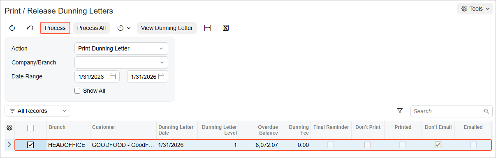

# Preparation of Dunning Letters: To Prepare Dunning Letters {#_5d346007-a64f-486a-a7dd-bc1c94915d65 .task}

The following activity will walk you through the process of preparing dunning letters to customers.

## Story {#section_bg2_hjv_vxb .section}

Suppose that on January 31, 2026, the Credit Control team of SweetLife Fruits &amp; Jams starts the process of generating dunning letters for its customers. Acting as Yona Jones, you need to run the process on the [Prepare Dunning Letters](AR_52_10_00.md) \(AR521000\) form for the *GOODFOOD* customer.

## Configuration Overview {#section_tz4_djx_cnb .section}

In the *U100* dataset, the following tasks have been performed to support this activity:

-   On the [Enable/Disable Features](CS_10_00_00.md) \(CS100000\) form, the *Dunning Letter Management* feature has been enabled.
-   On the [Statement Cycles](AR_20_28_00.md) \(AR202800\) form, the *EOM \(End of Month\)* statement cycle has been created.
-   On the [Customers](AR_30_30_00.md) \(AR303000\) form, the *GOODFOOD* customer has been created and assigned to the *DEFAULT* customer class.

## Process Overview {#section_eg2_hjv_vxb .section}

In this activity, on the [Prepare Dunning Letters](AR_52_10_00.md) \(AR521000\) form, you will prepare the first dunning letter for the *GOODFOOD* customer and print it on the [Print/Release Dunning Letters](AR_52_20_00.md) \(AR522000\) form. You will then prepare the second dunning letter for the customer and print it on the [Prepare Dunning Letters](AR_52_10_00.md) and [Print/Release Dunning Letters](AR_52_20_00.md) forms, respectively. Finally, on the [Invoices and Memos](AR_30_10_00.md) \(AR301000\) form, you will review the dunning fee invoice that was automatically generated and released by the system.

## System Preparation {#section_gg2_hjv_vxb .section}

Before you begin preparing dunning letters, do the following:

1.  Launch the Acumatica ERP website with the *U100* dataset preloaded, and sign in as Yona Jones by using the *jones* username and the *123* password.
2.  In the info area, in the upper-right corner of the top pane of the Acumatica ERP screen, make sure that the business date in your system is set to *1/31/2026*. If a different date is displayed, click the Business Date menu button, and select *1/31/2026* on the calendar.
3.  As a prerequisite activity, in the company to which you are signed in, be sure you have set up the dunning process, as described in [Dunning Process Setup: Implementation Activity](CreditPolicy_Dunning_Process_Setup_Implem_Activity.md).
4.  On the Company and Branch Selection menu on the top pane of the Acumatica ERP screen, select the *SweetLife Head Office and Wholesale Center* branch.

## Step 1: Preparing the First Dunning Letter {#section_ig2_hjv_vxb .section}

To prepare the first dunning letter to the *GOODFOOD* customer, do the following:

1.  Open the [Prepare Dunning Letters](AR_52_10_00.md) \(AR521000\) form.
2.  In the Selection area, specify the following settings:

    -   **Company/Branch**: *SWEETLIFE*
    -   **Customer Class**: *DEFAULT*
    -   **Dunning Letter Date**: *1/31/2026*
    -   **Add Coming-Due Documents**: Selected
    The *GOODFOOD* customer appears in the table along with other customers because its overdue invoices match the level 1 settings and because no dunning letters have already been prepared for the customer. The earliest due date among the customer's outstanding documents \(2/6/2023, which is the due date of one of the invoices\) is displayed in the **Earliest Due Date** column. The invoice is three years past due on *1/31/2026*, which is more than the 30 days past due specified for level 1 of dunning letters. Therefore, in the **Dunning Letter Level** column, you can see the level of the dunning letter to be generated, which is *1*.

3.  Select the check box in the unlabeled column for the *GOODFOOD* customer, and on the form toolbar, click **Process** to generate the dunning letter for the customer.
4.  On the [Print/Release Dunning Letters](AR_52_20_00.md) \(AR522000\) form, make sure that the following settings are specified:

    -   **Action**: *Print Dunning Letter*
    -   **Date Range**: *1/31/2026* to *1/31/2026*
    The system shows the dunning letters that have not yet been printed for the time interval between the start date and the end date of **Date Range** \(see the screenshot below\).

    **Tip:** To view all generated letters for the specified time interval, you can select the **Show All** check box. By using this form, you can also email the generated dunning letters to customers if the email accounts are configured in the system.

5.  Select the check box in the unlabeled column for the only row in the table, and on the form toolbar, click **Process** to view a printable preview of the dunning letter.

    

    The system displays the preview of the dunning letter; you can then print the letter.

    The dunning letter lists all of the customer's outstanding documents. The **Total Due** amount, which is displayed in the letter's footer in the base currency, is the total balance of the listed documents. The balance of each document in the currency of the document is displayed in the **Outstanding** column and in the base currency in the **Outstanding USD** column. The documents with a due date \(displayed in the **Due Date** column\) earlier than the dunning letter date are overdue. The **Overdue Amount**, which is also displayed in the letter's footer in the base currency, is the total balance of the overdue documents. \(For documents that are not overdue, *Current* is displayed in the **Due Date** column of the letter.\)

    Open payments, prepayments, and credit memos are not listed in the letter, and their balances are not counted in the total balances shown in the letter. Therefore, you have to apply all open payments and credit memos to overdue documents before you prepare the dunning letters.

    The generated letter shows six overdue invoices and asks the customer to settle the documents by 2/3/2026, which is the dunning letter date of 1/31/2026 plus 3 days. The 3 days is the **Days to Settle** that you have specified for level 1 of dunning letters on the [Accounts Receivable Preferences](AR_10_10_00.md) \(AR101000\) form.

    **Tip:** You can modify the text and the layout of a dunning letter by customizing the [Dunning Letter](AR_66_10_00.md) \(AR661000\) report.

## Step 2: Preparing the Second Dunning Letter {#section_sg2_hjv_vxb .section}

You can prepare the next dunning letter for the *GOODFOOD* customer no sooner than 3/3/2026. This date is calculated as follows:

-   The level 1 dunning letter is prepared on 1/31/2026. The time interval for dunning letter level 1 is 30 days, as specified in the accounts receivable preferences.
-   The time interval for the level 2 dunning letter is 60 days, so the difference between level 2 and level 1 is 30 \(60 – 30\) days.
-   The calculated difference is added to the date of the level 1 dunning letter, 1/31/2026 + 30 days = 3/2/2026. This is the last day when the payment can be made before the next dunning letter can be prepared.
-   On the next day, 3/3/2026, you can prepare the level 2 dunning letter.

To prepare the second dunning letter to the *GOODFOOD* customer, do the following:

1.  Open the [Prepare Dunning Letters](AR_52_10_00.md) \(AR521000\) form.
2.  In the Selection area, specify the following settings:

    -   **Company/Branch**: *SWEETLIFE*
    -   **Customer Class**: *DEFAULT*
    -   **Dunning Letter Date**: *3/3/2026*
    -   **Add Coming-Due Documents**: Selected
    The *GOODFOOD* customer appears in the table along with other customers because its overdue invoices match the level 2 settings and because the first dunning letter has already been prepared for the customer. The **Last Dunning Letter Date** column shows the date of the previous dunning letter \(1/31/2026\). The earliest due date among the customer's outstanding documents \(8/20/2023, which is the due date of one of the invoices\) is displayed in the **Earliest Due Date** column. The invoice is still three years past due on *3/3/2026*, which is more than the 60 days past due specified for level 2 of dunning letters. Therefore, in the **Dunning Letter Level** column, you can see the level of the dunning letter to be generated, which is *2*.

3.  Select the check box in the unlabeled column for the *GOODFOOD* customer, and on the form toolbar, click **Process** to generate the dunning letter for the customer.
4.  On the [Print/Release Dunning Letters](AR_52_20_00.md) \(AR522000\) form, make sure that the following settings are specified:

    -   **Action**: *Print Dunning Letter*
    -   **Date Range**: *3/3/2026* to *3/3/2026*
    The system shows the dunning letters that have not yet been printed for the time interval between the start date and end date of the date range.

5.  Select the check box in the unlabeled column for the only row in the table, and on the form toolbar, click **Process** to view a printable preview of the dunning letter.

    The system displays the preview of the dunning letter; you can then print the letter.

    The generated letter shows six overdue invoices and asks the customer to settle the documents by 3/6/2026, which is the dunning letter date of 3/3/2026 plus 3 days. The 3 days is the **Days to Settle** that you have specified for level 2 of dunning letters on the [Accounts Receivable Preferences](AR_10_10_00.md) \(AR101000\) form.

## Step 3: Reviewing the Dunning Fee Invoice {#section_zg2_hjv_vxb .section}

To review the invoice with the dunning fee, which has been automatically generated by the system, do the following:

1.  Open the Invoices and Memos \(AR3010PL\) list of records.
2.  In the list, open an invoice for the *GOODFOOD* customer, dated *3/3/2026* with the amount of *5.00*. \(The invoice has the *Dunning Letter Fee* description.\)
3.  On the [Invoices and Memos](AR_30_10_00.md) \(AR301000\) form, review the invoice.

    The system has automatically released the generated invoice because the **Automatically Release Dunning Fee Documents** check box is selected on the **Dunning** tab of the [Accounts Receivable Preferences](AR_10_10_00.md) \(AR101000\) form.

    The invoice **Due Date** is *3/10/2026*, which is the dunning letter date of *3/3/2026* plus 7 days \(on the **Dunning** tab of the [Accounts Receivable Preferences](AR_10_10_00.md) form, *7D \(7 Days\)* is selected in the **Terms** box\).

4.  On the **Details** tab, the *DUNNINGFEE* item has been automatically selected for the invoice line in the **Inventory ID** column.

    This is the non-stock item that you selected in the **Dunning Fee Item** box on the **Dunning** tab of the [Accounts Receivable Preferences](AR_10_10_00.md) form.

**Parent topic:**[Preparing Dunning Letters](../UserGuide/CreditPolicy_Preparing_Dunning_Letters_Mapref.md)

