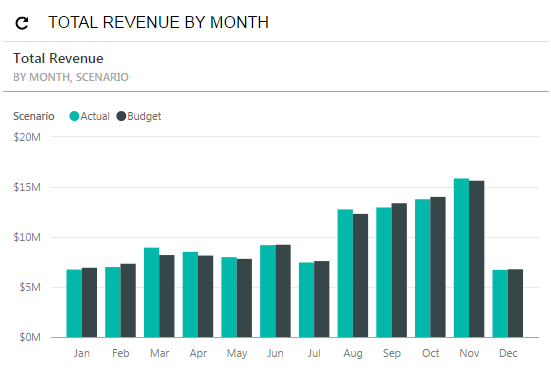

# Specific Widgets: Power BI Tile Widgets {#_d2a770aa-0f3b-4f59-bd38-76a54dec8563 .concept}

You can embed a Power BI tile on a dashboard. If you use Power BI tools for the monitoring and analysis of various data in your organization, you can display this information in Acumatica ERP to provide yourself and your colleagues \(if they also use the dashboard\) with all necessary business indicators on one page.

When embedding a Power BI tile as a widget on an Acumatica ERP dashboard, you need to specify the parameters that your system administrator obtained after registering your Acumatica ERP instance on Microsoft Azure; you also specify a Power BI dashboard and a Power BI tile from this dashboard. For a detailed description of the properties of the Power BI tile widget, see [Add Widget Dialog Box for Power BI Tile Widgets](DB__ref_PowerBI.md).

For an example of a Power BI tile widget, see the following screenshot.

By using a Power BI tile widget, you can open the source Bower BI dashboard and update the widget view.

For the step-by-step procedure on how to add a Power BI tile to an Acumatica ERP dashboard, see [Specific Widgets: To Add a Power BI Tile Widget](DB__how_Adding_PowerBI.md).

**Parent topic:**[Configuring Widgets](../UserGuide/RPT_Configuring_Widgets_Mapref.md)

