# Wiki Markup Reference {#_8cdcf471-10a7-4533-b343-b15613df5242 .concept}

You use wiki markup to create Acumatica Wiki articles. When you edit the text, you view the markup and can directly manipulate it. When you view the article, the markup is hidden and the text is formatted based on your specifications in the markup.

This topic describes the text and paragraph style conventions used in wiki markup.

## Text Styles { .section}

To meet specific formatting needs, you can format your text using the markup styles listed in the table below.

|Style|Type as|View as|
|-----|-------|-------|
|Bold|`'''Bold text'''`|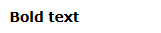|
|Italic|`''Italic text''`|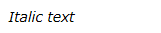|
|Bold and italic|`'''''Bold and italic text'''''`|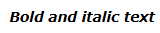|
|Underlined|`__Underlined Text__`|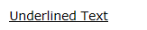|
|Strikethrough|`--Strikethrough text--`|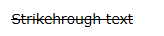|
|Subscript|`X<sub>2</sub>`|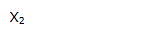|
|Superscript|`X<sup>2</sup>`|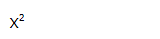|
|Fixed-width|`<tt>Enter</tt>`|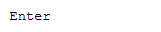|
|Code listing or markup|\{\{Enter\}\}|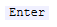|
|Increased font size|`<big> Big font text </big>`||
|Decreased font size|`<small> Small font text </small>`|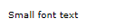|
|Ignored wiki markup|`<nowiki>--no strikethrough--</nowiki>`|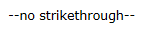|
|Comment not visible in article|`<!-- Comment here-->`||

## Special Symbols { .section}

To insert a special symbols, you can use the corresponding HTML code. The following table shows the most common special symbols and their codes.

|Symbol|Code|Symbol|Code|Symbol|Code|Symbol|Code|
|------|----|------|----|------|----|------|----|
|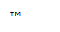|`&trade;`|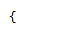|`&#0123;`|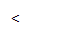|`&lt;`|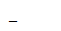|`&#95;`|
|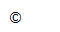|`&copy;`|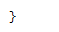|`&#0125;`|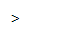|`&gt;`|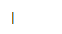|`&#124;`|
|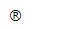|`&reg;`|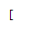|`&#91;`|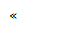|`&laquo;`|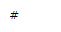|`&#35;`|
|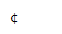|`&cent;`|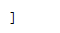|`&#93;`|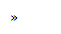|`&raquo;`|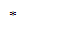|`&#42;`|
|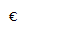|`&euro;`|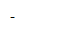|`&#45;`|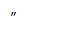|`&ldquo;`||`&#92;`|
|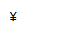|`&yen;`|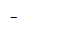|`&#8211;`|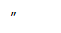|`&rdquo;`|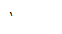|`&lsquo;`|
|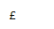|`&pound;`|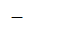|`&#8212;`|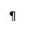|`&para;`|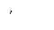|`&rsquo;`|

## Paragraph Styles { .section}

You can use spacing and headings to separate and organize paragraphs. Spacing between paragraphs make the text more readable, while headings provide visual cues that help users understand the structure of the article. Other styles, such as boxes and lists, make information easier to understand and remember.

To increase spacing between paragraphs when you're editing, insert two line breaks in the wiki text. Single line breaks are ignored.

The table below includes the paragraph styles you can use in wiki articles.

**Note:** All the paragraph styles listed below should be used at the beginning of the line.

|Style|Type as|View as|
|-----|-------|-------|
| |```
==First-Level 
Heading (H1)==
```

|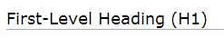|
|Second-Level Heading|```
===Second-Level 
Heading (H2)===
```

|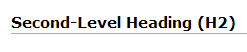|
|Third-Level Heading|```
====Third-Level 
Heading (H3)====
```

|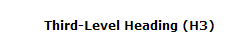|
|Fourth-Level Heading \(H4\)|```
=====Fourth-Level 
Heading (H4)=====
```

|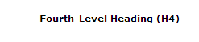|
|Solid line|```
----
```

|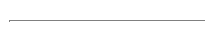|
|Indented text|```
Text
:Indented text
```

|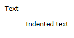|
|Bulleted List|```
*Item 1
*Item 2 
**Item 2.1
```

|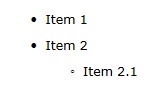|
|Numbered List|```
#Item 1 
#Item 2
```

|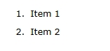|
|Mixed List|```
#Item 1 
#*Item 1.1
#Item 2
#*Item 2.1
```

|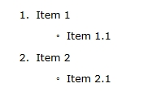|
|Expandable Section|```
<nowiki>=^'''Section'''
This is the expandable 
section content.
^=</nowiki>
```

|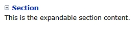|
|Text in a box|```
(((My box)))
```

|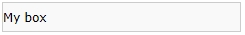|
|Note|```
((({S:Hint}A note provides 
additional information 
relevant to the process 
being described.)))
```

|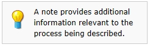|
|Warning|```
((({S:Warn}A caution alerts 
the user of a possible data loss, 
breach of security, 
or other serious problems.)))
```

||
|Code or markup text samples|||

## Table of Contents { .section}

A table of contents helps you to quickly find information if the article is lengthy or includes many headings. You insert a table of contents, which contains links to the headings within it, by placing the `{TOC}` string in the preferred location within the wiki text.

**Parent topic:**[Managing Wikis](../UserGuide/DM__mng_Wikis.md)

