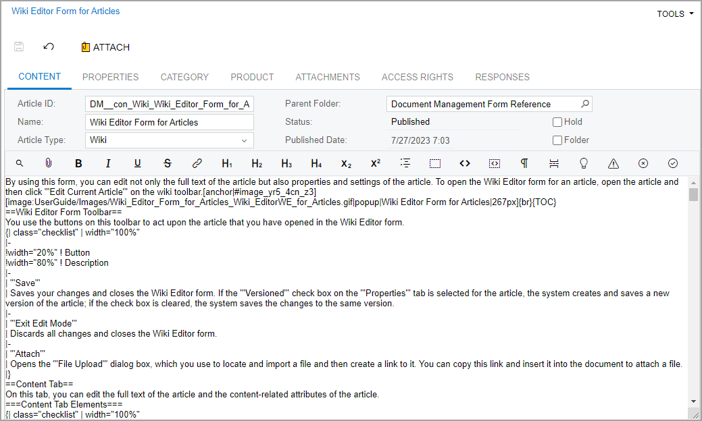

# Wiki Editor Form for Articles {#_e40bade0-f802-4db1-9baa-5f8686f15277 .reference}

By using this form, you can edit not only the full text of the article but also properties and settings of the article. To open the Wiki Editor form for an article, open the article and then click **Edit Current Article** on the wiki toolbar.

## Wiki Editor Form Toolbar { .section}

You use the buttons on this toolbar to act upon the article that you have opened in the Wiki Editor form.

|Button|Description|
|------|-----------|
|**Save**|Saves your changes and closes the Wiki Editor form. If the **Versioned** check box on the **Properties** tab is selected for the article, the system creates and saves a new version of the article; if the check box is cleared, the system saves the changes to the same version.|
|**Exit Edit Mode**|Discards all changes and closes the Wiki Editor form.|
|**Attach**|Opens the **File Upload** dialog box, which you use to locate and import a file and then create a link to it. You can copy this link and insert it into the document to attach a file.|

## Content Tab { .section}

On this tab, you can edit the full text of the article and the content-related attributes of the article.

|Element|Description|
|-------|-----------|
|**Article ID**|The unique article ID. To link the selected article to a form, base the article ID on the number of the form, with underscores replacing periods. For example, if the form number is *AP101000*, the ID of its form reference topic is *AP\_10\_10\_00*.|
|**Name**|The name to be used for the article on the wiki tree. The name may be different from the ID.|
|**Article Type**|The markup used in the article. You can select one of the following options:-   *Wiki*: Wiki markup, as described in [Wiki Markup Reference](DM__con_Wiki_Using_Wiki_Markup.md)
-   *HTML*: HTML

|
|**Parent Folder**|The name of the folder that holds the article.|
|**Status**|The current state of the article, which is usually *Hold* \(in progress\) or *Published* \(finished and available for all users\). You change the status of the drafted article to *Published* by clearing the **Hold** check box. Published articles can be viewed by all users, while unpublished articles can be viewed by only users who are authorized to edit the wiki.

 The other two statuses, *Rejected* and *Pending*, are used only if publishing approval is required for the wiki. *Rejected* means that the article was not approved, and *Pending* indicates that publishing has been requested but the article has not yet been approved or rejected.

|
|**Hold**|A check box that gives the article the *Hold* status if selected; when you clear the check box, the status of the article changes to *Published* if publishing approval is not required or *Pending* if publishing approval is required.|
|**Approved**|A check box indicating that the article has been approved.

 You can select the **Approved** check box to approve the article or the **Rejected** check box to reject the article.

|
|**Rejected**|A check box indicating that the article has been rejected.

 You can select the **Approved** check box to approve the article or the **Rejected** check box to reject the article.

|
|**Published Date**|The date of publishing or approval.|
|**Folder**|A check box indicating \(if selected\) that the article is also a folder.|

|Button|Description|
|------|-----------|
|**Preview** / **Edit**|Switches between Preview and Editor modes. Click **Preview** to see how the article will look after you save your current edits. Click **Edit** to switch to the editing mode.|
|**Save**|Saves your changes and exits the editor. This button is available only if you are editing a section of the article.

|
|**Cancel**|Cancels your changes and exits the editor.

 This button is available only if you are editing a section of the article.

|
|**Attach file**|Opens the **File Upload** dialog box so you can attach a file to the article.|
|**Bold**|Marks the selected text in bold style.|
|**Italic**|Marks the selected text in italic style.|
|**Underline**|Marks the selected text as underlined.|
|**Strikethrough**|Marks the selected text as strikethrough.|
|**Hyperlink**|Inserts an external hyperlink.|
|**H1**|Marks the selected text as a first-level header.|
|**H2**|Marks the selected text as a second-level header.|
|**H3**|Marks the selected text as a third-level header.|
|**H4**|Marks the selected text as a fourth-level header \(the lowest level\).|
|**Subscript**|Marks the selected text as subscript.|
|**Superscript**|Marks the selected text as superscript.|
|**TOC**|Inserts a table of contents. This button is available only in Edit mode.

|
|**Box**|Encloses the selected text in a gray box. This button is available only in Edit mode.

|
|**Inline Code**|Marks the selected text to be displayed as a listing. This button is available only in Edit mode.

|
|**Code Box**|Marks the selected text to be displayed as a block of code. This button is available only in Edit mode.

|
|**Line Break**|Inserts a line break. This button is available only in Edit mode.|
|**Page Break**|Inserts a page break. This button is available only in Edit mode.|
|**Hint Box**|Displays the selected text in a note box. This button is available only in Edit mode.

|
|**Warning Box**|Displays the selected text in a caution box. This button is available only in Edit mode.

|

## Properties Tab { .section}

On this tab, you can view information pertaining to the creation and last modification of the article. You can also set the article keywords and add a summary, both of which the system searches when a user performs a search.

|Element|Description|
|-------|-----------|
|**Summary**|A short description of the article content that is used to make searches more effective.|
|**Keywords**|A list of keywords of the article; use commas to separate keywords. The system uses keywords for searches.|
|**Versioned**|A check box that \(if selected\) indicates that the article is stored with all its versions.This option is offered to preserve backward compatibility.

|
|**Version tags**|The list of tags used on the article and the toolbar with tools to maintain the list.

 This option is offered to preserve backward compatibility.

|
|**Created**|The day and time the article was created.|
|**Last modified**|The day and time the article was last modified.|

## Category Tab { .section}

By searching for articles of specific categories, users can find the articles they want to see more quickly. For more information about creating and assigning categories, see [To Use Categories in Wikis](DM__how_Wiki_Using_Categories.md).

The table toolbar has only standard buttons.

|Columns|Description|
|-------|-----------|
|**Category ID**|The ID of the category assigned to the article.|

## Product Tab { .section}

By searching for articles you applied to specific products, users can find the articles they want to see more quickly. For more information about creating and applying products, see [To Use Categories in Wikis](DM__how_Wiki_Using_Categories.md).

The table toolbar has only standard buttons.

|Columns|Description|
|-------|-----------|
|**Product ID**|The ID of the product the article is applied to.|

## Attachments Tab { .section}

This tab displays the list of attached files \(such as images to be displayed in the text\), if the wiki article includes attached files.

|Button|Description|
|------|-----------|
|**Get Link**|Shows the external and the internal link to the file attachment.|
|**Edit**|Navigates to the [File Maintenance](SM_20_25_10.md) \(SM202510\) form so you can view the details of the file.|

|Column|Description|
|------|-----------|
|**Name**|The name of the file attached to the article.|
|**Description**|A comment that was provided for the file during import to give other users information about this version of the file.|
|**Created by**|The author of the last version of the file attachment.|
|**Last Modified**|The time of the last version of the file attachment.|
|**File Size \(kB\)**|The size of the last version of the file attachment.|

## Access Rights Tab { .section}

On this tab, you can quickly modify the access rights that roles have to the article.

The table toolbar has only standard buttons.

|Columns|Description|
|-------|-----------|
|**Role Name**|The role with access rights to the article.|
|**Access Rights**|The level of access rights assigned to the role for this wiki object \(folder or article\). You can set a role to any of the following options: *Inherit*, *Revoked*, *View Only*, *Edit*, *Insert*, *Publish*, or *Delete*.|
|**Parent Access Rights**|An info box that shows the level of access rights assigned to the role for the parent folder of this wiki object.|

## Subarticles Tab { .section}

This tab, available only if the article is defined as a folder, contains a table showing the articles included in the folder. You can move any article up or down the list and save its new position in the list.

|Button|Description|
|------|-----------|
|**Move up**|Moves the selected article one position up the list.|
|**Move down**|Moves the selected article one position down the list.|

|Element|Description|
|-------|-----------|
|**Folder**|A check box that indicates \(if selected\) that the article is also a folder.|
|**Article ID**|The identifier of the article.|
|**Article Name**|The name of the article.|

## Responses Tab { .section}

You can use this tab to check for feedback for the article.

The table toolbar has only standard buttons.

|Columns|Description|
|-------|-----------|
|**Login**|The user who submitted feedback.|
|**Date**|The date when the user submitted the feedback.|
|**Revision**|The article version which the user commented.|
|**Mark**|The rating the user set for the article.|
|**Summary**|The user comments.|

**Parent topic:**[Document Management Forms](../UserGuide/DM__DM_Form_Reference.md)

