# To Add a Graphic {#_900a82ab-0787-4ba6-bd5f-39897bbdaf6e .task}

At times, you might want to illustrate the concepts or ideas in an article. To do this, you can import graphics to add them to articles. In the process, you can specify a variety of display options.

## To Import a Graphic File {#section_jr1_qbc_tj .section}

Before you import your file, make sure that the size of your file does not exceed the maximum file size allowed and that the type of file is allowed. You can check the maximum allowable file size and the valid file extensions on the [File Upload Preferences](SM_20_25_50.md) \(SM202550\) form.

To import a graphic file for an article, do the following:

1.  Open the article to which you want to add the graphic.
2.  Open the article for editing. Do one of the following:
    -   Click **Edit** to the right of the section to which you want to add the graphic.
    -   On the wiki toolbar, click **Edit Current Article** to open the entire article in the Wiki Editor form.
3.  On the formatting toolbar, click **Attach File**.

    **Note:** Alternatively, if you opened the Wiki Editor form, you can click **Attach** on the Wiki Editor form toolbar. This opens the **File Upload** dialog box.

4.  In the **File Upload** dialog box, click **Browse** to find the file, select the file, and then click **Upload**. This opens the **File Link Editor** dialog box.
5.  In the **File Link Editor** dialog box, specify the following options:

    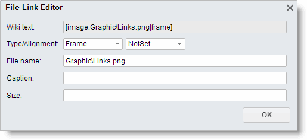

    -   In the **Type** box, select one of the following display options: *Not Set*, *Thumb*, *Frame*, or *Border*.
    -   In the **Alignment** box, select one of the following alignment options: *Not Set*, *Right*, *Left*, or *Center*.
    -   In the **Caption** box, enter the caption for the graphic.
    -   In the **Size** box, enter the display size \(in pixels\) of the graphic to be displayed.
    For more information, see the [Customize a Graphic](#section_mcz_rys_kj) section of this article.

6.  Click anywhere in the **Wiki text** box to update the link, and then copy the link.
7.  Click **OK** to close the dialog box.
8.  Click on the position in the text where you want to insert the graphic, and paste the link.
9.  Click **Save**.
10. Check the graphic displayed in the article, and correct the options if needed.

## To Update a Graphic File { .section}

When you need to replace a graphic, do the following:

1.  Open the wiki article with the graphic you want to update.
2.  Click the **Edit** link next to the graphic you want to replace. The system redirects you to the [File Maintenance](SM_20_25_10.md) \(SM202510\) form with the file name of the graphic specified in the **File** box. The form displays the list of versions of the file.
3.  Make sure the file name of the graphic begins with the correct article ID, separated from the graphic file name by a backslash \(\\\).

    CAUTION:

    If the article ID has changed, delete the old link and create a new one.

4.  On the form toolbar, click **Check Out**.
5.  On the form toolbar, click **Upload New Version**.
6.  In the **File Upload** dialog box, click **Browse** and select the graphic you want to upload.
7.  Make sure the **Check In** check box is selected to check in the updated version of the file.
8.  Click **Upload**.

The system uploads the file and adds it to the list of file versions under the original file name \(regardless of the name of the uploaded file\). By default, the new version of the file will be displayed in the article.

## To Customize a Graphic {#section_mcz_rys_kj .section}

You may need to change how a graphic is justified in the text, scale it, or alter other display options. This section describes the wiki markup syntax you use to customize an graphic.

See below for the most basic syntax for adding a graphic to a wiki article:

```
[image:*File name*]
```

where *File name* has the following format:

```
[*Article ID*\*Image file name*]
```

For example, the following syntax displays the graphic without borders and a caption:

```
[image:Graphic\Links.png]
```

The following graphic corresponds to the markup above:

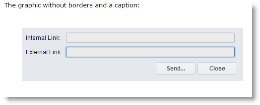

You use the following complete syntax to add a graphic to a wiki article:

```
[Image:File name|Type|Location|Caption|Size|Noclick|]
```

Follow these tips when you use these options, which the remainder of this article describes in detail:

-   List the options in any order.
-   Use no additional spaces before, between, or after any pipe sign \(\|\) because spaces can cause errors when the system parses the link.
-   Note that if the text between two pipe signs is not a valid option, the system interprets it as a caption.

|Option|Description|
|------|-----------|
|Type|Specifies the type of the graphic. Use one of the following values: *thumb*, *frame*, *border,* and *popup*.-   This is an example of the syntax for a thumbnail of a graphic:

    ```
[image:Adding Pictures\Favorites.GIF|thumb|Favorites]
    ```

The graphic is scaled down to 180 pixels and has a box around it, as shown in the screenshot below. The caption provided by the string \(*Links*\) is shown below the graphic and inside the box.

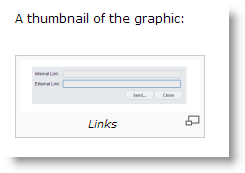

If you click the graphic, the system opens a new blank page and displays the graphic at its actual size, as shown in the screenshot below. To return to the article, click the **Back** button of the browser.

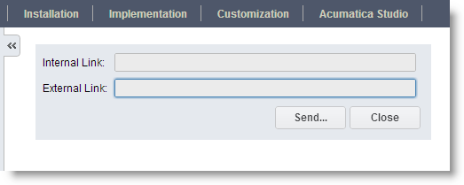

-   This is an example of the syntax for a graphic with a frame around it:

    ```
[image:Graphic\Links.png|frame|Links]
    ```

The system displays the graphic corresponding to the above syntax in its original size, with a box \(frame\) around it, as shown in the screenshot below. Notice the caption below the graphic and inside the box.

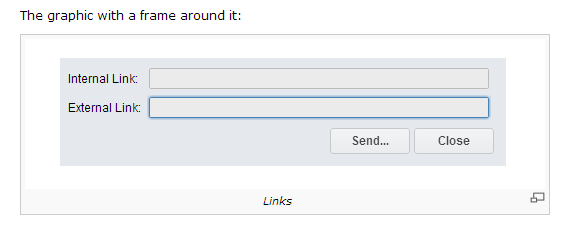

-   This is an example of the syntax for a graphic with a border:

    ```
[image:Graphic\Links.png|Links|border]
    ```

With the above syntax, the system displays the graphic in its original size with no caption, even if one is specified. The system adds a border around the graphic, as shown in the screenshot below.

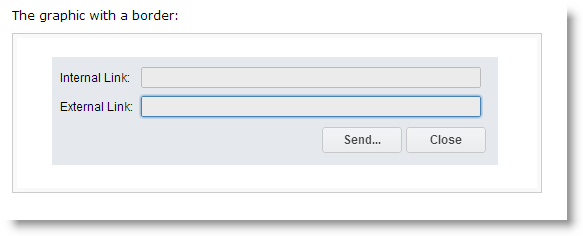

-   This is an example of the syntax for a pop-up graphic:

    ```
[image:Graphic\Links.png|popup|150px|Links]
    ```

The graphic is displayed at the specified size \(150 pixels\).

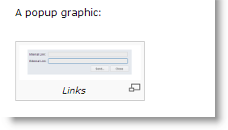

When you click the graphic, the system opens the graphic in its original size in a pop-up dialog box with a dark gray background. To return to the article, press Esc.

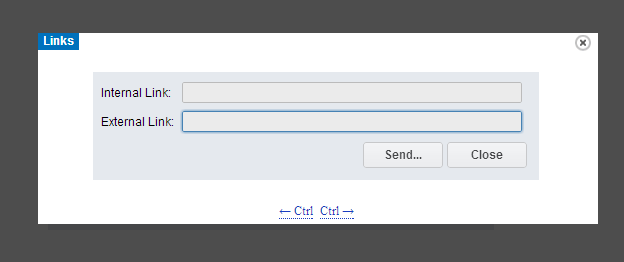


|
|Location|Defines the horizontal placement of the graphic on the page. Use one of the following values: *right*, *left*, or *center*. By default, the system displays graphics left-aligned. This is an example of the syntax for a centered graphic:

```
[image:Graphic\Links.png|Links|center]
```

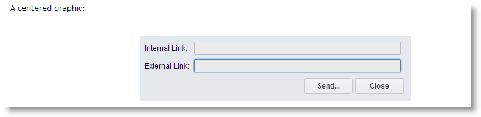

|
|Caption|Specifies the tooltip shown when a user points to the graphic. This is an example of the syntax for a graphic with the *caption* option: ```
[image:Graphic\Links.png|Links]
```

The corresponding image is shown in the screenshot below. The *Links* text, interpreted as a caption, is shown when you point to the image.

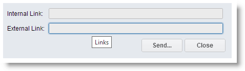

|
|Size|Gives you the ability to scale the graphic in either of the following ways:

 -   To the specified width, with the aspect ratio as in the original graphic: The syntax is *N*px, where *N* is a number of pixels.
-   To both the specified width and height: The syntax is *N*x*M*px, where *N* specifies the number of pixels for the width and *M* specifies the number of pixels for the height.

 This is an example of the syntax for a graphic with the specified height and width:

 ```
[image:Graphic\Links.png|100x50px|Links]
```

 The graphic is scaled down to 100 pixels in width and 50 pixels in height, as shown in the screenshot below.

 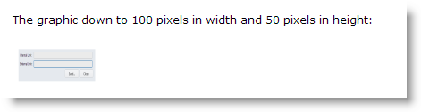

 If you click the scaled graphic, the system opens the graphic in its actual size on a blank page. To return to the article, click the **Back** button of the browser.

 

|
|NoClick|Prohibits the user from displaying the graphic in its actual size. See the following example of the syntax for a graphic with the *noclick* option:

 ```
[image:Graphic\Links.png|100px|Links|noclick]
```

 The syntax above results in the graphic being scaled down proportionally to 100 pixels in width. When you click this graphic, the system does not open the graphic in its actual size.

 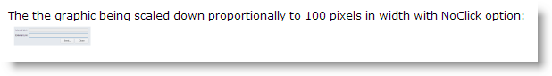

|

## To Attach Already Imported Files { .section}

You can easily attach one file to different articles.

To attach a file that is already imported into the system, do the following:

1.  Open the wiki article with the graphic you want to use.
2.  Open the article for editing. Do one of the following:
    -   Click **Edit** to the right of the section to where the graphic is located.
    -   On the wiki toolbar, click **Edit Current Article** to open the entire article in the Wiki Editor form.
3.  Select and copy the image link.
4.  Click **Cancel**.
5.  Open the wiki article where you want to insert the graphic.
6.  Open the article for editing. Do one of the following:
    -   Click **Edit** to the right of the section to which you want to add the graphic.
    -   On the wiki toolbar, click **Edit Current Article** to open the entire article in the Wiki Editor form.
7.  On the formatting toolbar, click **Attach File**.

    **Note:** Alternatively, if you opened the Wiki Editor form, you can click **Attach File** on the Wiki Editor form toolbar. This opens the **File Upload** dialog box.

8.  In the **File Upload** dialog box, select **Link to existing file** option, paste the link into the **Existing File** dialog box, and then click **Upload**. This opens the **File Link Editor** dialog box.
9.  Follow Steps 5 through 10 of the [Importing Graphic Files](#section_jr1_qbc_tj) procedure.

**Parent topic:**[Wiki Content Procedures](../UserGuide/DM__mng_Wiki_How_To.md)

