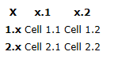
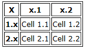
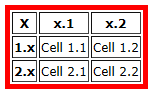
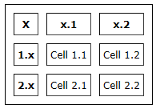
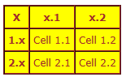
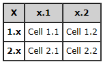
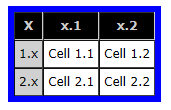

# To Add a Table {#_729b902d-b375-482f-bdfc-e0fa31bba9a4 .task}

You can easily build a table by using wiki markup.

## To Understand Table Markup { .section}

See below for descriptions of the basic wiki markup for tables, which you should use at the beginning of a line.

|Markup Element|Description|
|--------------|-----------|
|\{\||The beginning of the table. Table parameters may be defined on the first line.|
|\|+|The table title \(caption\) line.|
|\|\}|The end of the table.|
|!|A column heading.|
|!!|A column heading separator if headings are all specified on one line.|
|\||The beginning of a table cell.|
|\|\||A cell separator if all cells are specified on one line.|
|\|-|A table row separator.|
|width="x%"|Column width, where *x* is the predefined width in %. Insert the attribute before the column name, with column heading separators on both sides.

|

## To Define a Simple Table { .section}

See below for an example of the wiki markup to define a simple table. This example shows all the column headings in one line, separated by `!!`, with the row headings \(`1.x` and `2.x`\) on separate lines. All cells for each row are listed in one line.

```
{| 
! X !! x.1 !! x.2
|-
! 1.x
| Cell 1.1 || Cell 1.2
|-
! 2.x
| Cell 2.1 || Cell 2.2
|}
```

If you have long phrases in the cells or in the headings, you can define each cell in a separate line, as shown below.

```
{|
! X 
! x.1 
! x.2
|-
! 1.x
| Cell 1.1 
| Cell 1.2
|-
! 2.x
| Cell 2.1 
| Cell 2.2
|}
```

Both of the syntax examples above generate the same table, as shown below.



You can use parameters, described in the following sections, to affect how the table looks.

## To Define Table Borders { .section}

You specify the parameters of the table borders, among other parameters, after the \{\| characters that designate the start of the table. See the following examples of the syntax to define table borders:

-   `border="1"`: Adds an overall border around the table and borders between the cells.
-   `border="1" style="border: solid 5px #000000;"`: Adds borders as the previous example does, but makes the outer border black and 5 pixels thick.

Use the syntax below to generate a table with a border around the outside and between cells.

```
{| border="1" 
! X !! x.1 !! x.2
|-
! 1.x
| Cell 1.1 || Cell 1.2
|-
! 2.x
| Cell 2.1 || Cell 2.2
|}
```



Use the syntax below to generate the table with a thick red border.

```
{| border="1" style="border: solid 5px Red;"
! X !! x.1 !! x.2
|-
! 1.x
| Cell 1.1 || Cell 1.2
|-
! 2.x
| Cell 2.1 || Cell 2.2
|}
```



## To Add Cell Spacing and Padding { .section}

To add space to the cells and between cells, use the *cellspacing* and *cellpadding* parameters, as shown in the following examples:

-   `cellspacing="10"`: The *cellspacing* parameter defines space between cells. \(The default value is 1 pixel.\) When *cellspacing* is set to "0", as in this example, the borders of the neighboring cells merge into one line.
-   `cellpadding="4"`: The *cellpadding* parameter adds space to the cells, padding them in all directions. This example adds 4 pixels to cell space in each of 4 directions: above, below, right, and left.

Use the following syntax to generate the table \(shown below the syntax\) with enlarged spacing in the cells and between the cells.

```
{| cellspacing="10" cellpadding="4" border="1" style="border: solid 1px #000000;"
! X !! x.1 !! x.2
|-
! 1.x
| Cell 1.1 || Cell 1.2
|-
! 2.x
| Cell 2.1 || Cell 2.2
|}
```



## To Use Color { .section}

Use the syntax below to generate a table \(shown below the syntax\) with text color set to brown, background color set to yellow, and enlarged spacing in the cells.

```
{| cellspacing="0" cellpadding="4" border="1" style="color:brown;background-color:yellow;" 
! X !! x.1 !! x.2
|-
! 1.x
| Cell 1.1 || Cell 1.2
|-
! 2.x
| Cell 2.1 || Cell 2.2
|}
```



Use the syntax below to generate a table with a gray background color for the table heading \(shown below the syntax\).

```
{| cellspacing="0" cellpadding="4" border="1"
|- style="background-color: #D0D0D0;"
! X !! x.1 !! x.2
|-
! 1.x
| Cell 1.1 || Cell 1.2
|-
! 2.x
| Cell 2.1 || Cell 2.2
|}
```



You can also add color to the row headings. The following syntax sets the background color of the table heading to black, the text color of the table heading to gray, and the background color of the row headings to a different shade of gray.

```
{| cellspacing="0" cellpadding="4" border="1" style="border: solid 6px Blue;"
|- style="background-color: #000000; color: #CCCCCC;" 
! X !! x.1 !! x.2
|-
| style="background-color: #D0D0D0;" | 1.x
| Cell 1.1 || Cell 1.2
|-
| style="background-color: #D0D0D0;"  | 2.x
| Cell 2.1 || Cell 2.2
|}
```

The syntax above generates the table below.



**Parent topic:**[Wiki Content Procedures](../UserGuide/DM__mng_Wiki_How_To.md)

