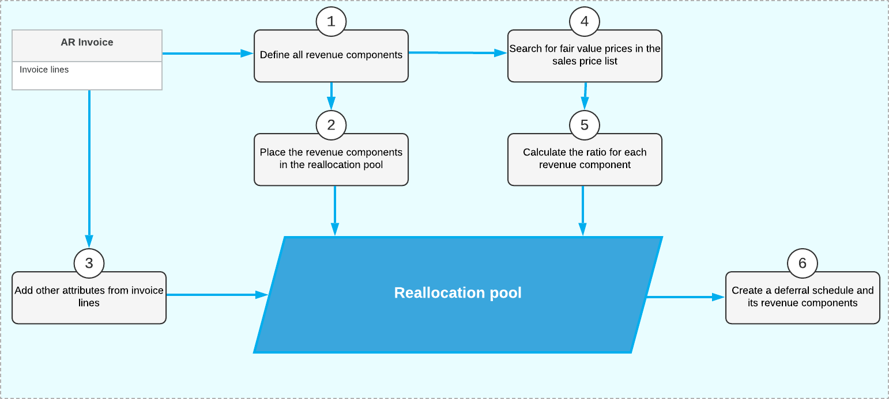

# Recognition of Revenue from Customer Contracts {#_fc4d8e96-10a1-41bf-ba03-5b1576cd79b4 .concept}

Acumatica ERP supports the requirements of the following standards as well as their models of recognizing revenue:

-   The International Financial Reporting Standard \(IFRS\) 15—generally referred to as *IFRS 15*
-   The 606 Revenue from Contracts with Customers Generally Accepted Accounting Principles \(GAAP\) standard—generally referred to as *ASC 606*

Per these requirements and standards, if a contract exists between a seller and a buyer to transfer a package and the contract consists of multiple distinct performance obligations, the transaction price is allocated to each performance obligation based on the relative standalone selling prices of the goods or services being provided to the customer. Revenue is recognized when the performance obligations are satisfied. If a performance obligation is satisfied over time, the related revenue is also recognized over time. If a customer receives a discount, it can be allocated to only one performance obligation or to multiple performance obligations \(for example, inventory IDs\) in the contract.

## Example of Revenue Recognition {#section_lsb_3jv_vxb .section}

Consider the following example, which illustrates how revenue is recognized:

A company sells a package consisting of three items: a software subscription license, the related support services, and upgrade services. The duration of the contract is two years, and the transaction price is $1,000. The standalone selling prices \(fair value prices\) for the license, support, and upgrades are $750, $500, and $250, respectively. The revenue is calculated as shown in the following table.

|Item|Calculation|Revenue|
|----|-----------|-------|
|License|1,000 \* 750 / \(750 + 500 + 250\)|$500.00|
|Support|1,000 \* 500 / \(750 + 500 + 250\)|$333.33|
|Upgrade|1,000 \* 250 / \(750 + 500 + 250\)|$166.67|

The revenue of each item will be recognized evenly during two years—one half in the first year and the other half in the second year.

## Configuration and Workflow of Revenue Recognition {#section_psb_3jv_vxb .section}

To use the revenue recognition according to *IFRS 15* and *ASC 606*, you should configure the following settings and create the following documents:

1.  On the [Enable/Disable Features](CS_10_00_00.md) \(CS100000\) form, you enable the *Revenue Recognition by IFRS 15/ASC 606* feature.
2.  On the [Sales Prices](AR_20_20_00.md) \(AR202000\) form, you specify a price for the particular item and select the **Fair Value** check box for this price. For details on configuring sales prices, see [Sales Prices: General Information](Prices_Reviewing_Sales_Prices_GeneralInfo.md). If you are going to use items with the *MDA* type, each item within the package must have a sales price configured. For details on configuring MDA, see [To Configure a Package for IFRS 15/ASC 606](DR__how_To_Configure_Package_IFRS15_ASC606.md).
3.  On the [Invoices and Memos](AR_30_10_00.md) \(AR301000\) form, you create an AR invoice with the item that has a fair value price configured. For details on the creation of AR invoices, see [AR Invoices: General Information](Finance_ARInvoices_GeneralInfo.md).
4.  To view how the system has calculated the reallocation of amounts for deferral components, before releasing the invoice, you save the invoice, and then you click **View Deferrals** on the table toolbar of the **Details** tab of the [Invoices and Memos](AR_30_10_00.md) form.
5.  On the [Deferral Schedule](DR_20_15_00.md) \(DR201500\) form, which opens in a separate window, you review the table on the **Reallocation Pool** tab.
6.  You generate transactions for the deferral schedule by clicking **Generate Transactions** on the **Details** tab of the [Deferral Schedule](DR_20_15_00.md) form.

**Important:** The configuration settings described above should be applied for each unreleased document if the *Revenue Recognition by IFRS 15/ASC 606* feature has been enabled on the [Enable/Disable Features](CS_10_00_00.md) form without posting unreleased documents. If this is the case, when a user tries to release an AR or SO document created before the feature was enabled or view the deferred schedule for such documents, the system displays an error message.

## Reallocation Pool {#section_ssb_3jv_vxb .section}

A *reallocation pool* is a table in the system where the inputs and outputs of the reallocation process are stored. The reallocation process collects data about sold packages from invoice lines and splits these packages into separate performance obligations. Then for each sales order, the process collects the fair value \(or best estimated\) price from the list of sales prices, and allocates the transaction price among the sales orders in proportion to their standalone prices. The resulting sales orders and their amounts are used to create a deferred schedule and its components.

The share of each component in the transaction price depends on the following:

-   The estimated standalone \(or fair value\) price
-   The number of components in a package
-   The quantity of packages in an invoice line

The following diagram illustrates how data for the reallocation pool is retrieved and calculated. All these actions are performed automatically by the system.



As the diagram shows, the following steps are involved with the data retrieval and calculation in the reallocation pool:

1.  For each invoice line with a deferral code, the system defines one revenue component or multiple revenue components.
2.  Each revenue component is placed in the reallocation pool in a separate row.
3.  This row is updated with other attributes \(such as quantity\) from the corresponding invoice line. The transaction price is also calculated.
4.  For each revenue component \(a row in the reallocation pool\), the system searches for a fair value price in the sales price list.
5.  Based on fair value prices, the system calculates the ratio for each revenue component. These ratios or shares are used to reallocate the transaction price to each component.
6.  The data from the reallocation pool is used to create a deferral schedule \(one for each document\) and its revenue components \(one for each row of the reallocation pool\).

The results of these calculations are shown on the **Reallocation Pool** tab of the [Deferral Schedule](DR_20_15_00.md) \(DR201500\) form.

## Algorithm for Selecting the Fair Value Price {#section_ysb_3jv_vxb .section}

The system uses the following input data entered on the [Sales Prices](AR_20_20_00.md) \(AR202000\) form to select the fair value prices used by the revenue reallocation process:

-   The inventory ID \(performance obligation\) defined by the revenue component—that is, the value in the**Component ID** box on the [Deferral Schedule](DR_20_15_00.md) \(DR201500\) form
-   The unit of measure of the sales order in the pool \(that is, the UOM of the revenue component\)
-   The document currency and the value of the **Use Fair Value Prices in Base Currency** check box on the [Deferred Revenue Preferences](DR_10_10_00.md) \(DR101000\) form
-   The date on which the price is valid \(that is, the document date\)
-   The customer for which the price is specified
-   The customer class to which the customer belongs
-   The quantity
-   The warehouse \(for SO invoices only\)

For inventory items, multiple prices with different goals may be available in the system. The system searches for prices according to the price search priority \(highest to lowest\) and stops the search when an applicable price for an item is found. The system uses the standard Acumatica ERP price priorities when selecting fair value prices with the following exceptions:

-   Promotional prices are not selected.
-   Default prices are not selected.
-   Prices are not applicable if the **Fair Value** check box is cleared on the [Sales Prices](AR_20_20_00.md) form.

If no applicable price is found, the system displays a warning message; a document with a warning message cannot be released.

## Algorithm for Selecting Fair Value Prices for Inventories Marked by a Deferral Code of Flexible Type {#section_ctb_3jv_vxb .section}

Invoice lines or revenue components of the inventories with the *MDA* type can contain items marked by deferral codes with flexible types \(*Flexible by Period*, *Prorate by Days*, or *Flexible by Days in Period*\). In AR invoices containing these items, you have to enter the term start date and the term end date in the **Term Start Date** and **Term End Date** columns on the **Details** tab of the [Invoices and Memos](AR_30_10_00.md) \(AR301000\) form. If fair value prices selected on the [Sales Prices](AR_20_20_00.md) \(AR202000\) form have the **Prorated** check boxes selected for them, the effective price for these inventories will be increased or decreased in proportion to the term specified for the invoice line. The following formula will be used for calculating the price:

``` {#codeblock_etb_3jv_vxb}
EP = FVP * (([Term  end] - [Term start] + 1 day) / 365)
```

The symbols in the formula have the following meanings:

-   *EP*: The effective fair value price
-   *FVP*: The fair value price from the [Sales Prices](AR_20_20_00.md) form
-   *Term end*: The date specified for the invoice line in the **Term End Date** column on the **Details** tab of the [Deferral Schedule](DR_20_15_00.md) \(DR201500\) form
-   *Term start*: The date specified for the invoice line in the **Term Start Date** column on the **Details** tab of the [Deferral Schedule](DR_20_15_00.md) form

## Residual Method for ASC606 {#section_gtb_3jv_vxb .section}

Acumatica ERP supports the residual approach for allocating the transaction price to the performance obligations. This approach can be used by companies that cannot establish observable standalone selling prices \(fair value prices\) for a performance obligation or for multiple performance obligations on the same invoice. In this case, the ASC606 standard allows companies to use the residual approach described in *ASC 606-10-32-34*, where revenue for these performance obligations is allocated on a residual basis.

For revenue components, the *Residual* allocation method is available to be used with ASC606. This allocation method can be used for one of the revenue components of an item with the *MDA* deferral code.

The allocation method for a component can be changed at any time. The updated method will be used in new deferral schedules or when the existing deferral schedules are recalculated.

For fair value prices of selected performance obligations, runtime computation is used. For specific prices, the system can calculate the effective fair value prices at runtime by applying to them the discounts for which the **Apply to Deferred Revenue** check box is selected on the [Discount Codes](AR_20_90_00.md) \(AR209000\) form and the **Discountable** check box is selected on the [Sales Prices](AR_20_20_00.md) \(AR202000\) form. These effective fair value prices will be used for revenue allocation.

To configure the *Residual* allocation method, you perform the following actions:

1.  On the [Non-Stock Items](IN_20_20_00.md) \(IN202000\) and [Stock Items](IN_20_25_00.md) \(IN202500\) forms, for each needed component, you select the *Residual* allocation method in the **Allocation Method** column of the **Revenue Components** table of the **Deferral** tab.

    On the [Stock Items](IN_20_25_00.md) and [Non-Stock Items](IN_20_20_00.md) forms, for the same item, you can mix the revenue components whose revenue is allocated based on fair value price \(with and without runtime computation\) and the component with the *Residual* allocation method.

2.  On the [Deferred Revenue Preferences](DR_10_10_00.md) \(DR101000\) form, you specify an account and subaccount, if applicable, in the **Suspense Account** and **Suspense Sub.** boxes. If the residual amount or any allocation weight is zero or a negative value, the entire revenue of the invoice will be posted to this suspense account and subaccount.

Revenue components are used in documents according to the following rules:

-   If an invoice contains a single revenue component with the *Residual* allocation method, the residual amount is calculated as the invoice amount without taxes minus the revenue of non-residual components. If an invoice contains multiple revenue components with the *Residual* allocation method, the calculated residual amount is distributed among the residual components based on their allocation weights.
-   Revenue components with different deferral settings can be used in the same document. For an inventory item,you can specify revenue components with flexible deferral codes and different default terms. For all revenue components of the same inventory item, recognition will start on the **Term Start Date** specified in a document line on data entry forms. In a document line for an inventory item, the default **Term End Date** is based on the maximum default terms of the components.
-   A residual component will be included in the deferral schedule created for a document if there is a deferral code associated with the component; the revenue allocated for the component will be recognized based on its schedule. The revenue allocated for a residual component that is not associated with any deferral code will be recognized immediately.

## Support of Foreign Currencies {#section_otb_3jv_vxb .section}

Any document that is subject to revenue reallocation may be in the base currency or a foreign currency. If the document is in the base currency, the best estimated or fair value prices specified on the [Sales Prices](AR_20_20_00.md) \(AR202000\) form must also be in the base currency. For documents in a foreign currency, the prices used for reallocation can be in either the base currency or the foreign currency, depending on whether the **Use Fair Value Prices in Base Currency** check box on the [Deferred Revenue Preferences](DR_10_10_00.md) \(DR101000\) form is selected. Regardless of the currency, the prices must be defined on the document date for all inventories registered in document lines or revenue components; otherwise, the system will not be able to prepare data for the reallocation pool and will display an error.

Deferred schedules are always created in the base currency, as well as further revenue recognition. If a document is in a foreign currency, the system will recalculate its transaction price from the foreign currency to the base currency.

## Support of Multiple Base Currencies {#section_rtb_3jv_vxb .section}

If the *Multiple Base Currencies* feature is enabled on the [Enable/Disable Features](CS_10_00_00.md) \(CS100000\) form, the system searches for fair value prices according to the following rules:

-   For documents in a base currency, the system searched for prices specified in a price list in the base currency of the document's originating branch
-   For documents in a foreign currency, the system searched for prices specified in a price list in the base currency of the document's originating branch, if the **Use Fair Value Price in Base Currency** check box is selected on the [Deferred Revenue Preferences](DR_10_10_00.md) \(DR101000\) form.

If a document has not been released and the status of its automatic schedule is *Draft*, you can change the branch in any document line and the base currency in the document. The system will delete the existing draft of the schedule and create a new schedule with the updated branch and base currency.

**Parent topic:**[Processing Deferrals](../UserGuide/DR__con_Processing_of_Deferrals.md)

